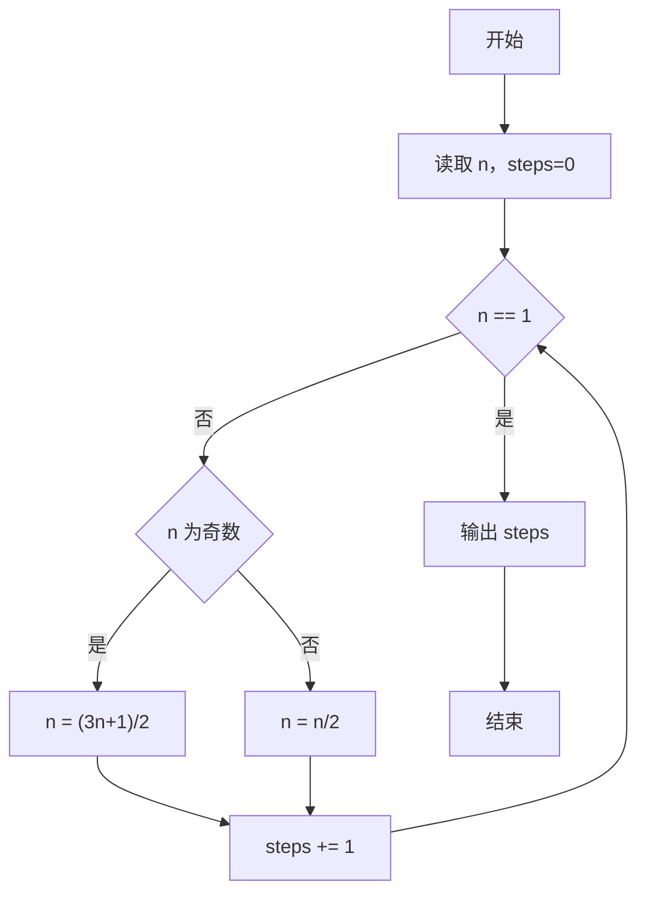
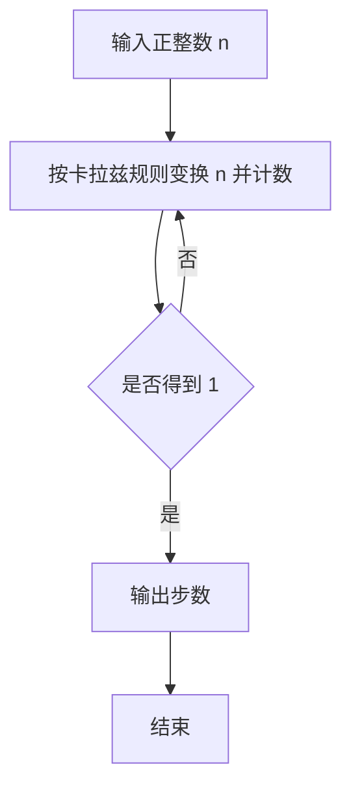

# 1001 害死人不偿命的(3n+1)猜想

- **分值：** 15分

### 题目描述

卡拉兹(Callatz)猜想：

对任何一个正整数 $n$，如果它是偶数，那么把它砍掉一半；如果它是奇数，那么把 $(3n+1)$ 砍掉一半。这样一直反复砍下去，最后一定在某一步得到 $n=1$。卡拉兹在 1950 年的世界数学家大会上公布了这个猜想，传说当时耶鲁大学师生齐动员，拼命想证明这个貌似很傻很天真的命题，结果闹得学生们无心学业，一心只证 $(3n+1)$，以至于有人说这是一个阴谋，卡拉兹是在蓄意延缓美国数学界教学与科研的进展……

我们今天的题目不是证明卡拉兹猜想，而是对给定的任一不超过 1000 的正整数 $n$，简单地数一下，需要多少步（砍几下）才能得到 $n=1$？

### 输入格式：

每个测试输入包含 1 个测试用例，即给出正整数 $n$ 的值。

### 输出格式：

输出从 $n$ 计算到 1 需要的步数。

### 输入样例：
```
3
```

### 输出样例：
```
5
```


### 解题思路

本题的核心是：按题目规则不断变换 n，统计变为 1 所需的步数。程序先读取题目输入，再按照上述规则完成数据处理，最后严格按照题目要求输出结果。实现时应优先根据题目约束选择合适的数据类型和数据结构，避免溢出或不必要的重复计算。

时间复杂度为 O(log n)；空间复杂度取决于输入规模，主要用于保存题目数据和中间结果。

### 代码流程说明

1. 读取正整数 n，初始化 steps=0。
2. 当 n≠1 时：若 n 为奇数则 n=(3n+1)/2，否则 n=n/2，steps 加一。
3. 输出 steps。

### 代码实现

```ruby
# 题目：1001-害死人不偿命的(3n+1)猜想
# 实现原理：
# 本题的核心是：按题目规则不断变换 n，统计变为 1 所需的步数
# 时间复杂度为 O(log n)；空间复杂度取决于输入规模，主要用于保存题目数据和中间结果。
# 代码步骤：
# 1. 读取输入并初始化必要的数据结构。
# 2. 按题意完成核心计算，处理边界情况。
# 3. 按题目要求格式化并输出结果。
#
n = STDIN.read.to_i
steps = 0
while n != 1
  n = n.odd? ? (3 * n + 1) / 2 : n / 2
  steps += 1
end
puts steps
```

### 代码流程图



### 解题流程图



### 常见易错点

- 奇数规则是先算 3n+1 再整体除以 2，不要只做 3n+1。
- n=1 时答案为 0，循环条件必须先判断。
- Ruby 整数任意大，无需额外防溢出。
