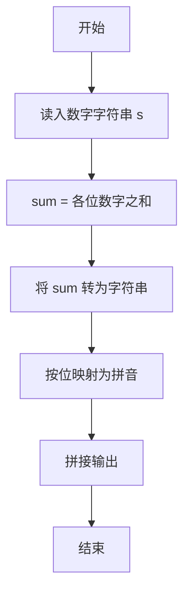
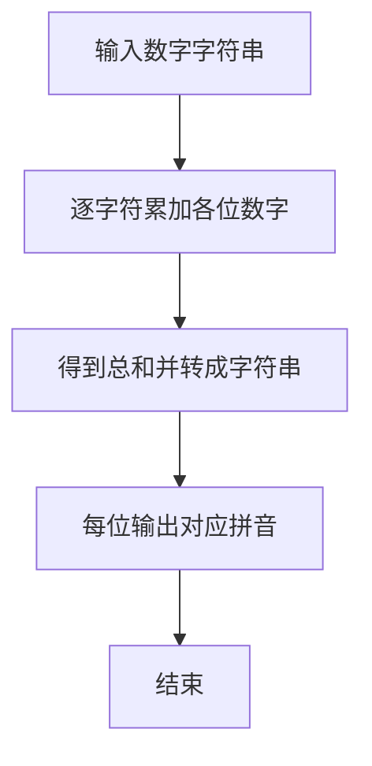

# 1002 写出这个数

- **分值：** 20分

### 题目描述

读入一个正整数 $n$，计算其各位数字之和，用汉语拼音写出和的每一位数字。

### 输入格式：

每个测试输入包含 1 个测试用例，即给出自然数 $n$ 的值。这里保证 $n$ 小于 $10^{100}$。

### 输出格式：

在一行内输出 $n$ 的各位数字之和的每一位，拼音数字间有 1 个空格，但一行中最后一个拼音数字后没有空格。

### 输入样例：
```
1234567890987654321123456789
```

### 输出样例：
```
yi san wu
```


### 解题思路

本题的核心是：将输入数字字符串逐字符映射为中文拼音，避免整数溢出。程序先读取题目输入，再按照上述规则完成数据处理，最后严格按照题目要求输出结果。实现时应优先根据题目约束选择合适的数据类型和数据结构，避免溢出或不必要的重复计算。

时间复杂度为 O(L)；空间复杂度取决于输入规模，主要用于保存题目数据和中间结果。

### 代码流程说明

1. 按字符串读入大整数。
2. 求各位数字之和。
3. 将和的每一位映射为拼音并依次输出。

### 代码实现

```ruby
# 题目：1002-写出这个数
# 实现原理：
# 本题的核心是：将输入数字字符串逐字符映射为中文拼音，避免整数溢出
# 时间复杂度为 O(L)；空间复杂度取决于输入规模，主要用于保存题目数据和中间结果。
# 代码步骤：
# 1. 读取输入并初始化必要的数据结构。
# 2. 按题意完成核心计算，处理边界情况。
# 3. 按题目要求格式化并输出结果。
#
words = %w[ling yi er san si wu liu qi ba jiu]
total = STDIN.read.strip.chars.sum(&:to_i)
puts total.to_s.chars.map { |digit| words[digit.to_i] }.join(" ")
```

### 代码流程图



### 解题流程图



### 常见易错点

- 必须按字符串处理输入，避免整数溢出。
- 拼音表顺序是 ling yi er san si wu liu qi ba jiu。
- 总和为 0 时仍要输出 ling。
