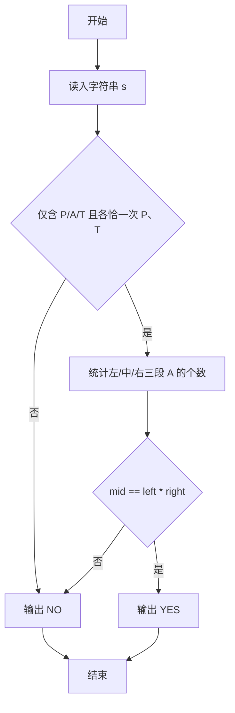
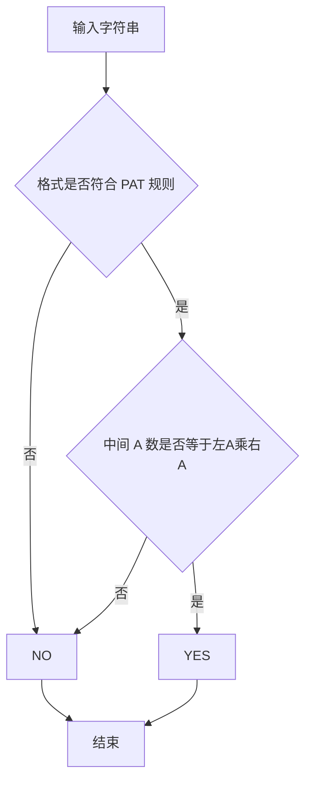

# 1003 我要通过！

- **分值：** 20分

### 题目描述

“**答案正确**”是自动判题系统给出的最令人欢喜的回复。本题属于 PAT 的“**答案正确**”大派送 —— 只要读入的字符串满足下列条件，系统就输出“**答案正确**”，否则输出“**答案错误**”。

得到“**答案正确**”的条件是：

1. 字符串中必须仅有 `P`、 `A`、 `T`这三种字符，不可以包含其它字符；
2. 任意形如 `xPATx` 的字符串都可以获得“**答案正确**”，其中 `x` 或者是空字符串，或者是仅由字母 `A` 组成的字符串；
3. 如果 `aPbTc` 是正确的，那么 `aPbATca` 也是正确的，其中 `a`、 `b`、 `c` 均或者是空字符串，或者是仅由字母 `A` 组成的字符串。

现在就请你为 PAT 写一个自动裁判程序，判定哪些字符串是可以获得“**答案正确**”的。

### 输入格式：

每个测试输入包含 1 个测试用例。第 1 行给出一个正整数 $n$（$n\le 10$），是需要检测的字符串个数。接下来每个字符串占一行，字符串长度不超过 100，且不包含空格。

### 输出格式：

每个字符串的检测结果占一行，如果该字符串可以获得“**答案正确**”，则输出 `YES`，否则输出 `NO`。

### 输入样例：
```
10
PAT
PAAT
AAPATAA
AAPAATAAAA
xPATx
PT
Whatever
APAAATAA
APT
APATTAA

```

### 输出样例：
```
YES
YES
YES
YES
NO
NO
NO
NO
NO
NO
```

**鸣谢江西财经大学软件学院朱政同学、用户 woluo_z 补充测试数据！**


### 解题思路

本题的核心是：检查字符串中 P、A、T 的位置关系，并验证中间 A 的数量关系。程序先读取题目输入，再按照上述规则完成数据处理，最后严格按照题目要求输出结果。实现时应优先根据题目约束选择合适的数据类型和数据结构，避免溢出或不必要的重复计算。

时间复杂度为 O(L)；空间复杂度取决于输入规模，主要用于保存题目数据和中间结果。

### 代码流程说明

1. 读入字符串，定位唯一 P 与唯一 T。
2. 统计 P 前、P/T 中间、T 后三段的 A 数量。
3. 验证仅含 PAT、且 中间A数 = 左侧A数 × 右侧A数。

### 代码实现

```ruby
# 题目：1003-我要通过！
# 实现原理：
# 本题的核心是：检查字符串中 P、A、T 的位置关系，并验证中间 A 的数量关系
# 时间复杂度为 O(L)；空间复杂度取决于输入规模，主要用于保存题目数据和中间结果。
# 代码步骤：
# 1. 读取输入并初始化必要的数据结构。
# 2. 按题意完成核心计算，处理边界情况。
# 3. 按题目要求格式化并输出结果。
#
tokens = STDIN.read.split
count = tokens.shift.to_i

count.times do
  word = tokens.shift
  chars = word.chars
  p_index = chars.index("P")
  t_index = chars.index("T")
  valid_symbols = chars.all? { |char| %w[P A T].include?(char) }
  valid_count = chars.count("P") == 1 && chars.count("T") == 1
  valid_order = p_index && t_index && t_index > p_index + 1
  valid_shape = valid_order && (p_index * (t_index - p_index - 1) == chars.length - t_index - 1)
  puts valid_symbols && valid_count && valid_shape ? "YES" : "NO"
end
```

### 代码流程图



### 解题流程图



### 常见易错点

- P 与 T 必须各只出现一次，且 P 在 T 前。
- 三段都允许 0 个 A，但 P/T 之间的 A 至少 1 个时乘法才可能成立。
- 除 PAT 外出现其他字符直接 NO。
