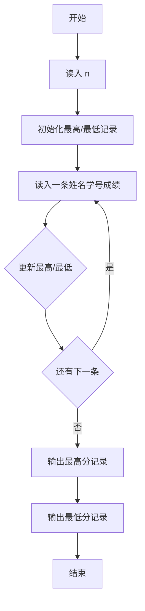
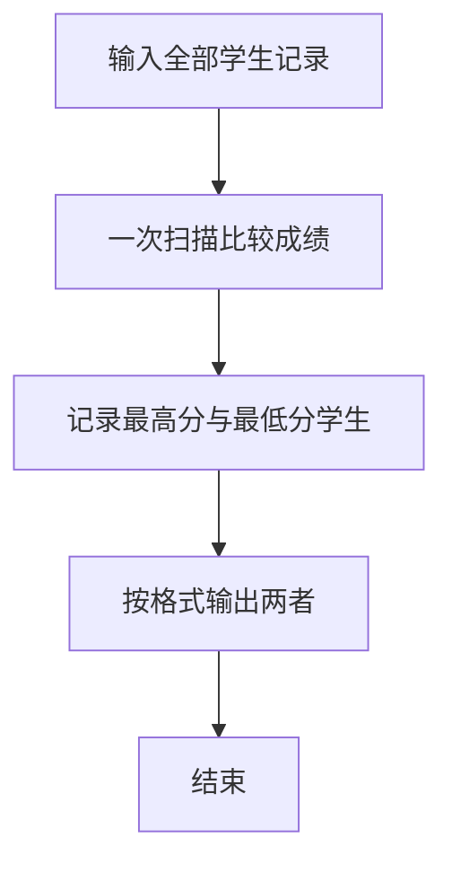

# 1004 成绩排名

- **分值：** 20分

### 题目描述

读入 $n$（$n>0$）名学生的姓名、学号、成绩，分别输出成绩最高和成绩最低学生的姓名和学号。

### 输入格式：

每个测试输入包含 1 个测试用例，格式为
```
第 1 行：正整数 $n$
第 2 行：第 1 个学生的姓名 学号 成绩
第 3 行：第 2 个学生的姓名 学号 成绩
  ... ... ...
第 $n+1$ 行：第 $n$ 个学生的姓名 学号 成绩
```
其中`姓名`和`学号`均为不超过 10 个字符的字符串，成绩为 0 到 100 之间的一个整数，这里保证在一组测试用例中没有两个学生的成绩是相同的。

### 输出格式：

对每个测试用例输出 2 行，第 1 行是成绩最高学生的姓名和学号，第 2 行是成绩最低学生的姓名和学号，字符串间有 1 个空格。

### 输入样例：
```
3
Joe Math990112 89
Mike CS991301 100
Mary EE990830 95
```

### 输出样例：
```
Mike CS991301
Joe Math990112
```


### 解题思路

本题的核心是：顺序扫描所有学生记录，维护当前最高分和最低分及对应信息。程序先读取题目输入，再按照上述规则完成数据处理，最后严格按照题目要求输出结果。实现时应优先根据题目约束选择合适的数据类型和数据结构，避免溢出或不必要的重复计算。

时间复杂度为 O(n)；空间复杂度取决于输入规模，主要用于保存题目数据和中间结果。

### 代码流程说明

1. 读入学生人数 n。
2. 逐条比较分数，维护最高分与最低分记录。
3. 先输出最高分学生，再输出最低分学生。

### 代码实现

```ruby
# 题目：1004-成绩排名
# 实现原理：
# 本题的核心是：顺序扫描所有学生记录，维护当前最高分和最低分及对应信息
# 时间复杂度为 O(n)；空间复杂度取决于输入规模，主要用于保存题目数据和中间结果。
# 代码步骤：
# 1. 读取输入并初始化必要的数据结构。
# 2. 按题意完成核心计算，处理边界情况。
# 3. 按题目要求格式化并输出结果。
#
tokens = STDIN.read.split
count = tokens.shift.to_i
highest = nil
lowest = nil

count.times do
  name, student_id, score = tokens.shift(3)
  record = [name, student_id, score.to_i]
  highest = record if highest.nil? || record[2] > highest[2]
  lowest = record if lowest.nil? || record[2] < lowest[2]
end

puts highest[0, 2].join(" ")
puts lowest[0, 2].join(" ")
```

### 代码流程图



### 解题流程图



### 常见易错点

- 输出顺序是先最高后最低。
- 分数可能相同，按扫描到的更新规则保持与题面一致。
- 姓名和学号是字符串，不要转成数字。
