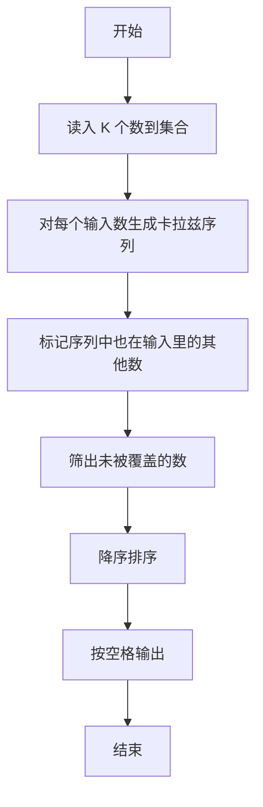
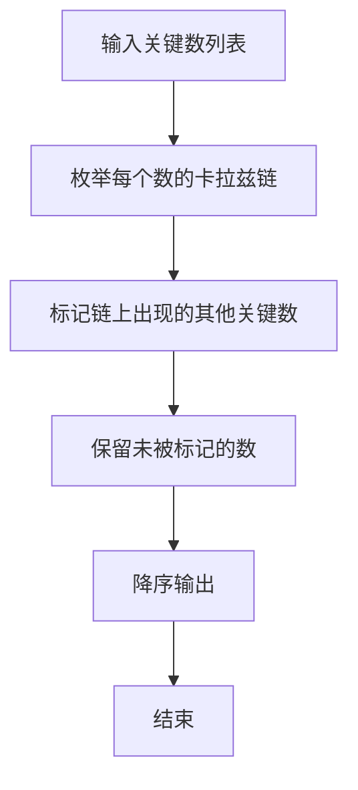

# 1005 继续(3n+1)猜想

- **分值：** 25分

### 题目描述

卡拉兹(Callatz)猜想已经在1001中给出了描述。在这个题目里，情况稍微有些复杂。

当我们验证卡拉兹猜想的时候，为了避免重复计算，可以记录下递推过程中遇到的每一个数。例如对 $n=3$ 进行验证的时候，我们需要计算 3、5、8、4、2、1，则当我们对 $n=5$、8、4、2 进行验证的时候，就可以直接判定卡拉兹猜想的真伪，而不需要重复计算，因为这 4 个数已经在验证3的时候遇到过了，我们称 5、8、4、2 是被 3“覆盖”的数。我们称一个数列中的某个数 $n$ 为“关键数”，如果 $n$ 不能被数列中的其他数字所覆盖。

现在给定一系列待验证的数字，我们只需要验证其中的几个关键数，就可以不必再重复验证余下的数字。你的任务就是找出这些关键数字，并按从大到小的顺序输出它们。

### 输入格式：

每个测试输入包含 1 个测试用例，第 1 行给出一个正整数 $K$（$K<100$），第 2 行给出 $K$ 个互不相同的待验证的正整数 $n$（$1<n\le 100$）的值，数字间用空格隔开。

### 输出格式：

每个测试用例的输出占一行，按从大到小的顺序输出关键数字。数字间用 1 个空格隔开，但一行中最后一个数字后没有空格。

### 输入样例：
```
6
3 5 6 7 8 11
```

### 输出样例：
```
7 6
```


### 解题思路
本题的核心是：先标记被其他数覆盖的数，再对剩余数按降序输出。程序先读取题目输入，再按照上述规则完成数据处理，最后严格按照题目要求输出结果。实现时应优先根据题目约束选择合适的数据类型和数据结构，避免溢出或不必要的重复计算。

时间复杂度为 O(n²)；空间复杂度取决于输入规模，主要用于保存题目数据和中间结果。

### 代码流程说明

1. 读入 K 个整数。
2. 对每个数执行卡拉兹序列，标记序列中出现的其他输入数。
3. 将未被标记的数按降序输出。

### 代码实现

```ruby
# 题目：1005-继续(3n+1)猜想
# 实现原理：
# 按照题目规则读取输入，完成核心计算并输出结果。
# 时间复杂度和空间复杂度取决于题目输入规模。
# 代码步骤：
# 1. 读取输入并初始化必要的数据结构。
# 2. 按题意完成核心计算，处理边界情况。
# 3. 按题目要求格式化并输出结果。
#
tokens = STDIN.read.split.map(&:to_i)
values = tokens.drop(1)
covered = {}

values.each do |value|
  current = value
  first = true
  while current != 1
    covered[current] = true unless first
    current = current.odd? ? (3 * current + 1) / 2 : current / 2
    first = false
  end
end

puts values.reject { |value| covered[value] }.sort.reverse.join(" ")
```

### 代码流程图



### 解题流程图



### 常见易错点

- 某数覆盖自己时不要把自己标成“被覆盖”。
- 序列中间结果若不在输入集合中，不影响标记。
- 输出降序，且最后一个数后不要多余空格。
