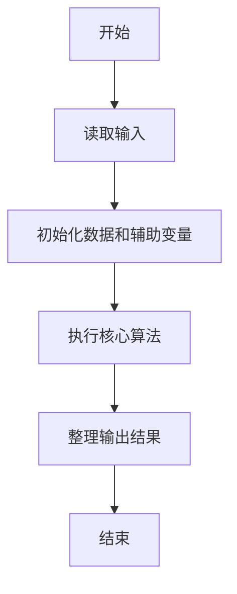
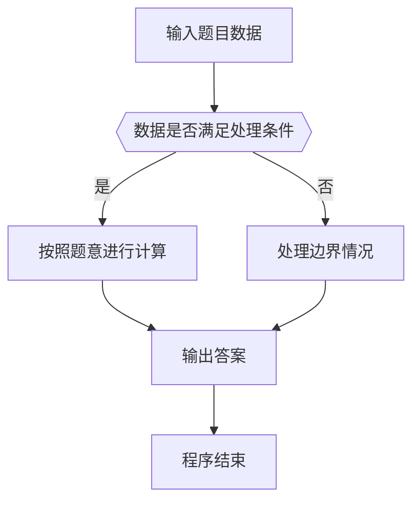

# 1006 换个格式输出整数

- **分值：** 15分

### 题目描述

让我们用字母 `B` 来表示“百”、字母 `S` 表示“十”，用 `12...n` 来表示不为零的个位数字 `n`（$<10$），换个格式来输出任一个不超过 3 位的正整数。例如 `234` 应该被输出为 `BBSSS1234`，因为它有 2 个“百”、3 个“十”、以及个位的 4。

### 输入格式：

每个测试输入包含 1 个测试用例，给出正整数 $n$（$<1000$）。

### 输出格式：

每个测试用例的输出占一行，用规定的格式输出 $n$。

### 输入样例 1：
```
234
```

### 输出样例 1：
```
BBSSS1234
```

### 输入样例 2：
```
23
```

### 输出样例 2：
```
SS123
```


### 解题思路

本题的核心是：分别输出相应数量的 `B`、`S` 和个位数字，构造题目要求的格式。程序先读取题目输入，再按照上述规则完成数据处理，最后严格按照题目要求输出结果。实现时应优先根据题目约束选择合适的数据类型和数据结构，避免溢出或不必要的重复计算。

时间复杂度为 O(n)；空间复杂度为 O(1)。

### 代码流程说明

1. 读取 1006 换个格式输出整数 所需的输入数据。
2. 初始化计数器、数组或其他辅助变量。
3. 分别输出相应数量的 `B`、`S` 和个位数字，构造题目要求的格式。
4. 按题目规定的格式输出计算结果。

### 代码实现

```ruby
# 题目：1006-换个格式输出整数
# 实现原理：
# 本题的核心是：分别输出相应数量的 `B`、`S` 和个位数字，构造题目要求的格式。程序先读取题目输入，再按照上述规则完成数据处理，最后严格按照题目要求输出结果。实现时应优先根据题目约束选择合适的数据类型和数据结构，避免溢出或不必要的重复计算。
# 时间复杂度为 O(n)；空间复杂度为 O(1)。
# 代码步骤：
# 1. 读取输入并初始化必要的数据结构。
# 2. 按题意完成核心计算，处理边界情况。
# 3. 按题目要求格式化并输出结果。
#
number = STDIN.read.to_i
result = "B" * (number / 100)
result << "S" * ((number / 10) % 10)
result << (1..(number % 10)).to_a.join unless number % 10 == 0
puts result
```

### 代码流程图



### 解题流程图



### 常见易错点

- 注意输入数据的范围，选择足够大的整数类型，并正确处理边界值。
- 循环、数组下标和字符串结束位置要严格对应题目定义，避免越界。
- 输出格式必须与题目要求完全一致，包括空格、换行、大小写和特殊符号。
- 如果存在排序、去重、进位、约分或四舍五入等操作，应在输出前统一完成。
