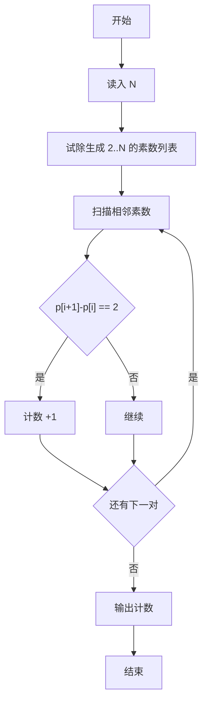
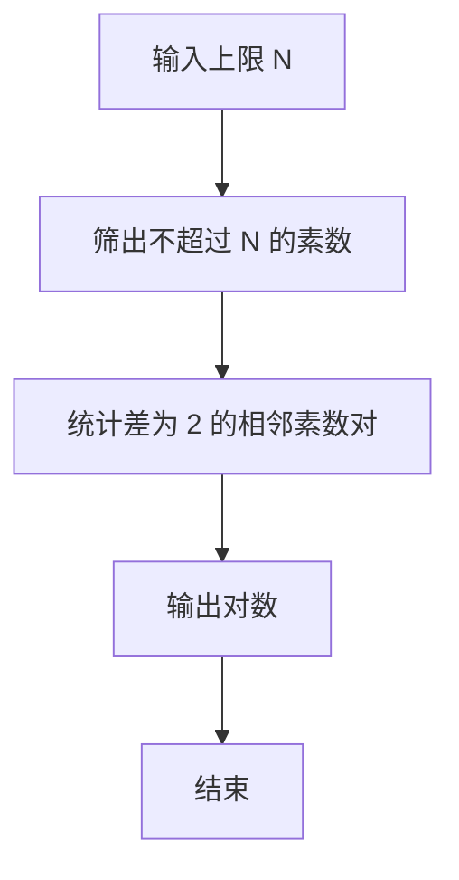

# 1007 素数对猜想

- **分值：** 20分

### 题目描述

让我们定义 $d_n$ 为：$d_n=p_{n+1}-p_n$，其中 $p_i$ 是第 $i$ 个素数。显然有 $d_1=1$，且对于 $n>1$ 有 $d_n$ 是偶数。“素数对猜想”认为“存在无穷多对相邻且差为 2 的素数”。

现给定任意正整数 $N$（$N<10^5$），请计算不超过 $N$ 的满足猜想的素数对的个数。

### 输入格式：

输入在一行给出正整数`N`。

### 输出格式：

在一行中输出不超过`N`的满足猜想的素数对的个数。

### 输入样例：
```
20
```

### 输出样例：
```
4
```


### 解题思路

本题的核心是：用试除法判断素数，枚举相邻整数并统计同时为素数的情况。程序先读取题目输入，再按照上述规则完成数据处理，最后严格按照题目要求输出结果。实现时应优先根据题目约束选择合适的数据类型和数据结构，避免溢出或不必要的重复计算。

时间复杂度为 O(n√n)；空间复杂度取决于输入规模，主要用于保存题目数据和中间结果。

### 代码流程说明

1. 读入 N。
2. 用试除法生成不超过 N 的素数表。
3. 统计相邻素数差为 2 的对数。

### 代码实现

```ruby
# 题目：1007-素数对猜想
# 实现原理：
# 本题的核心是：用试除法判断素数，枚举相邻整数并统计同时为素数的情况
# 时间复杂度为 O(n√n)；空间复杂度取决于输入规模，主要用于保存题目数据和中间结果。
# 代码步骤：
# 1. 读取输入并初始化必要的数据结构。
# 2. 按题意完成核心计算，处理边界情况。
# 3. 按题目要求格式化并输出结果。
#
limit = STDIN.read.to_i

prime = lambda do |number|
  next false if number < 2
  next true if number == 2
  next false if number.even?

  divisor = 3
      while divisor * divisor <= number
        return false if (number % divisor).zero?
        divisor += 2
      end
  true
end

answer = limit >= 4 ? (2..(limit - 2)).count { |value| prime.call(value) && prime.call(value + 2) } : 0
puts answer
```

### 代码流程图



### 解题流程图



### 常见易错点

- 1 不是素数。
- 只统计相邻素数对，不要任意两素数。
- N 较小时可能答案为 0。
