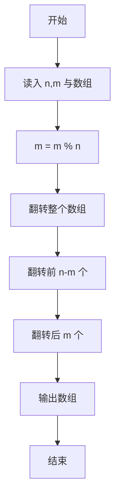
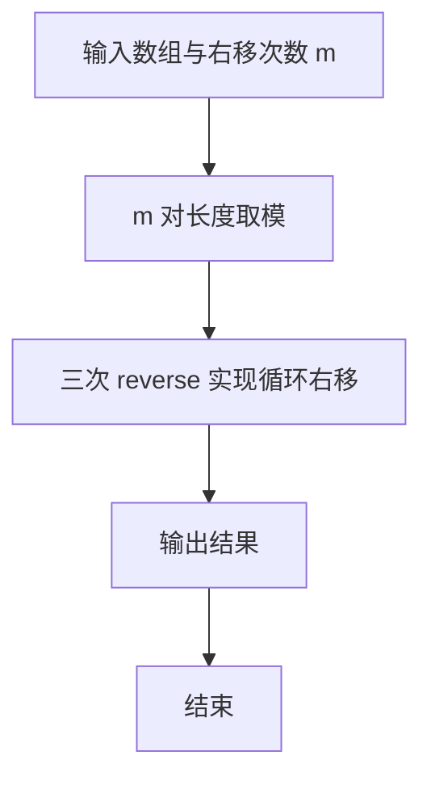

# 1008 数组元素循环右移问题

- **分值：** 20分

### 题目描述

一个数组 $A$ 中存有 $N$（$N>0$）个整数，在不允许使用另外数组的前提下，将每个整数循环向右移 $M$（$M\ge 0$）个位置，即将 $A$ 中的数据由（$A_0 A_1 \cdots A_{N-1}$）变换为（$A_{N-M} \cdots A_{N-1} A_0 A_1 \cdots A_{N-M-1}$）（最后 $M$ 个数循环移至最前面的 $M$ 个位置）。如果需要考虑程序移动数据的次数尽量少，要如何设计移动的方法？

### 输入格式：

每个输入包含一个测试用例，第 1 行输入 $N$（$1\le N\le 100$）和 $M$（$M\ge 0$）；第 2 行输入 $N$ 个整数，之间用空格分隔。

### 输出格式：

在一行中输出循环右移$M$位以后的整数序列，之间用空格分隔，序列结尾不能有多余空格。

### 输入样例：
```
6 2
1 2 3 4 5 6
```

### 输出样例：
```
5 6 1 2 3 4
```


### 解题思路

本题的核心是：通过三次区间翻转实现整体右移，额外空间为常数。程序先读取题目输入，再按照上述规则完成数据处理，最后严格按照题目要求输出结果。实现时应优先根据题目约束选择合适的数据类型和数据结构，避免溢出或不必要的重复计算。

时间复杂度为 O(n)；空间复杂度取决于输入规模，主要用于保存题目数据和中间结果。

### 代码流程说明

1. 读入数组长度 n 与右移位数 m，m 取模 n。
2. 依次翻转 [0,n)、[0,n-m)、[n-m,n)。
3. 输出数组。

### 代码实现

```ruby
# 题目：1008-数组元素循环右移问题
# 实现原理：
# 本题的核心是：通过三次区间翻转实现整体右移，额外空间为常数
# 时间复杂度为 O(n)；空间复杂度取决于输入规模，主要用于保存题目数据和中间结果。
# 代码步骤：
# 1. 读取输入并初始化必要的数据结构。
# 2. 按题意完成核心计算，处理边界情况。
# 3. 按题目要求格式化并输出结果。
#
tokens = STDIN.read.split.map(&:to_i)
length, move = tokens.shift(2)
values = tokens.first(length)
move %= length
rotated = move.zero? ? values : values[-move, move] + values[0, length - move]
puts rotated.join(" ")
```

### 代码流程图



### 解题流程图



### 常见易错点

- m 可能大于 n，必须先取模。
- m=0 时数组不变。
- 三次翻转顺序不能颠倒。
