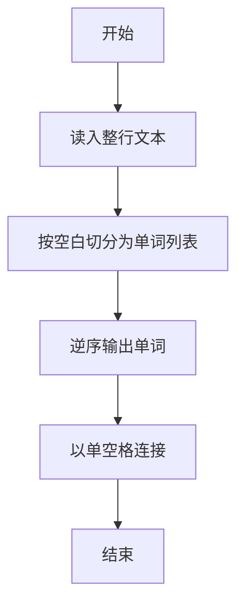
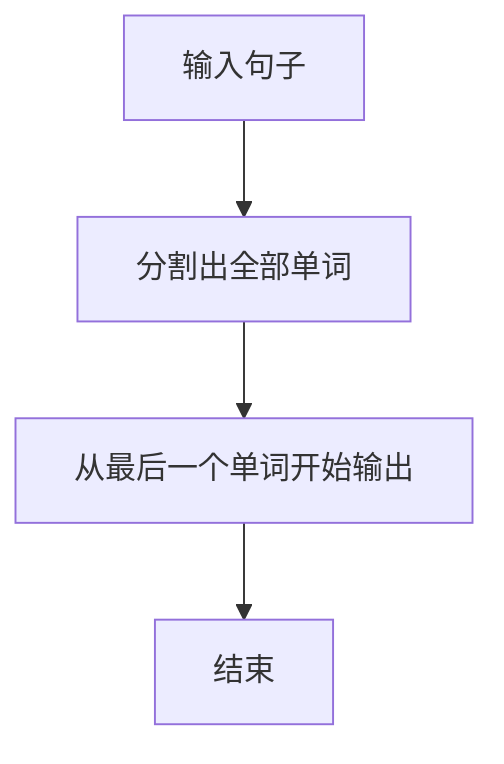

# 1009 说反话

- **分值：** 20分

### 题目描述

给定一句英语，要求你编写程序，将句中所有单词的顺序颠倒输出。

### 输入格式：

测试输入包含一个测试用例，在一行内给出总长度不超过 80 的字符串。字符串由若干单词和若干空格组成，其中单词是由英文字母（大小写有区分）组成的字符串，单词之间用 1 个空格分开，输入保证句子末尾没有多余的空格。

### 输出格式：

每个测试用例的输出占一行，输出倒序后的句子。

### 输入样例：
```
Hello World Here I Come

```

### 输出样例：
```
Come I Here World Hello

```

**鸣谢用户 无影 修正数据！**


### 解题思路

本题的核心是：按空白分割单词并从后向前输出。程序先读取题目输入，再按照上述规则完成数据处理，最后严格按照题目要求输出结果。实现时应优先根据题目约束选择合适的数据类型和数据结构，避免溢出或不必要的重复计算。

时间复杂度为 O(L)；空间复杂度取决于输入规模，主要用于保存题目数据和中间结果。

### 代码流程说明

1. 读入一行，按空白切分单词。
2. 逆序遍历单词。
3. 用单个空格连接输出。

### 代码实现

```ruby
# 题目：1009-说反话
# 实现原理：
# 本题的核心是：按空白分割单词并从后向前输出
# 时间复杂度为 O(L)；空间复杂度取决于输入规模，主要用于保存题目数据和中间结果。
# 代码步骤：
# 1. 读取输入并初始化必要的数据结构。
# 2. 按题意完成核心计算，处理边界情况。
# 3. 按题目要求格式化并输出结果。
#
puts STDIN.read.split.reverse.join(" ")
```

### 代码流程图



### 解题流程图



### 常见易错点

- 单词间可能多个空格，分割后再输出单空格。
- 若只有一个单词则原样输出。
- 行尾不要多余空格。
