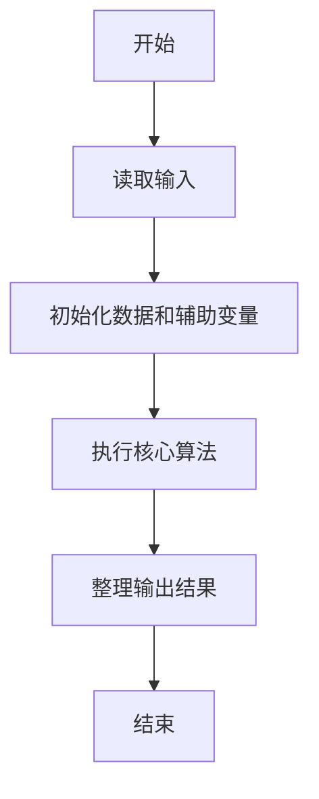
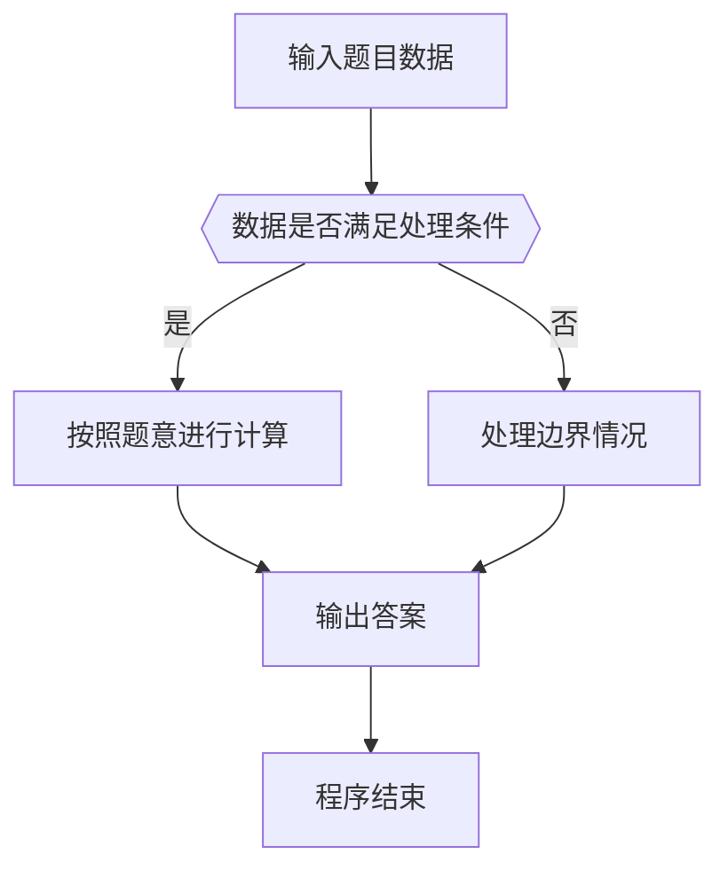

# 1010 一元多项式求导

- **分值：** 25分

### 题目描述

设计函数求一元多项式的导数。（注：当 $n$ 为整数时，$x^n$ 的一阶导数为 $n x^{n-1}$。）

### 输入格式：

以指数递降方式输入多项式非零项系数和指数（绝对值均为不超过 1000 的整数）。数字间以空格分隔。

### 输出格式：

以与输入相同的格式输出导数多项式非零项的系数和指数。数字间以空格分隔，但结尾不能有多余空格。注意“零多项式”的指数和系数都是 0，但是表示为 `0 0`。

### 输入样例：
```
3 4 -5 2 6 1 -2 0
```

### 输出样例：
```
12 3 -10 1 6 0
```


### 解题思路

本题的核心是：每次读取系数和指数，输出导数项的系数与指数。程序先读取题目输入，再按照上述规则完成数据处理，最后严格按照题目要求输出结果。实现时应优先根据题目约束选择合适的数据类型和数据结构，避免溢出或不必要的重复计算。

时间复杂度为 O(n)；空间复杂度取决于输入规模，主要用于保存题目数据和中间结果。

### 代码流程说明

1. 读取 1010 一元多项式求导 所需的输入数据。
2. 初始化计数器、数组或其他辅助变量。
3. 每次读取系数和指数，输出导数项的系数与指数。
4. 按题目规定的格式输出计算结果。

### 代码实现

```ruby
# 题目：1010-一元多项式求导
# 实现原理：
# 本题的核心是：每次读取系数和指数，输出导数项的系数与指数。程序先读取题目输入，再按照上述规则完成数据处理，最后严格按照题目要求输出结果。实现时应优先根据题目约束选择合适的数据类型和数据结构，避免溢出或不必要的重复计算。
# 时间复杂度为 O(n)；空间复杂度取决于输入规模，主要用于保存题目数据和中间结果。
# 代码步骤：
# 1. 读取输入并初始化必要的数据结构。
# 2. 按题意完成核心计算，处理边界情况。
# 3. 按题目要求格式化并输出结果。
#
values = STDIN.read.split.map(&:to_i)
result = []

values.each_slice(2) do |coefficient, exponent|
  next if exponent.nil? || exponent.zero?

  result.concat([coefficient * exponent, exponent - 1])
end

puts(result.empty? ? "0 0" : result.join(" "))
```

### 代码流程图



### 解题流程图



### 常见易错点

- 注意输入数据的范围，选择足够大的整数类型，并正确处理边界值。
- 循环、数组下标和字符串结束位置要严格对应题目定义，避免越界。
- 输出格式必须与题目要求完全一致，包括空格、换行、大小写和特殊符号。
- 如果存在排序、去重、进位、约分或四舍五入等操作，应在输出前统一完成。
