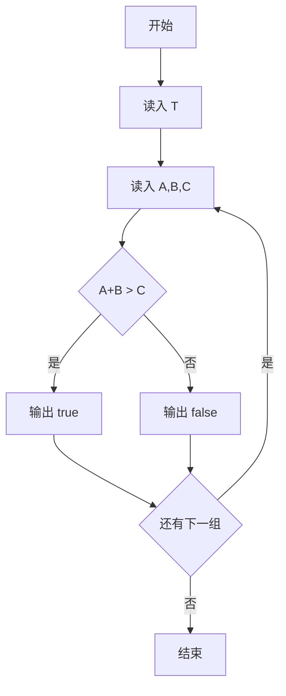
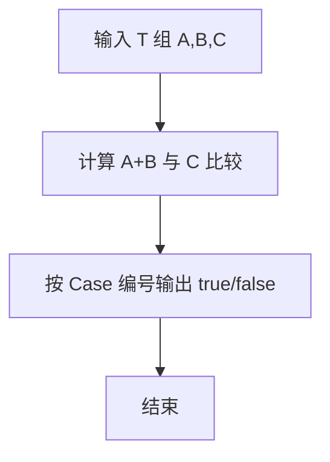

# 1011 A+B 和 C

- **分值：** 15分

### 题目描述

给定区间 $[-2^{31}, 2^{31}]$ 内的 3 个整数 $A$、$B$ 和 $C$，请判断 $A+B$ 是否大于 $C$。

### 输入格式：

输入第 1 行给出正整数 $T$（$T\le 10$），是测试用例的个数。随后给出 $T$ 组测试用例，每组占一行，顺序给出 $A$、$B$ 和 $C$。整数间以空格分隔。

### 输出格式：

对每组测试用例，在一行中输出 `Case #X: true` 如果 $A+B>C$，否则输出 `Case #X: false`，其中 `X` 是测试用例的编号（从 1 开始）。

### 输入样例：
```
4
1 2 3
2 3 4
2147483647 0 2147483646
0 -2147483648 -2147483647
```

### 输出样例：
```
Case #1: false
Case #2: true
Case #3: true
Case #4: false
```


### 解题思路

本题的核心是：使用大整数读取每组的 A、B、C，判断 A+B 是否大于 C。程序先读取题目输入，再按照上述规则完成数据处理，最后严格按照题目要求输出结果。实现时应优先根据题目约束选择合适的数据类型和数据结构，避免溢出或不必要的重复计算。

时间复杂度为 O(T)；空间复杂度为 O(1)。

### 代码流程说明

1. 读入测试用例组数 T。
2. 每组读取 A、B、C（Ruby Integer 可直接容纳 32 位边界）。
3. 输出 Case #i: true/false。

### 代码实现

```ruby
# 题目：1011-A+B 和 C
# 实现原理：
# 本题的核心是：使用大整数读取每组的 A、B、C，判断 A+B 是否大于 C
# 时间复杂度为 O(T)；空间复杂度为 O(1)。
# 代码步骤：
# 1. 读取输入并初始化必要的数据结构。
# 2. 按题意完成核心计算，处理边界情况。
# 3. 按题目要求格式化并输出结果。
#
tokens = STDIN.read.split.map(&:to_i)
count = tokens.shift

count.times do |index|
  a, b, c = tokens.shift(3)
  result = a + b > c ? "true" : "false"
  puts "Case ##{index + 1}: #{result}"
end
```

### 代码流程图



### 解题流程图



### 常见易错点

- A、B、C 可达 2^31，注意用能表示该范围的整数（Ruby 原生即可）。
- 输出大小写必须是 true/false。
- Case 编号从 1 开始。
