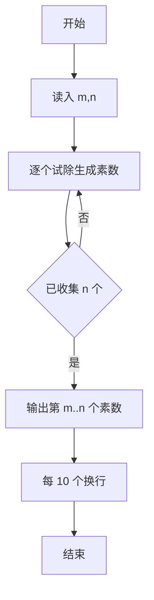
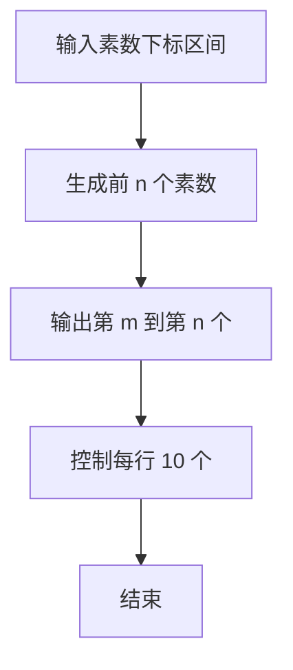

# 1013 数素数

- **分值：** 20分

### 题目描述

令 $P_i$ 表示第 $i$ 个素数。现任给两个正整数 $M$ 和 $N$，满足 $M\le N\le 10^4$，请输出 $P_M$ 到 $P_N$ 的所有素数。

### 输入格式：

输入在一行中给出 $M$ 和 $N$，其间以空格分隔。

### 输出格式：

输出从 $P_M$ 到 $P_N$ 的所有素数，每 10 个数字占 1 行，其间以空格分隔，但行末不得有多余空格。

### 输入样例：
```
5 27
```

### 输出样例：
```
11 13 17 19 23 29 31 37 41 43
47 53 59 61 67 71 73 79 83 89
97 101 103
```


### 解题思路

本题的核心是：从 2 开始试除生成素数，输出指定下标区间。程序先读取题目输入，再按照上述规则完成数据处理，最后严格按照题目要求输出结果。实现时应优先根据题目约束选择合适的数据类型和数据结构，避免溢出或不必要的重复计算。

时间复杂度为 O(p√m)；空间复杂度取决于输入规模，主要用于保存题目数据和中间结果。

### 代码流程说明

1. 读入区间下标 m、n（1-based）。
2. 生成至少 n 个素数。
3. 输出第 m 到第 n 个素数，每行 10 个。

### 代码实现

```ruby
# 题目：1013-数素数
# 实现原理：
# 本题的核心是：从 2 开始试除生成素数，输出指定下标区间
# 时间复杂度为 O(p√m)；空间复杂度取决于输入规模，主要用于保存题目数据和中间结果。
# 代码步骤：
# 1. 读取输入并初始化必要的数据结构。
# 2. 按题意完成核心计算，处理边界情况。
# 3. 按题目要求格式化并输出结果。
#
first, last = STDIN.read.split.map(&:to_i)
primes = []
candidate = 2
until primes.length >= last
  prime = candidate < 4 || (candidate.odd? && (3..Math.sqrt(candidate).to_i).step(2).none? { |d| (candidate % d).zero? })
  primes << candidate if prime
  candidate += 1
end
selected = primes[(first - 1)..(last - 1)]
selected.each_slice(10) { |group| puts group.join(" ") }
```

### 代码流程图



### 解题流程图



### 常见易错点

- 下标从 1 开始，第 1 个素数是 2。
- 输出格式是每行最多 10 个，空格分隔。
- 行尾不要多余空格。
