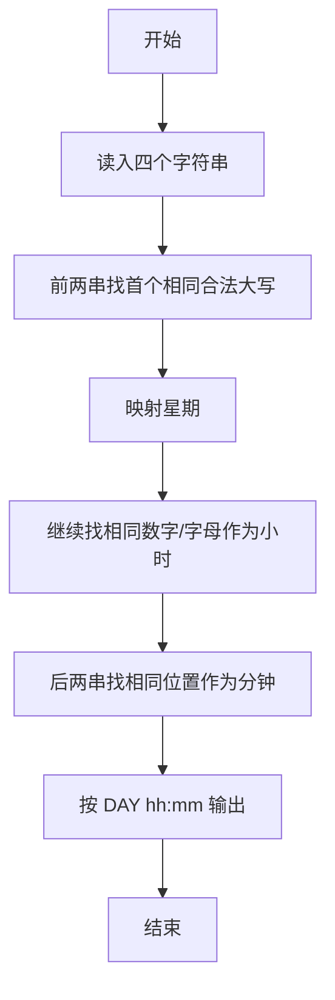
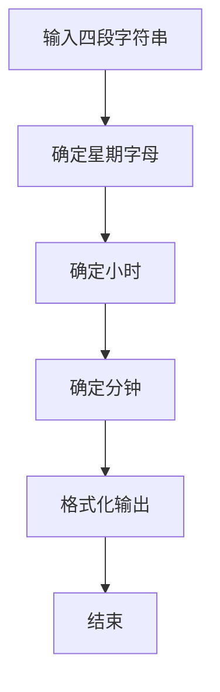

# 1014 福尔摩斯的约会

- **分值：** 20分

### 题目描述

大侦探福尔摩斯接到一张奇怪的字条：
```
我们约会吧！
3485djDkxh4hhGE
2984akDfkkkkggEdsb
s&hgsfdk
d&Hyscvnm
```
大侦探很快就明白了，字条上奇怪的乱码实际上就是约会的时间`星期四 14:04`，因为前面两字符串中第 1 对相同的大写英文字母（大小写有区分）是第 4 个字母 `D`，代表星期四；第 2 对相同的字符是 `E` ，那是第 5 个英文字母，代表一天里的第 14 个钟头（于是一天的 0 点到 23 点由数字 0 到 9、以及大写字母 `A` 到 `N` 表示）；后面两字符串第 1 对相同的英文字母 `s` 出现在第 4 个位置（从 0 开始计数）上，代表第 4 分钟。现给定两对字符串，请帮助福尔摩斯解码得到约会的时间。

### 输入格式：

输入在 4 行中分别给出 4 个非空、不包含空格、且长度不超过 60 的字符串。

### 输出格式：

在一行中输出约会的时间，格式为 `DAY HH:MM`，其中 `DAY` 是某星期的 3 字符缩写，即 `MON` 表示星期一，`TUE` 表示星期二，`WED` 表示星期三，`THU` 表示星期四，`FRI` 表示星期五，`SAT` 表示星期六，`SUN` 表示星期日。题目输入保证每个测试存在唯一解。

### 输入样例：
```
3485djDkxh4hhGE
2984akDfkkkkggEdsb
s&hgsfdk
d&Hyscvnm
```

### 输出样例：
```
THU 14:04
```


### 解题思路

本题的核心是：按顺序匹配前两串中的首个相同大写字母和数字，再匹配星期与分钟。程序先读取题目输入，再按照上述规则完成数据处理，最后严格按照题目要求输出结果。实现时应优先根据题目约束选择合适的数据类型和数据结构，避免溢出或不必要的重复计算。

时间复杂度为 O(L)；空间复杂度取决于输入规模，主要用于保存题目数据和中间结果。

### 代码流程说明

1. 扫描前两串，找第一对相同的大写字母（星期）。
2. 再往后找第一对相同的数字或字母（小时）。
3. 后两串匹配分钟，按格式输出。

### 代码实现

```ruby
# 题目：1014-福尔摩斯的约会
# 实现原理：
# 本题的核心是：按顺序匹配前两串中的首个相同大写字母和数字，再匹配星期与分钟
# 时间复杂度为 O(L)；空间复杂度取决于输入规模，主要用于保存题目数据和中间结果。
# 代码步骤：
# 1. 读取输入并初始化必要的数据结构。
# 2. 按题意完成核心计算，处理边界情况。
# 3. 按题目要求格式化并输出结果。
#
a, b, c, d = STDIN.read.split.map(&:chars)
first = a.each_index.find { |i| a[i] == b[i] && ("A".."G").include?(a[i]) }
second = ((first + 1)...a.length).find do |i|
  a[i] == b[i] && ("A".."N").include?(a[i]) || a[i] == b[i] && a[i].match?(/\d/)
end
hour = a[second].match?(/\d/) ? a[second].to_i : a[second].ord - "A".ord + 10
minute = c.each_index.find { |i| c[i] == d[i] && c[i].match?(/[A-Za-z]/) }
days = %w[MON TUE WED THU FRI SAT SUN]
puts format("%s %02d:%02d", days[a[first].ord - "A".ord], hour, minute)
```

### 代码流程图



### 解题流程图



### 常见易错点

- 星期字母范围是 A-G。
- 小时需转成 00-12 的两位数字。
- 分钟必须两位补零。
