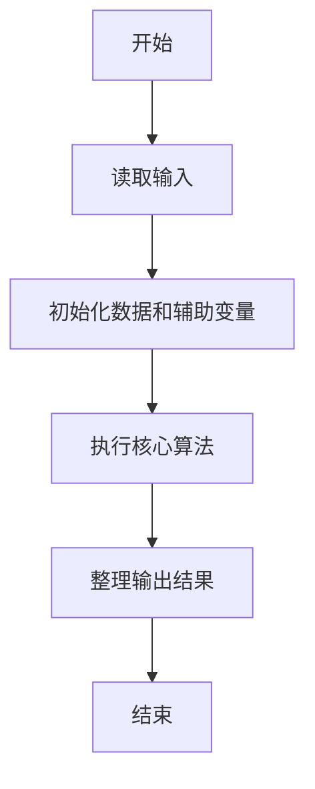
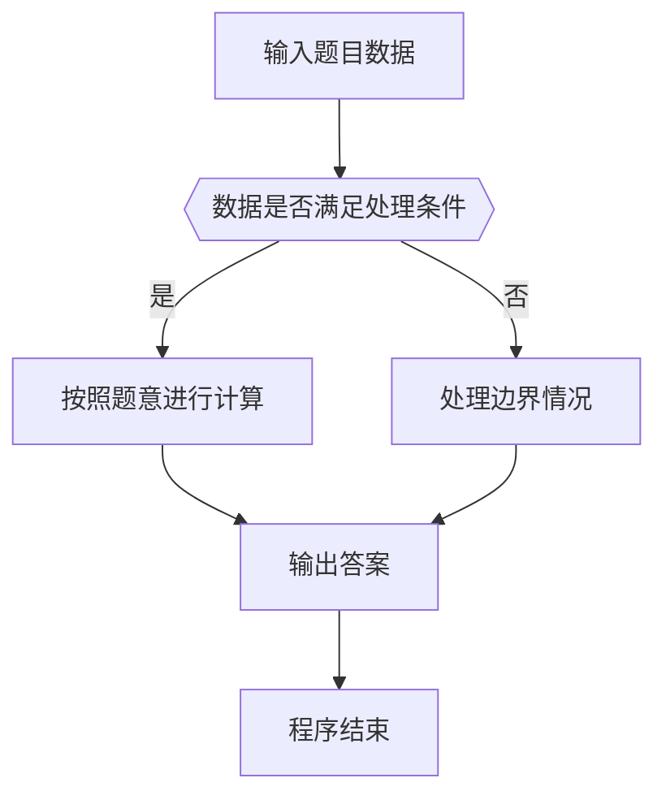

# 1015 德才论

- **分值：** 25分

### 题目描述

宋代史学家司马光在《资治通鉴》中有一段著名的“德才论”：“是故才德全尽谓之圣人，才德兼亡谓之愚人，德胜才谓之君子，才胜德谓之小人。凡取人之术，苟不得圣人，君子而与之，与其得小人，不若得愚人。”

现给出一批考生的德才分数，请根据司马光的理论给出录取排名。

### 输入格式：

输入第一行给出 3 个正整数，分别为：$N$（$N\le 10^5$），即考生总数；$L$（$L\ge 60$），为录取最低分数线，即德分和才分均不低于 $L$ 的考生才有资格被考虑录取；$H$（$H<100$），为优先录取线——德分和才分均不低于此线的被定义为“才德全尽”，此类考生按德才总分从高到低排序；才分不到但德分到优先录取线的一类考生属于“德胜才”，也按总分排序，但排在第一类考生之后；德才分均低于 $H$，但是德分不低于才分的考生属于“才德兼亡”但尚有“德胜才”者，按总分排序，但排在第二类考生之后；其他达到最低线 $L$ 的考生也按总分排序，但排在第三类考生之后。

随后 $N$ 行，每行给出一位考生的信息，包括：`准考证号 德分 才分`，其中`准考证号`为 8 位整数，德才分为区间 $[0,100]$ 内的整数。数字间以空格分隔。

### 输出格式：

输出第一行首先给出达到最低分数线的考生人数 $M$，随后 $M$ 行，每行按照输入格式输出一位考生的信息，考生按输入中说明的规则从高到低排序。当某类考生中有多人总分相同时，按其德分降序排列；若德分也并列，则按准考证号的升序输出。

### 输入样例：
```
14 60 80
10000001 64 90
10000002 90 60
10000011 85 80
10000003 85 80
10000004 80 85
10000005 82 77
10000006 83 76
10000007 90 78
10000008 75 79
10000009 59 90
10000010 88 45
10000012 80 100
10000013 90 99
10000014 66 60
```

### 输出样例：
```
12
10000013 90 99
10000012 80 100
10000003 85 80
10000011 85 80
10000004 80 85
10000007 90 78
10000006 83 76
10000005 82 77
10000002 90 60
10000014 66 60
10000008 75 79
10000001 64 90
```


### 解题思路

本题的核心是：按总分、德分和准则对考生分类排序，最后统一输出。程序先读取题目输入，再按照上述规则完成数据处理，最后严格按照题目要求输出结果。实现时应优先根据题目约束选择合适的数据类型和数据结构，避免溢出或不必要的重复计算。

时间复杂度为 O(n log n)；空间复杂度取决于输入规模，主要用于保存题目数据和中间结果。

### 代码流程说明

1. 读取 1015 德才论 所需的输入数据。
2. 初始化计数器、数组或其他辅助变量。
3. 按总分、德分和准则对考生分类排序，最后统一输出。
4. 按题目规定的格式输出计算结果。

### 代码实现

```ruby
# 题目：1015-德才论
# 实现原理：
# 本题的核心是：按总分、德分和准则对考生分类排序，最后统一输出。程序先读取题目输入，再按照上述规则完成数据处理，最后严格按照题目要求输出结果。实现时应优先根据题目约束选择合适的数据类型和数据结构，避免溢出或不必要的重复计算。
# 时间复杂度为 O(n log n)；空间复杂度取决于输入规模，主要用于保存题目数据和中间结果。
# 代码步骤：
# 1. 读取输入并初始化必要的数据结构。
# 2. 按题意完成核心计算，处理边界情况。
# 3. 按题目要求格式化并输出结果。
#
tokens = STDIN.read.split
count, lower, higher = tokens.shift(3).map(&:to_i)
students = []

count.times do
  id, virtue, talent = tokens.shift(3)
  virtue = virtue.to_i
  talent = talent.to_i
  next if virtue < lower || talent < lower

  category = if virtue >= higher && talent >= higher
               4
             elsif virtue >= higher
               3
             elsif virtue >= talent
               2
             else
               1
             end
  students << [category, virtue + talent, virtue, id, talent]
end

students.sort_by! { |category, total, virtue, id, _| [-category, -total, -virtue, id] }
puts students.length
students.each { |_, _, virtue, id, talent| puts "#{id} #{virtue} #{talent}" }
```

### 代码流程图



### 解题流程图



### 常见易错点

- 注意输入数据的范围，选择足够大的整数类型，并正确处理边界值。
- 循环、数组下标和字符串结束位置要严格对应题目定义，避免越界。
- 输出格式必须与题目要求完全一致，包括空格、换行、大小写和特殊符号。
- 如果存在排序、去重、进位、约分或四舍五入等操作，应在输出前统一完成。
