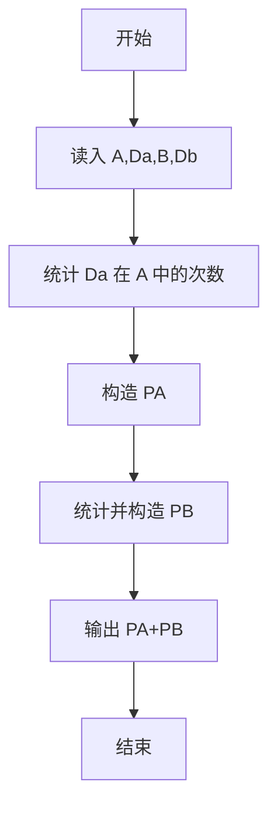
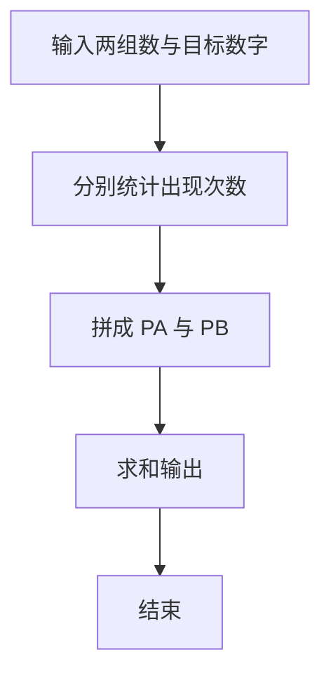

# 1016 部分A+B

- **分值：** 15分

### 题目描述

正整数 $A$ 的“$D_A$（为 1 位整数）部分”定义为由 $A$ 中所有 $D_A$ 组成的新整数 $P_A$。例如：给定 $A = 3862767$，$D_A = 6$，则 $A$ 的“6 部分”$P_A$ 是 66，因为 $A$ 中有 2 个 6。

现给定 $A$、$D_A$、$B$、$D_B$，请编写程序计算 $P_A + P_B$。

### 输入格式：

输入在一行中依次给出 $A$、$D_A$、$B$、$D_B$，中间以空格分隔，其中 $0 < A, B < 10^{9}$。

### 输出格式：

在一行中输出 $P_A + P_B$ 的值。

### 输入样例 1：
```
3862767 6 13530293 3

```

### 输出样例 1：
```
399

```

### 输入样例 2：
```
3862767 1 13530293 8

```

### 输出样例 2：
```
0

```

**鸣谢用户 George Hu 修正数据范围！**


### 解题思路

本题的核心是：分别提取两数中指定数字出现的次数，再按十进制位权拼接。程序先读取题目输入，再按照上述规则完成数据处理，最后严格按照题目要求输出结果。实现时应优先根据题目约束选择合适的数据类型和数据结构，避免溢出或不必要的重复计算。

时间复杂度为 O(L)；空间复杂度取决于输入规模，主要用于保存题目数据和中间结果。

### 代码流程说明

1. 读入 A、Da、B、Db。
2. 统计 Da 在 A 中的出现次数 cntA，构造 PA=Da 重复 cntA 次。
3. 同理 PB，输出 PA+PB。

### 代码实现

```ruby
# 题目：1016-部分A+B
# 实现原理：
# 本题的核心是：分别提取两数中指定数字出现的次数，再按十进制位权拼接
# 时间复杂度为 O(L)；空间复杂度取决于输入规模，主要用于保存题目数据和中间结果。
# 代码步骤：
# 1. 读取输入并初始化必要的数据结构。
# 2. 按题意完成核心计算，处理边界情况。
# 3. 按题目要求格式化并输出结果。
#
a, digit_a, b, digit_b = STDIN.read.split
part = lambda do |number, digit|
  chars = number.chars.select { |char| char == digit }
  chars.empty? ? 0 : chars.join.to_i
end
puts part.call(a, digit_a) + part.call(b, digit_b)
```

### 代码流程图



### 解题流程图



### 常见易错点

- 次数为 0 时 PA/PB 为 0，和为另一个数。
- 按十进制位权拼接，不是把数字直接相乘次数。
- 输入可能是长数字串，按字符串处理更稳。
