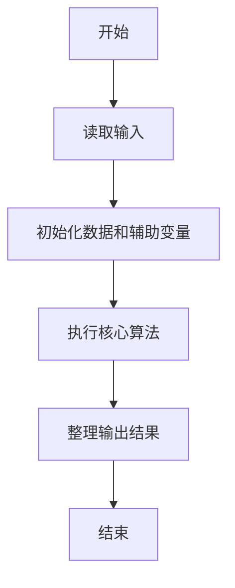
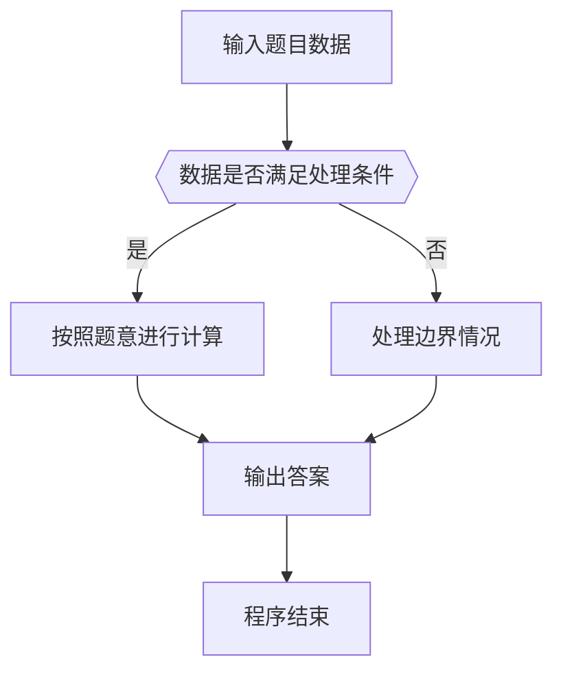

# 1019 数字黑洞

- **分值：** 20分

### 题目描述

给定任一个各位数字不完全相同的 4 位正整数，如果我们先把 4 个数字按非递增排序，再按非递减排序，然后用第 1 个数字减第 2 个数字，将得到一个新的数字。一直重复这样做，我们很快会停在有“数字黑洞”之称的 `6174`，这个神奇的数字也叫 Kaprekar 常数。

例如，我们从`6767`开始，将得到
```
7766 - 6677 = 1089
9810 - 0189 = 9621
9621 - 1269 = 8352
8532 - 2358 = 6174
7641 - 1467 = 6174
... ...
```

现给定任意 4 位正整数，请编写程序演示到达黑洞的过程。

### 输入格式：

输入给出一个区间 $[0,10^4)$ 内的正整数 $N$。

### 输出格式：

如果 $N$ 的 4 位数字全相等，则在一行内输出 `N - N = 0000`；否则将计算的每一步在一行内输出，直到 `6174` 作为差出现，输出格式见样例。注意每个数字按 `4` 位数格式输出。

### 输入样例 1：
```
6767
```

### 输出样例 1：
```
7766 - 6677 = 1089
9810 - 0189 = 9621
9621 - 1269 = 8352
8532 - 2358 = 6174
```

### 输入样例 2：
```
2222
```

### 输出样例 2：
```
2222 - 2222 = 0000
```


### 解题思路

本题的核心是：反复将数字的降序排列数减去升序排列数，直到 6174 或 0。程序先读取题目输入，再按照上述规则完成数据处理，最后严格按照题目要求输出结果。实现时应优先根据题目约束选择合适的数据类型和数据结构，避免溢出或不必要的重复计算。

时间复杂度为 O(k)；空间复杂度取决于输入规模，主要用于保存题目数据和中间结果。

### 代码流程说明

1. 读取 1019 数字黑洞 所需的输入数据。
2. 初始化计数器、数组或其他辅助变量。
3. 反复将数字的降序排列数减去升序排列数，直到 6174 或 0。
4. 按题目规定的格式输出计算结果。

### 代码实现

```ruby
# 题目：1019-数字黑洞
# 实现原理：
# 本题的核心是：反复将数字的降序排列数减去升序排列数，直到 6174 或 0。程序先读取题目输入，再按照上述规则完成数据处理，最后严格按照题目要求输出结果。实现时应优先根据题目约束选择合适的数据类型和数据结构，避免溢出或不必要的重复计算。
# 时间复杂度为 O(k)；空间复杂度取决于输入规模，主要用于保存题目数据和中间结果。
# 代码步骤：
# 1. 读取输入并初始化必要的数据结构。
# 2. 按题意完成核心计算，处理边界情况。
# 3. 按题目要求格式化并输出结果。
#
number = STDIN.read.to_i
loop do
  digits = format("%04d", number).chars
  high = digits.sort.reverse.join.to_i
  low = digits.sort.join.to_i
  number = high - low
  puts format("%04d - %04d = %04d", high, low, number)
  break if number.zero? || number == 6174
end
```

### 代码流程图



### 解题流程图



### 常见易错点

- 注意输入数据的范围，选择足够大的整数类型，并正确处理边界值。
- 循环、数组下标和字符串结束位置要严格对应题目定义，避免越界。
- 输出格式必须与题目要求完全一致，包括空格、换行、大小写和特殊符号。
- 如果存在排序、去重、进位、约分或四舍五入等操作，应在输出前统一完成。
