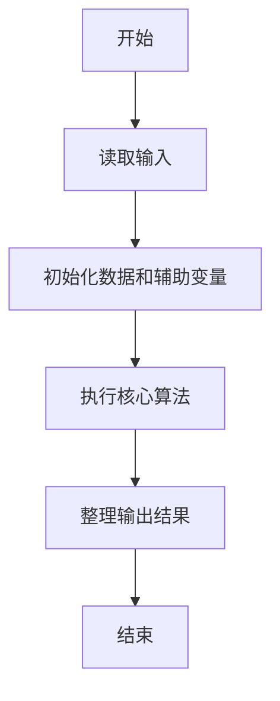
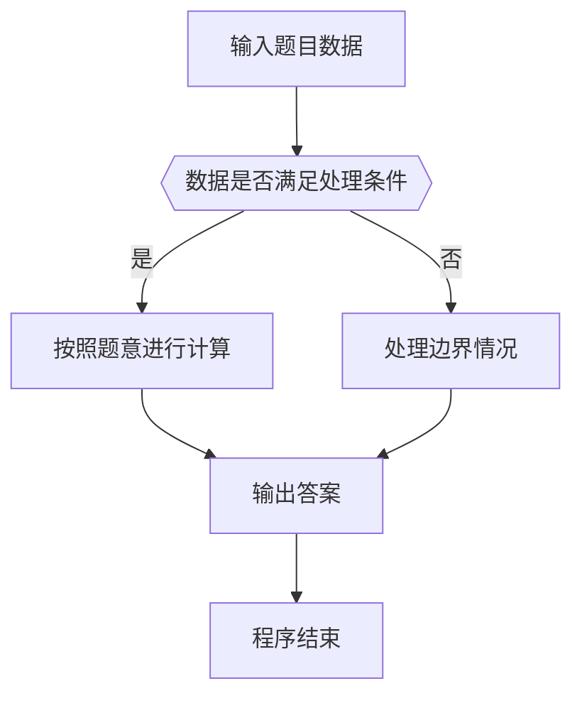

# 1020 月饼

- **分值：** 25分

### 题目描述

月饼是中国人在中秋佳节时吃的一种传统食品，不同地区有许多不同风味的月饼。现给定所有种类月饼的库存量、总售价、以及市场的最大需求量，请你计算可以获得的最大收益是多少。

注意：销售时允许取出一部分库存。样例给出的情形是这样的：假如我们有 3 种月饼，其库存量分别为 18、15、10 万吨，总售价分别为 75、72、45 亿元。如果市场的最大需求量只有 20 万吨，那么我们最大收益策略应该是卖出全部 15 万吨第 2 种月饼、以及 5 万吨第 3 种月饼，获得 72 + 45/2 = 94.5（亿元）。

### 输入格式：

每个输入包含一个测试用例。每个测试用例先给出一个不超过 1000 的正整数 $N$ 表示月饼的种类数、以及不超过 500（以万吨为单位）的正整数 $D$ 表示市场最大需求量。随后一行给出 $N$ 个正数表示每种月饼的库存量（以万吨为单位）；最后一行给出 $N$ 个正数表示每种月饼的总售价（以亿元为单位）。数字间以空格分隔。

### 输出格式：

对每组测试用例，在一行中输出最大收益，以亿元为单位并精确到小数点后 2 位。

### 输入样例：
```
3 20
18 15 10
75 72 45
```

### 输出样例：
```
94.50
```


### 解题思路

本题的核心是：按单价从高到低贪心销售，优先售出单价最高的库存。程序先读取题目输入，再按照上述规则完成数据处理，最后严格按照题目要求输出结果。实现时应优先根据题目约束选择合适的数据类型和数据结构，避免溢出或不必要的重复计算。

时间复杂度为 O(n log n)；空间复杂度取决于输入规模，主要用于保存题目数据和中间结果。

### 代码流程说明

1. 读取 1020 月饼 所需的输入数据。
2. 初始化计数器、数组或其他辅助变量。
3. 按单价从高到低贪心销售，优先售出单价最高的库存。
4. 按题目规定的格式输出计算结果。

### 代码实现

```ruby
# 题目：1020-月饼
# 实现原理：
# 本题的核心是：按单价从高到低贪心销售，优先售出单价最高的库存。程序先读取题目输入，再按照上述规则完成数据处理，最后严格按照题目要求输出结果。实现时应优先根据题目约束选择合适的数据类型和数据结构，避免溢出或不必要的重复计算。
# 时间复杂度为 O(n log n)；空间复杂度取决于输入规模，主要用于保存题目数据和中间结果。
# 代码步骤：
# 1. 读取输入并初始化必要的数据结构。
# 2. 按题意完成核心计算，处理边界情况。
# 3. 按题目要求格式化并输出结果。
#
tokens = STDIN.read.split.map(&:to_f)
count = tokens.shift.to_i
demand = tokens.shift
stock = tokens.shift(count)
sales = tokens.shift(count)
prices = stock.each_index.map { |i| sales[i] / stock[i] }
answer = 0.0

prices.each_index.sort_by { |i| -prices[i] }.each do |i|
  amount = [demand, stock[i]].min
  answer += amount * prices[i]
  demand -= amount
  break if demand.zero?
end
puts format("%.2f", answer)
```

### 代码流程图



### 解题流程图



### 常见易错点

- 注意输入数据的范围，选择足够大的整数类型，并正确处理边界值。
- 循环、数组下标和字符串结束位置要严格对应题目定义，避免越界。
- 输出格式必须与题目要求完全一致，包括空格、换行、大小写和特殊符号。
- 如果存在排序、去重、进位、约分或四舍五入等操作，应在输出前统一完成。
