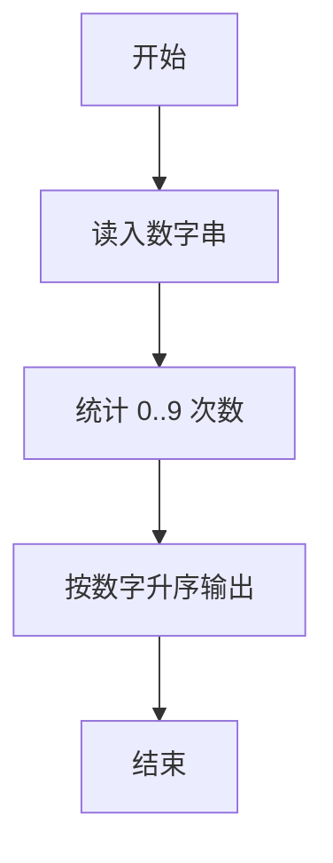
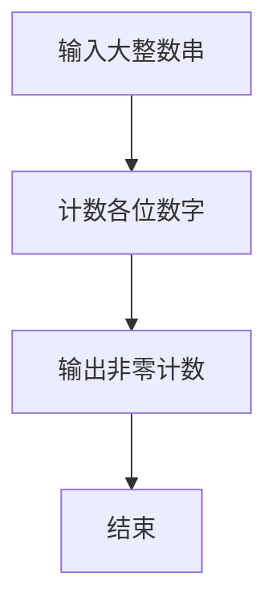

# 1021 个位数统计

- **分值：** 15分

### 题目描述

给定一个 $k$ 位整数 $N=d_{k-1}10^{k-1}+\cdots+d_1 10^1+d_0$（$0\le d_i\le 9$，$i=0,\ldots,k-1$，$d_{k-1}>0$），请编写程序统计每种不同的个位数字出现的次数。例如：给定 $N=100311$，则有 2 个 0，3 个 1，和 1 个 3。

### 输入格式：

每个输入包含 1 个测试用例，即一个不超过 1000 位的正整数 $N$。

### 输出格式：

对 $N$ 中每一种不同的个位数字，以 `D:M` 的格式在一行中输出该位数字 `D` 及其在 $N$ 中出现的次数 `M`。要求按 `D` 的升序输出。

### 输入样例：
```
100311
```

### 输出样例：
```
0:2
1:3
3:1
```


### 解题思路

本题的核心是：扫描数字字符串，用数组统计 0 到 9 的出现次数。程序先读取题目输入，再按照上述规则完成数据处理，最后严格按照题目要求输出结果。实现时应优先根据题目约束选择合适的数据类型和数据结构，避免溢出或不必要的重复计算。

时间复杂度为 O(L)；空间复杂度取决于输入规模，主要用于保存题目数据和中间结果。

### 代码流程说明

1. 以字符串读入 n。
2. 统计 0-9 出现次数。
3. 按升序输出出现过的数字:次数。

### 代码实现

```ruby
# 题目：1021-个位数统计
# 实现原理：
# 本题的核心是：扫描数字字符串，用数组统计 0 到 9 的出现次数
# 时间复杂度为 O(L)；空间复杂度取决于输入规模，主要用于保存题目数据和中间结果。
# 代码步骤：
# 1. 读取输入并初始化必要的数据结构。
# 2. 按题意完成核心计算，处理边界情况。
# 3. 按题目要求格式化并输出结果。
#
counts = Array.new(10, 0)
STDIN.read.strip.each_char { |char| counts[char.to_i] += 1 }
counts.each_with_index { |count, digit| puts "#{digit}:#{count}" unless count.zero? }
```

### 代码流程图



### 解题流程图



### 常见易错点

- 只输出出现过的数字。
- 格式为 d:cnt，冒号为英文符号。
- 按数字从小到大。
