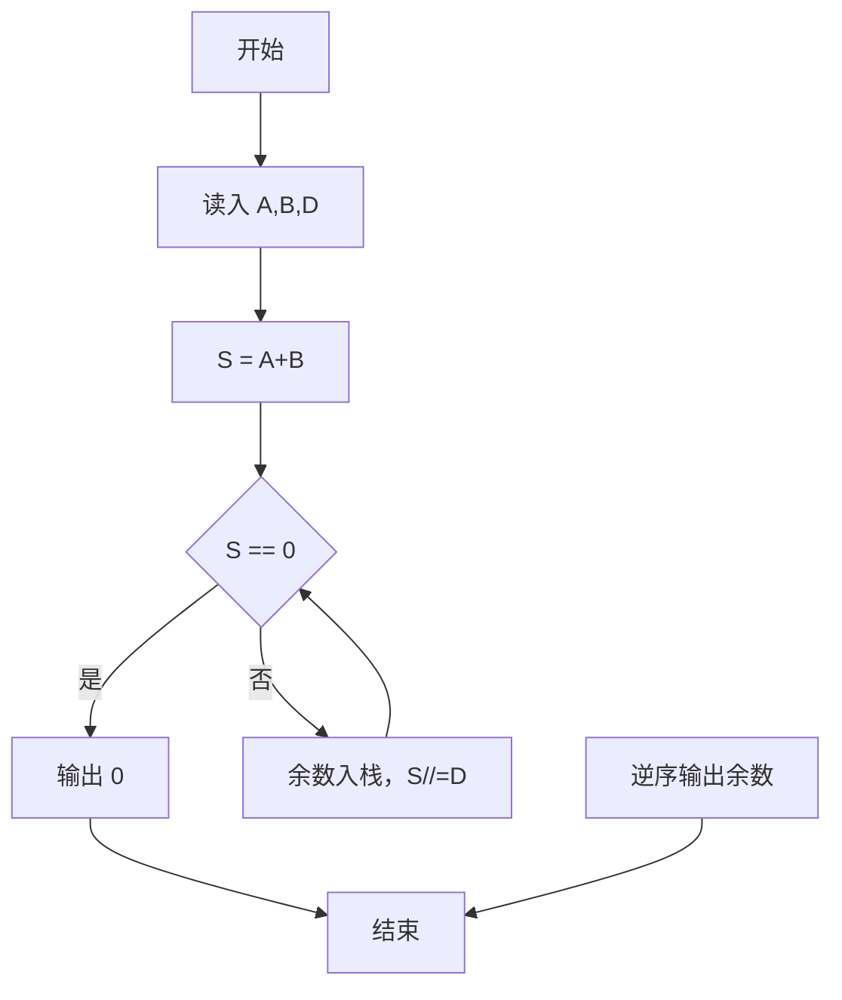
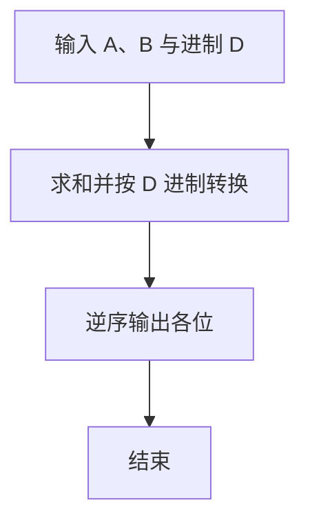

# 1022 D进制的A+B

- **分值：** 20分

### 题目描述

输入两个非负 10 进制整数 $A$ 和 $B$（$A,B\le 2^{30}-1$），输出 $A+B$ 的 $D$（$1<D\le 10$）进制数。

### 输入格式：

输入在一行中依次给出 3 个整数 $A$、$B$ 和 $D$。

### 输出格式：

输出 $A+B$ 的 $D$ 进制数。

### 输入样例：
```
123 456 8

```

### 输出样例：
```
1103

```

**鸣谢用户谢浩然补充数据！**


### 解题思路

本题的核心是：将非负整数反复除以 D 取余，逆序得到目标进制表示。程序先读取题目输入，再按照上述规则完成数据处理，最后严格按照题目要求输出结果。实现时应优先根据题目约束选择合适的数据类型和数据结构，避免溢出或不必要的重复计算。

时间复杂度为 O(log_D n)；空间复杂度取决于输入规模，主要用于保存题目数据和中间结果。

### 代码流程说明

1. 读入 A、B、D。
2. 计算 S=A+B。
3. 反复除 D 取余，逆序输出。

### 代码实现

```ruby
# 题目：1022-D进制的A+B
# 实现原理：
# 本题的核心是：将非负整数反复除以 D 取余，逆序得到目标进制表示
# 时间复杂度为 O(log_D n)；空间复杂度取决于输入规模，主要用于保存题目数据和中间结果。
# 代码步骤：
# 1. 读取输入并初始化必要的数据结构。
# 2. 按题意完成核心计算，处理边界情况。
# 3. 按题目要求格式化并输出结果。
#
a, b, base = STDIN.read.split.map(&:to_i)
number = a + b
if number.zero?
  puts 0
else
  digits = []
  while number.positive?
    digits << (number % base).to_s
    number /= base
  end
  puts digits.reverse.join
end
```

### 代码流程图



### 解题流程图



### 常见易错点

- 和为 0 时输出 0。
- 进制转换结果要逆序。
- D 在 2-10 之间，直接输出数字即可。
