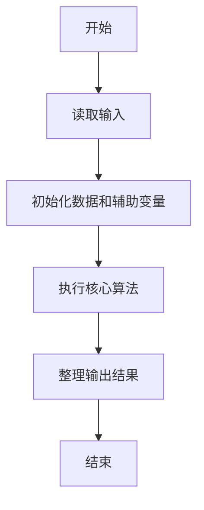
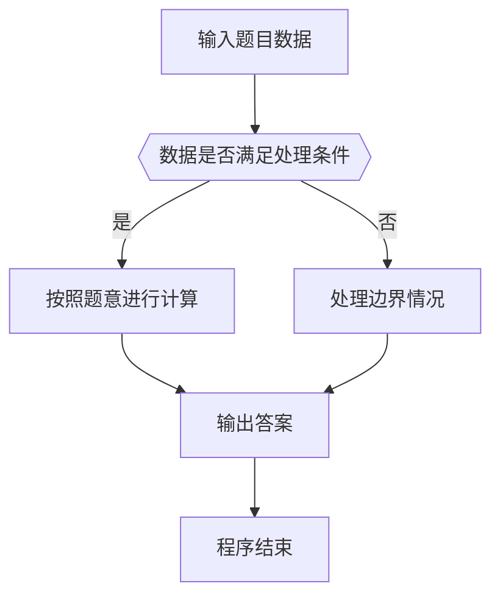

# 1023 组个最小数

- **分值：** 20分

### 题目描述

给定数字 0-9 各若干个。你可以以任意顺序排列这些数字，但必须全部使用。目标是使得最后得到的数尽可能小（注意 0 不能做首位）。例如：给定两个 0，两个 1，三个 5，一个 8，我们得到的最小的数就是 10015558。

现给定数字，请编写程序输出能够组成的最小的数。

### 输入格式：

输入在一行中给出 10 个非负整数，顺序表示我们拥有数字 0、数字 1、……数字 9 的个数。整数间用一个空格分隔。10 个数字的总个数不超过 50，且至少拥有 1 个非 0 的数字。

### 输出格式：

在一行中输出能够组成的最小的数。

### 输入样例：
```
2 2 0 0 0 3 0 0 1 0
```

### 输出样例：
```
10015558
```


### 解题思路

本题的核心是：按数字从小到大排列，保证首位非零后拼成最小数。程序先读取题目输入，再按照上述规则完成数据处理，最后严格按照题目要求输出结果。实现时应优先根据题目约束选择合适的数据类型和数据结构，避免溢出或不必要的重复计算。

时间复杂度为 O(n)；空间复杂度取决于输入规模，主要用于保存题目数据和中间结果。

### 代码流程说明

1. 读取 1023 组个最小数 所需的输入数据。
2. 初始化计数器、数组或其他辅助变量。
3. 按数字从小到大排列，保证首位非零后拼成最小数。
4. 按题目规定的格式输出计算结果。

### 代码实现

```ruby
# 题目：1023-组个最小数
# 实现原理：
# 本题的核心是：按数字从小到大排列，保证首位非零后拼成最小数。程序先读取题目输入，再按照上述规则完成数据处理，最后严格按照题目要求输出结果。实现时应优先根据题目约束选择合适的数据类型和数据结构，避免溢出或不必要的重复计算。
# 时间复杂度为 O(n)；空间复杂度取决于输入规模，主要用于保存题目数据和中间结果。
# 代码步骤：
# 1. 读取输入并初始化必要的数据结构。
# 2. 按题意完成核心计算，处理边界情况。
# 3. 按题目要求格式化并输出结果。
#
counts = STDIN.read.split.map(&:to_i)
first = (1..9).find { |digit| counts[digit].positive? }
counts[first] -= 1
puts first.to_s + counts.each_index.flat_map { |digit| [digit.to_s] * counts[digit] }.join
```

### 代码流程图



### 解题流程图



### 常见易错点

- 注意输入数据的范围，选择足够大的整数类型，并正确处理边界值。
- 循环、数组下标和字符串结束位置要严格对应题目定义，避免越界。
- 输出格式必须与题目要求完全一致，包括空格、换行、大小写和特殊符号。
- 如果存在排序、去重、进位、约分或四舍五入等操作，应在输出前统一完成。
