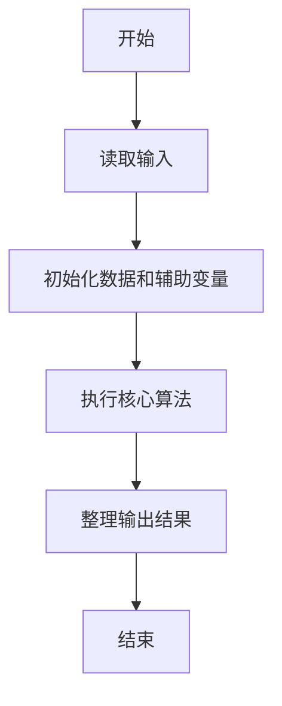
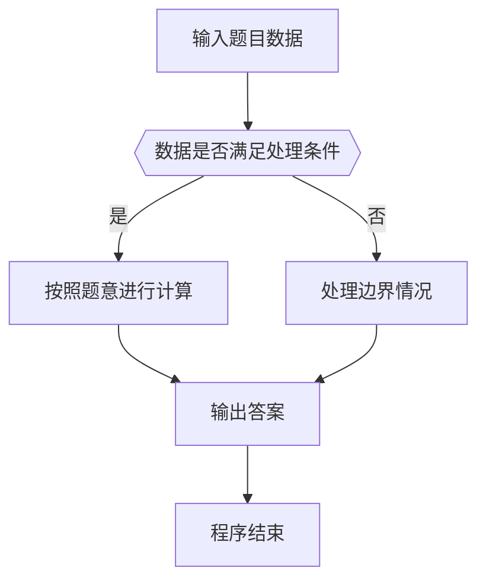

# 1024 科学计数法

- **分值：** 20分

### 题目描述

科学计数法是科学家用来表示很大或很小的数字的一种方便的方法，其满足正则表达式 [+-][1-9]`.`[0-9]+E[+-][0-9]+，即数字的整数部分只有 1 位，小数部分至少有 1 位，该数字及其指数部分的正负号即使对正数也必定明确给出。

现以科学计数法的格式给出实数 $A$，请编写程序按普通数字表示法输出 $A$，并保证所有有效位都被保留。

### 输入格式：

每个输入包含 1 个测试用例，即一个以科学计数法表示的实数 $A$。该数字的存储长度不超过 9999 字节，且其指数的绝对值不超过 9999。

### 输出格式：

对每个测试用例，在一行中按普通数字表示法输出 $A$，并保证所有有效位都被保留，包括末尾的 0。

### 输入样例 1：
```
+1.23400E-03
```

### 输出样例 1：
```
0.00123400
```

### 输入样例 2：
```
-1.2E+10
```

### 输出样例 2：
```
-12000000000
```


### 解题思路

本题的核心是：解析小数点位置与有效数字，依据指数移动小数点并补零。程序先读取题目输入，再按照上述规则完成数据处理，最后严格按照题目要求输出结果。实现时应优先根据题目约束选择合适的数据类型和数据结构，避免溢出或不必要的重复计算。

时间复杂度为 O(L)；空间复杂度取决于输入规模，主要用于保存题目数据和中间结果。

### 代码流程说明

1. 读取 1024 科学计数法 所需的输入数据。
2. 初始化计数器、数组或其他辅助变量。
3. 解析小数点位置与有效数字，依据指数移动小数点并补零。
4. 按题目规定的格式输出计算结果。

### 代码实现

```ruby
# 题目：1024-科学计数法
# 实现原理：
# 本题的核心是：解析小数点位置与有效数字，依据指数移动小数点并补零。程序先读取题目输入，再按照上述规则完成数据处理，最后严格按照题目要求输出结果。实现时应优先根据题目约束选择合适的数据类型和数据结构，避免溢出或不必要的重复计算。
# 时间复杂度为 O(L)；空间复杂度取决于输入规模，主要用于保存题目数据和中间结果。
# 代码步骤：
# 1. 读取输入并初始化必要的数据结构。
# 2. 按题意完成核心计算，处理边界情况。
# 3. 按题目要求格式化并输出结果。
#
text = STDIN.read.strip
sign = text.start_with?("-") ? "-" : ""
text = text.sub(/^[+-]/, "")
mantissa, exponent = text.split("E").map(&:strip)
exponent = exponent.to_i
digits = mantissa.delete(".")
decimal_position = mantissa.include?(".") ? mantissa.index(".") + exponent : mantissa.length + exponent
number = if decimal_position <= 0
           "0." + "0" * -decimal_position + digits
         elsif decimal_position >= digits.length
           digits + "0" * (decimal_position - digits.length)
         else
           digits[0, decimal_position] + "." + digits[decimal_position..]
         end
puts sign + number
```

### 代码流程图



### 解题流程图



### 常见易错点

- 注意输入数据的范围，选择足够大的整数类型，并正确处理边界值。
- 循环、数组下标和字符串结束位置要严格对应题目定义，避免越界。
- 输出格式必须与题目要求完全一致，包括空格、换行、大小写和特殊符号。
- 如果存在排序、去重、进位、约分或四舍五入等操作，应在输出前统一完成。
