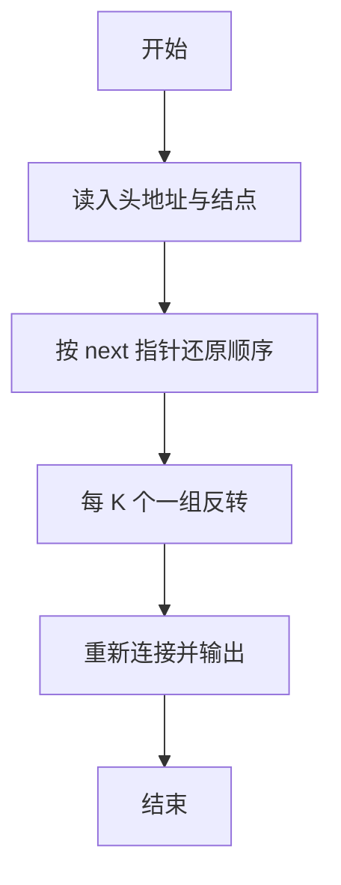
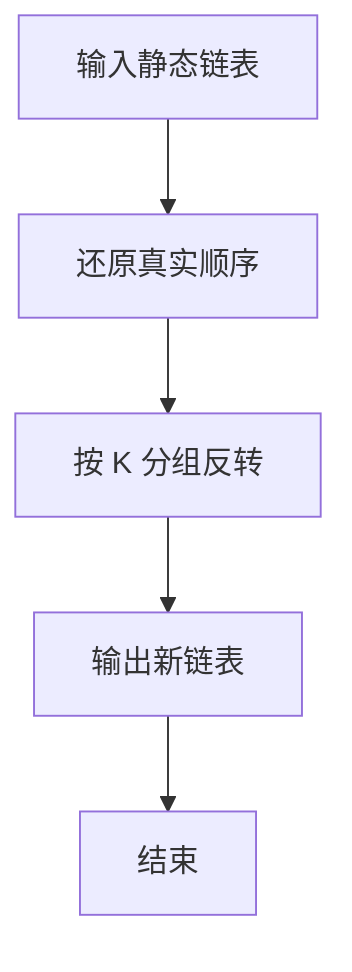

# 1025 反转链表

- **分值：** 25分

### 题目描述

给定一个常数 $K$ 以及一个单链表 $L$，请编写程序将 $L$ 中每 $K$ 个结点反转。例如：给定 $L$ 为 1→2→3→4→5→6，$K$ 为 3，则输出应该为 3→2→1→6→5→4；如果 $K$ 为 4，则输出应该为 4→3→2→1→5→6，即最后不到 $K$ 个元素不反转。

### 输入格式：

每个输入包含 1 个测试用例。每个测试用例第 1 行给出第 1 个结点的地址、结点总个数正整数 $N$（$N\le 10^5$）、以及正整数 $K$（$K\le N$），即要求反转的子链结点的个数。结点的地址是 5 位非负整数，NULL 地址用 $-1$ 表示。

接下来有 $N$ 行，每行格式为：
```
Address Data Next
```

其中 `Address` 是结点地址，`Data` 是该结点保存的整数数据，`Next` 是下一结点的地址。

### 输出格式：

对每个测试用例，顺序输出反转后的链表，其上每个结点占一行，格式与输入相同。

### 输入样例：
```
00100 6 4
00000 4 99999
00100 1 12309
68237 6 -1
33218 3 00000
99999 5 68237
12309 2 33218
```

### 输出样例：
```
00000 4 33218
33218 3 12309
12309 2 00100
00100 1 99999
99999 5 68237
68237 6 -1
```


### 解题思路

本题的核心是：读取链表后按给定长度分组，逐组反转并重新连接。程序先读取题目输入，再按照上述规则完成数据处理，最后严格按照题目要求输出结果。实现时应优先根据题目约束选择合适的数据类型和数据结构，避免溢出或不必要的重复计算。

时间复杂度为 O(n)；空间复杂度取决于输入规模，主要用于保存题目数据和中间结果。

### 代码流程说明

1. 按地址串起真实链表。
2. 按 K 个一组反转，不足 K 的保持原序。
3. 按新顺序输出地址、数据、下一地址。

### 代码实现

```ruby
# 题目：1025-反转链表
# 实现原理：
# 本题的核心是：读取链表后按给定长度分组，逐组反转并重新连接
# 时间复杂度为 O(n)；空间复杂度取决于输入规模，主要用于保存题目数据和中间结果。
# 代码步骤：
# 1. 读取输入并初始化必要的数据结构。
# 2. 按题意完成核心计算，处理边界情况。
# 3. 按题目要求格式化并输出结果。
#
tokens = STDIN.read.split
head, count, group = tokens.shift(3)
count = count.to_i
group = group.to_i
values = {}
next_nodes = {}
count.times do
  address, value, next_address = tokens.shift(3)
  values[address] = value
  next_nodes[address] = next_address
end

order = []
current = head
while current != "-1"
  order << current
  current = next_nodes[current]
end
order.each_slice(group).with_index do |slice, index|
  order[index * group, group] = slice.reverse if slice.length == group
end
order.each_with_index { |address, i| puts "#{address} #{values[address]} #{i + 1 == order.length ? '-1' : order[i + 1]}" }
```

### 代码流程图



### 解题流程图



### 常见易错点

- 不在链上的结点要忽略。
- 最后一组不足 K 时不反转。
- 输出的 Next 要按新顺序重算，最后一组 Next 为 -1。
