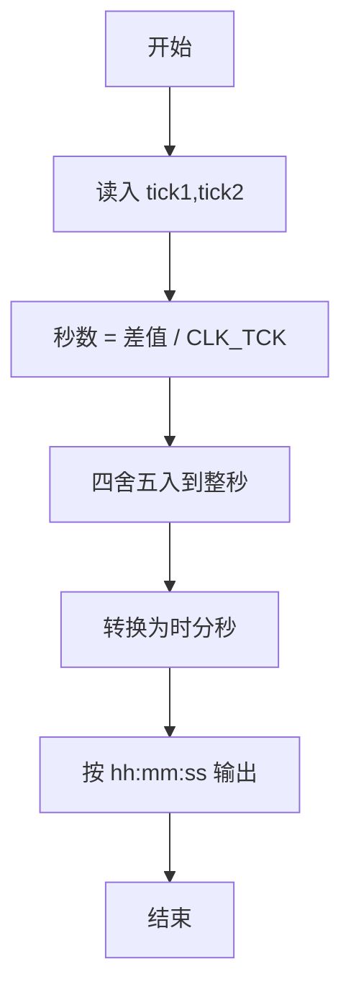
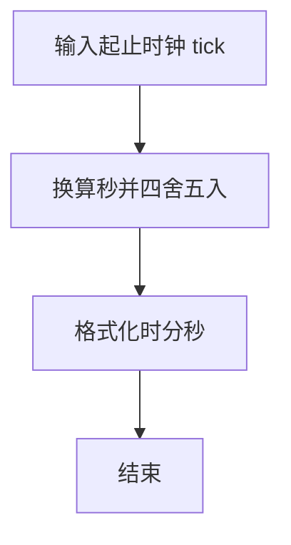

# 1026 程序运行时间

- **分值：** 15分

### 题目描述

要获得一个 C 语言程序的运行时间，常用的方法是调用头文件 time.h，其中提供了 clock() 函数，可以捕捉从程序开始运行到 clock() 被调用时所耗费的时间。这个时间单位是 clock tick，即“时钟打点”。同时还有一个常数 CLK_TCK，给出了机器时钟每秒所走的时钟打点数。于是为了获得一个函数 $f$ 的运行时间，我们只要在调用 $f$ 之前先调用 clock()，获得一个时钟打点数 C1；在 $f$ 执行完成后再调用 clock()，获得另一个时钟打点数 C2；两次获得的时钟打点数之差 (C2-C1) 就是 $f$ 运行所消耗的时钟打点数，再除以常数 CLK_TCK，就得到了以秒为单位的运行时间。

这里不妨简单假设常数 CLK_TCK 为 100。现给定被测函数前后两次获得的时钟打点数，请你给出被测函数运行的时间。

### 输入格式：

输入在一行中顺序给出 2 个整数 $C_1$ 和 $C_2$。注意两次获得的时钟打点数肯定不相同，即 $C_1<C_2$，并且取值在 $[0,10^7]$。

### 输出格式：

在一行中输出被测函数运行的时间。运行时间必须按照 `hh:mm:ss`（即2位的 `时:分:秒`）格式输出；不足 1 秒的时间四舍五入到秒。

### 输入样例：
```
123 4577973
```

### 输出样例：
```
12:42:59
```


### 解题思路

本题的核心是：将时钟 tick 差值按每秒 tick 数转换为时分秒并四舍五入。程序先读取题目输入，再按照上述规则完成数据处理，最后严格按照题目要求输出结果。实现时应优先根据题目约束选择合适的数据类型和数据结构，避免溢出或不必要的重复计算。

时间复杂度为 O(1)；空间复杂度取决于输入规模，主要用于保存题目数据和中间结果。

### 代码流程说明

1. 读入起止 tick，计算差值。
2. 除以 CLOCKS_PER_SEC 得到秒数并四舍五入。
3. 转换为 hh:mm:ss 输出。

### 代码实现

```ruby
# 题目：1026-程序运行时间
# 实现原理：
# 本题的核心是：将时钟 tick 差值按每秒 tick 数转换为时分秒并四舍五入
# 时间复杂度为 O(1)；空间复杂度取决于输入规模，主要用于保存题目数据和中间结果。
# 代码步骤：
# 1. 读取输入并初始化必要的数据结构。
# 2. 按题意完成核心计算，处理边界情况。
# 3. 按题目要求格式化并输出结果。
#
start_time, end_time = STDIN.read.split.map(&:to_i)
seconds = (end_time - start_time + 50) / 100
puts format("%02d:%02d:%02d", seconds / 3600, seconds / 60 % 60, seconds % 60)
```

### 代码流程图



### 解题流程图



### 常见易错点

- 是四舍五入，不是直接截断。
- 时分秒都要两位补零。
- 先处理总秒数再进位到时分秒。
