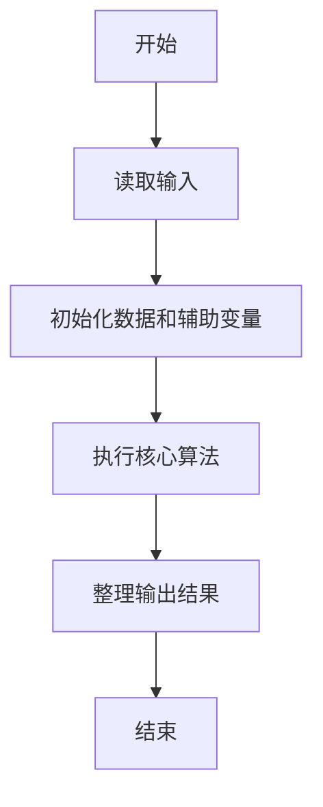
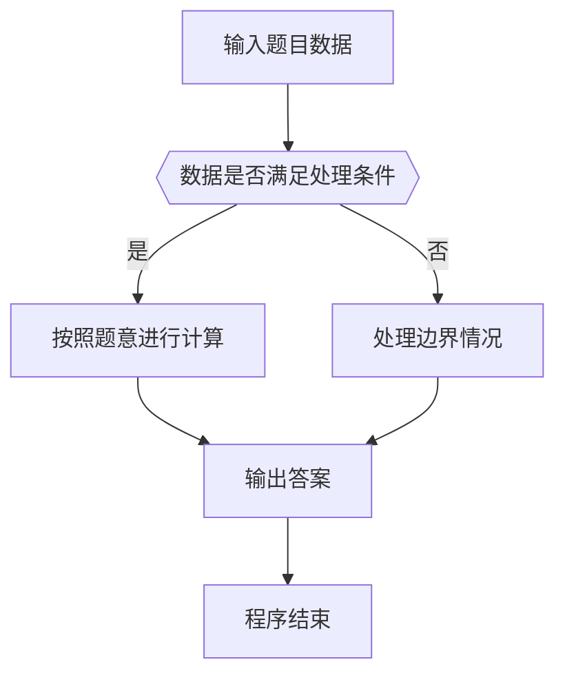

# 1028 人口普查

- **分值：** 20分

### 题目描述

某城镇进行人口普查，得到了全体居民的生日。现请你写个程序，找出镇上最年长和最年轻的人。

这里确保每个输入的日期都是合法的，但不一定是合理的——假设已知镇上没有超过 200 岁的老人，而今天是 2014 年 9 月 6 日，所以超过 200 岁的生日和未出生的生日都是不合理的，应该被过滤掉。

### 输入格式：

输入在第一行给出正整数 $N$，取值在$(0, 10^5]$；随后 $N$ 行，每行给出 1 个人的姓名（由不超过 5 个英文字母组成的字符串）、以及按 `yyyy/mm/dd`（即年/月/日）格式给出的生日。题目保证最年长和最年轻的人没有并列。

### 输出格式：

在一行中顺序输出有效生日的个数、最年长人和最年轻人的姓名，其间以空格分隔。

### 输入样例：
```
5
John 2001/05/12
Tom 1814/09/06
Ann 2121/01/30
James 1814/09/05
Steve 1967/11/20
```

### 输出样例：
```
3 Tom John
```


### 解题思路

本题的核心是：过滤有效年龄记录，并按出生日期排序找出最年长和最年轻者。程序先读取题目输入，再按照上述规则完成数据处理，最后严格按照题目要求输出结果。实现时应优先根据题目约束选择合适的数据类型和数据结构，避免溢出或不必要的重复计算。

时间复杂度为 O(n log n)；空间复杂度取决于输入规模，主要用于保存题目数据和中间结果。

### 代码流程说明

1. 读取 1028 人口普查 所需的输入数据。
2. 初始化计数器、数组或其他辅助变量。
3. 过滤有效年龄记录，并按出生日期排序找出最年长和最年轻者。
4. 按题目规定的格式输出计算结果。

### 代码实现

```ruby
# 题目：1028-人口普查
# 实现原理：
# 本题的核心是：过滤有效年龄记录，并按出生日期排序找出最年长和最年轻者。程序先读取题目输入，再按照上述规则完成数据处理，最后严格按照题目要求输出结果。实现时应优先根据题目约束选择合适的数据类型和数据结构，避免溢出或不必要的重复计算。
# 时间复杂度为 O(n log n)；空间复杂度取决于输入规模，主要用于保存题目数据和中间结果。
# 代码步骤：
# 1. 读取输入并初始化必要的数据结构。
# 2. 按题意完成核心计算，处理边界情况。
# 3. 按题目要求格式化并输出结果。
#
tokens = STDIN.read.split
count = tokens.shift.to_i
valid = []
count.times do
  name, birthday = tokens.shift(2)
  valid << [name, birthday] if ("1814/09/06".."2014/09/06").include?(birthday)
end
if valid.empty?
  puts 0
else
  valid.sort_by! { |_, birthday| birthday }
  puts "#{valid.length} #{valid.first[0]} #{valid.last[0]}"
end
```

### 代码流程图



### 解题流程图



### 常见易错点

- 注意输入数据的范围，选择足够大的整数类型，并正确处理边界值。
- 循环、数组下标和字符串结束位置要严格对应题目定义，避免越界。
- 输出格式必须与题目要求完全一致，包括空格、换行、大小写和特殊符号。
- 如果存在排序、去重、进位、约分或四舍五入等操作，应在输出前统一完成。
