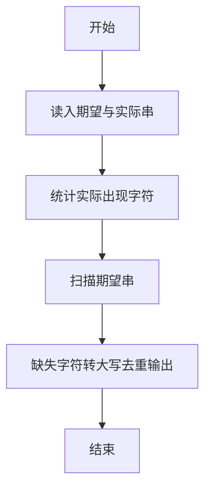
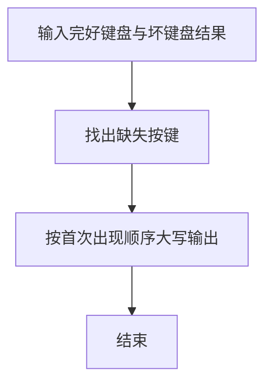

# 1029 旧键盘

- **分值：** 20分

### 题目描述

旧键盘上坏了几个键，于是在敲一段文字的时候，对应的字符就不会出现。现在给出应该输入的一段文字、以及实际被输入的文字，请你列出肯定坏掉的那些键。

### 输入格式：

输入在 2 行中分别给出应该输入的文字、以及实际被输入的文字。每段文字是不超过 80 个字符的串，由字母 A-Z（包括大、小写）、数字 0-9、以及下划线 `_`（代表空格）组成。题目保证 2 个字符串均非空。

### 输出格式：

按照发现顺序，在一行中输出坏掉的键。其中英文字母只输出大写，每个坏键只输出一次。题目保证至少有 1 个坏键。

### 输入样例：
```
7_This_is_a_test
_hs_s_a_es
```

### 输出样例：
```
7TI
```


### 解题思路

本题的核心是：比较原串和实际输入串，记录缺失字符并按首次出现顺序输出。程序先读取题目输入，再按照上述规则完成数据处理，最后严格按照题目要求输出结果。实现时应优先根据题目约束选择合适的数据类型和数据结构，避免溢出或不必要的重复计算。

时间复杂度为 O(L)；空间复杂度取决于输入规模，主要用于保存题目数据和中间结果。

### 代码流程说明

1. 读入期望串与实际串。
2. 标记实际串中出现过的字符。
3. 按期望串首次出现顺序输出缺失字符并大写去重。

### 代码实现

```ruby
# 题目：1029-旧键盘
# 实现原理：
# 本题的核心是：比较原串和实际输入串，记录缺失字符并按首次出现顺序输出
# 时间复杂度为 O(L)；空间复杂度取决于输入规模，主要用于保存题目数据和中间结果。
# 代码步骤：
# 1. 读取输入并初始化必要的数据结构。
# 2. 按题意完成核心计算，处理边界情况。
# 3. 按题目要求格式化并输出结果。
#
expected, typed = STDIN.read.split
typed_chars = typed.to_s.chars
missing = []
expected.to_s.chars.each do |char|
  next if typed_chars.include?(char)
  key = char.upcase
  missing << key unless missing.include?(key)
end
puts missing.join
```

### 代码流程图



### 解题流程图



### 常见易错点

- 输出统一大写。
- 同一缺失字符只输出一次。
- 保持在期望串中首次出现的顺序。
