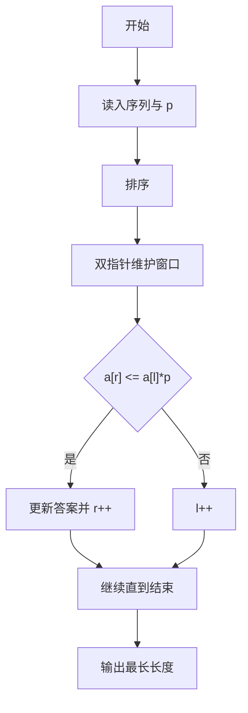
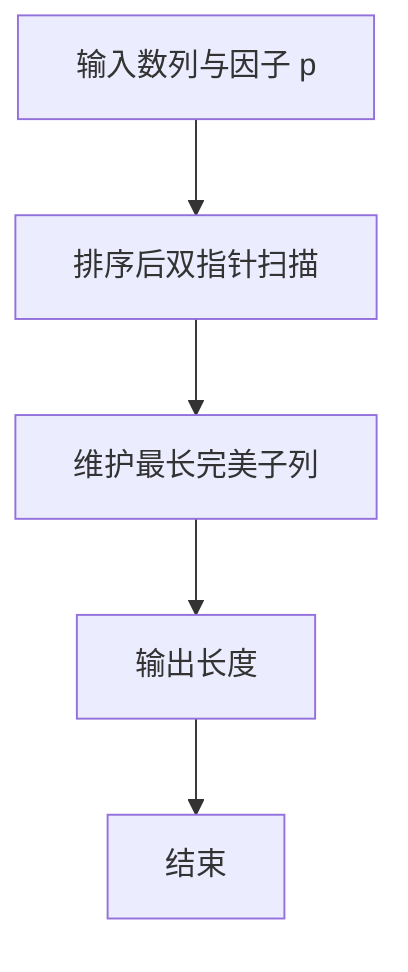

# 1030 完美数列

- **分值：** 25分

### 题目描述

给定一个正整数数列，和正整数 $p$，设这个数列中的最大值是 $M$，最小值是 $m$，如果 $M \le mp$，则称这个数列是完美数列。

现在给定参数 $p$ 和一些正整数，请你从中选择尽可能多的数构成一个完美数列。

### 输入格式：

输入第一行给出两个正整数 $N$ 和 $p$，其中 $N$（$\le 10^5$）是输入的正整数的个数，$p$（$\le 10^9$）是给定的参数。第二行给出 $N$ 个正整数，每个数不超过 $10^9$。

### 输出格式：

在一行中输出最多可以选择多少个数可以用它们组成一个完美数列。

### 输入样例：
```
10 8
2 3 20 4 5 1 6 7 8 9
```

### 输出样例：
```
8
```


### 解题思路

本题的核心是：排序后用双指针维护满足最大值不超过最小值 p 的最长区间。程序先读取题目输入，再按照上述规则完成数据处理，最后严格按照题目要求输出结果。实现时应优先根据题目约束选择合适的数据类型和数据结构，避免溢出或不必要的重复计算。

时间复杂度为 O(n log n)；空间复杂度取决于输入规模，主要用于保存题目数据和中间结果。

### 代码流程说明

1. 读入序列并排序。
2. 双指针扩展右端、收缩左端。
3. 更新最大长度，其中 max <= min * p。

### 代码实现

```ruby
# 题目：1030-完美数列
# 实现原理：
# 本题的核心是：排序后用双指针维护满足最大值不超过最小值 p 的最长区间
# 时间复杂度为 O(n log n)；空间复杂度取决于输入规模，主要用于保存题目数据和中间结果。
# 代码步骤：
# 1. 读取输入并初始化必要的数据结构。
# 2. 按题意完成核心计算，处理边界情况。
# 3. 按题目要求格式化并输出结果。
#
tokens = STDIN.read.split.map(&:to_i)
count, factor = tokens.shift(2)
values = tokens.first(count).sort
best = 0
left = 0
values.each_with_index do |value, right|
  left += 1 while value > values[left] * factor
  best = [best, right - left + 1].max
end
puts best
```

### 代码流程图



### 解题流程图



### 常见易错点

- 先排序再双指针。
- 比较时注意 p 很大时乘积可能很大，Ruby 无溢出。
- 答案至少为 1。
