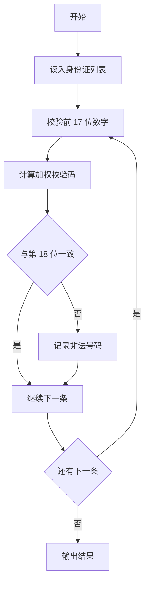
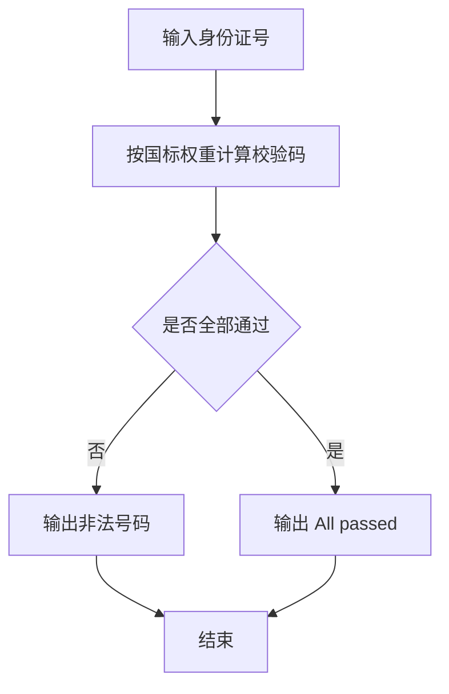

# 1031 查验身份证

- **分值：** 15分

### 题目描述

一个合法的身份证号码由17位地区、日期编号和顺序编号加1位校验码组成。校验码的计算规则如下：

首先对前17位数字加权求和，权重分配为：{7，9，10，5，8，4，2，1，6，3，7，9，10，5，8，4，2}；然后将计算的和对11取模得到值`Z`；最后按照以下关系对应`Z`值与校验码`M`的值：
```
Z：0 1 2 3 4 5 6 7 8 9 10
M：1 0 X 9 8 7 6 5 4 3 2
```
现在给定一些身份证号码，请你验证校验码的有效性，并输出有问题的号码。

### 输入格式：

输入第一行给出正整数 $N$（$N\le 100$），是输入的身份证号码的个数。随后 $N$ 行，每行给出 1 个 18 位身份证号码。

### 输出格式：

按照输入的顺序每行输出1个有问题的身份证号码。这里并不检验前17位是否合理，只检查前17位是否全为数字且最后1位校验码计算准确。如果所有号码都正常，则输出`All passed`。

### 输入样例 1：
```
4
320124198808240056
12010X198901011234
110108196711301866
37070419881216001X
```

### 输出样例 1：
```
12010X198901011234
110108196711301866
37070419881216001X
```

### 输入样例 2：
```
2
320124198808240056
110108196711301862
```

### 输出样例 2：
```
All passed
```

**鸣谢阜阳师范学院范建中老师补充数据**

**鸣谢浙江工业大学之江学院石洗凡老师纠正数据**


### 解题思路

本题的核心是：按权重计算前 17 位校验和，并与校验码表逐个比对。程序先读取题目输入，再按照上述规则完成数据处理，最后严格按照题目要求输出结果。实现时应优先根据题目约束选择合适的数据类型和数据结构，避免溢出或不必要的重复计算。

时间复杂度为 O(n)；空间复杂度取决于输入规模，主要用于保存题目数据和中间结果。

### 代码流程说明

1. 读入 n 个身份证号。
2. 校验前 17 位是否全数字，计算加权和。
3. 比对校验码，输出非法号码或 All passed。

### 代码实现

```ruby
# 题目：1031-查验身份证
# 实现原理：
# 本题的核心是：按权重计算前 17 位校验和，并与校验码表逐个比对
# 时间复杂度为 O(n)；空间复杂度取决于输入规模，主要用于保存题目数据和中间结果。
# 代码步骤：
# 1. 读取输入并初始化必要的数据结构。
# 2. 按题意完成核心计算，处理边界情况。
# 3. 按题目要求格式化并输出结果。
#
tokens = STDIN.read.split
count = tokens.shift.to_i
weights = [7, 9, 10, 5, 8, 4, 2, 1, 6, 3, 7, 9, 10, 5, 8, 4, 2]
checks = "10X98765432"
invalid = tokens.first(count).select do |id|
  !id.match?(/\A\d{17}[0-9X]\z/) || checks[(id[0, 17].chars.map(&:to_i).zip(weights).sum { |d, w| d * w } % 11)] != id[-1]
end
puts invalid.empty? ? "All passed" : invalid
```

### 代码流程图



### 解题流程图



### 常见易错点

- 权重表与校验码表要与题目完全一致。
- 前 17 位出现非数字直接判非法。
- 非法号码按输入顺序输出。
