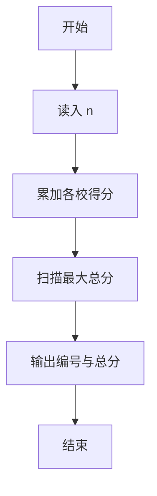
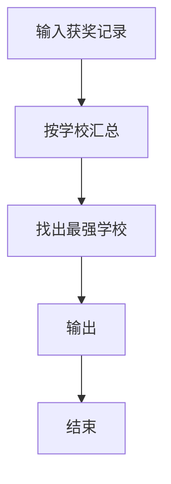

# 1032 挖掘机技术哪家强

- **分值：** 20分

### 题目描述

为了用事实说明挖掘机技术到底哪家强，PAT 组织了一场挖掘机技能大赛。现请你根据比赛结果统计出技术最强的那个学校。

### 输入格式：

输入在第 1 行给出不超过 $10^5$ 的正整数 $N$，即参赛人数。随后 $N$ 行，每行给出一位参赛者的信息和成绩，包括其所代表的学校的编号（从 1 开始连续编号）、及其比赛成绩（百分制），中间以空格分隔。

### 输出格式：

在一行中给出总得分最高的学校的编号、及其总分，中间以空格分隔。题目保证答案唯一，没有并列。

### 输入样例：
```
6
3 65
2 80
1 100
2 70
3 40
3 0

```

### 输出样例：
```
2 150

```

**鸣谢用户 米泰亚德 补充数据！**


### 解题思路

本题的核心是：统计每组数据的总量，并维护总量最大的组及其编号。程序先读取题目输入，再按照上述规则完成数据处理，最后严格按照题目要求输出结果。实现时应优先根据题目约束选择合适的数据类型和数据结构，避免溢出或不必要的重复计算。

时间复杂度为 O(n)；空间复杂度取决于输入规模，主要用于保存题目数据和中间结果。

### 代码流程说明

1. 读入 n 条 学校编号与得分。
2. 累加各校总分。
3. 输出总分最大的学校编号与分数。

### 代码实现

```ruby
# 题目：1032-挖掘机技术哪家强
# 实现原理：
# 本题的核心是：统计每组数据的总量，并维护总量最大的组及其编号
# 时间复杂度为 O(n)；空间复杂度取决于输入规模，主要用于保存题目数据和中间结果。
# 代码步骤：
# 1. 读取输入并初始化必要的数据结构。
# 2. 按题意完成核心计算，处理边界情况。
# 3. 按题目要求格式化并输出结果。
#
tokens = STDIN.read.split.map(&:to_i)
count = tokens.shift
scores = Hash.new(0)
count.times { scores[tokens.shift] += tokens.shift }
winner = scores.max_by { |team, score| [score, -team] }
puts "#{winner[0]} #{winner[1]}"
```

### 代码流程图



### 解题流程图



### 常见易错点

- 学校编号不连续，要用哈希或足够大的数组。
- 输出的是编号与总分。
- 保证唯一最大值。
