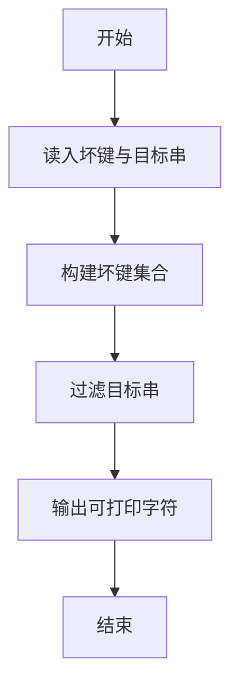
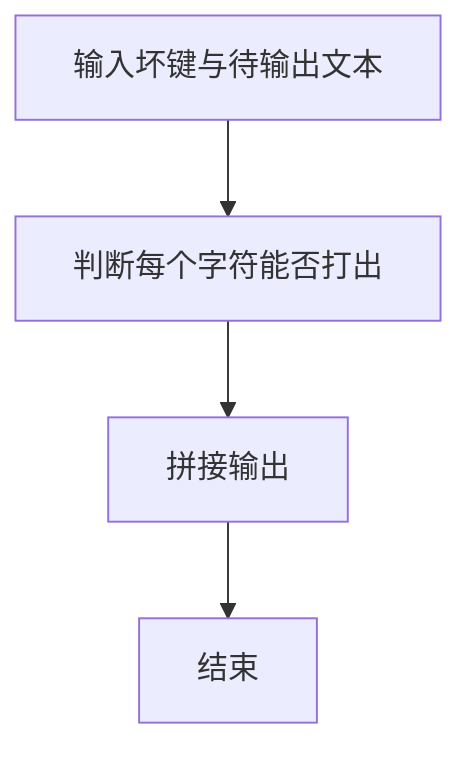

# 1033 旧键盘打字

- **分值：** 20分

### 题目描述

旧键盘上坏了几个键，于是在敲一段文字的时候，对应的字符就不会出现。现在给出应该输入的一段文字、以及坏掉的那些键，打出的结果文字会是怎样？

### 输入格式：

输入在 2 行中分别给出坏掉的那些键、以及应该输入的文字。其中对应英文字母的坏键以大写给出；每段文字是不超过 $10^5$ 个字符的串。可用的字符包括字母 [`a`-`z`, `A`-`Z`]、数字 `0`-`9`、以及下划线 `_`（代表空格）、`,`、`.`、`-`、`+`（代表上档键）。题目保证第 2 行输入的文字串非空。

注意：如果上档键坏掉了，那么大写的英文字母无法被打出。

### 输出格式：

在一行中输出能够被打出的结果文字。如果没有一个字符能被打出，则输出空行。

### 输入样例：
```
7+IE.
7_This_is_a_test.
```

### 输出样例：
```
_hs_s_a_tst
```


### 解题思路

本题的核心是：由原串和实际输入串构造坏键集合，再过滤大小写匹配后的字符。程序先读取题目输入，再按照上述规则完成数据处理，最后严格按照题目要求输出结果。实现时应优先根据题目约束选择合适的数据类型和数据结构，避免溢出或不必要的重复计算。

时间复杂度为 O(L)；空间复杂度取决于输入规模，主要用于保存题目数据和中间结果。

### 代码流程说明

1. 读入坏键串与目标串。
2. 若坏键含大写，则所有字母都坏。
3. 输出目标串中仍可打出的字符。

### 代码实现

```ruby
# 题目：1033-旧键盘打字
# 实现原理：
# 本题的核心是：由原串和实际输入串构造坏键集合，再过滤大小写匹配后的字符
# 时间复杂度为 O(L)；空间复杂度取决于输入规模，主要用于保存题目数据和中间结果。
# 代码步骤：
# 1. 读取输入并初始化必要的数据结构。
# 2. 按题意完成核心计算，处理边界情况。
# 3. 按题目要求格式化并输出结果。
#
broken, typed = STDIN.read.split
broken = broken.chars
shift_broken = broken.include?("+")
result = typed.chars.reject do |char|
  broken.include?(char) || broken.include?(char.upcase) || (shift_broken && char.match?(/[A-Z]/))
end
puts result.join
```

### 代码流程图



### 解题流程图



### 常见易错点

- 坏键中的大写表示整个字母键损坏。
- 上档字符也可能失效，与题面保持一致。
- 空结果直接空行。
