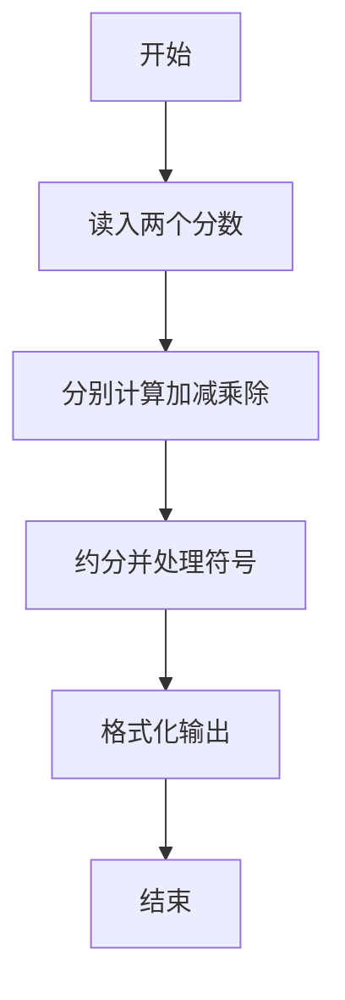
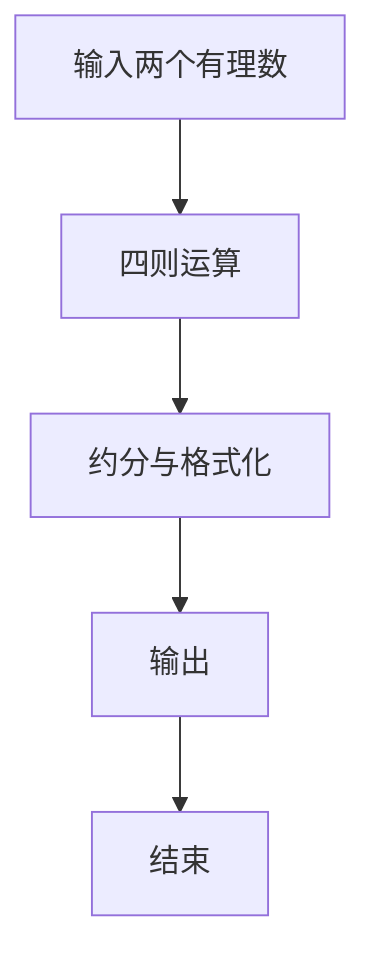

# 1034 有理数四则运算

- **分值：** 20分

### 题目描述

本题要求编写程序，计算 2 个有理数的和、差、积、商。

### 输入格式：

输入在一行中按照 `a1/b1 a2/b2` 的格式给出两个分数形式的有理数，其中分子和分母全是整型范围内的整数，负号只可能出现在分子前，分母不为 0。

### 输出格式：

分别在 4 行中按照 `有理数1 运算符 有理数2 = 结果` 的格式顺序输出 2 个有理数的和、差、积、商。注意输出的每个有理数必须是该有理数的最简形式 `k a/b`，其中 `k` 是整数部分，`a/b` 是最简分数部分；若为负数，则须加括号；若除法分母为 0，则输出 `Inf`。题目保证正确的输出中没有超过整型范围的整数。

### 输入样例 1：
```
2/3 -4/2
```

### 输出样例 1：
```
2/3 + (-2) = (-1 1/3)
2/3 - (-2) = 2 2/3
2/3 * (-2) = (-1 1/3)
2/3 / (-2) = (-1/3)
```

### 输入样例 2：
```
5/3 0/6
```

### 输出样例 2：
```
1 2/3 + 0 = 1 2/3
1 2/3 - 0 = 1 2/3
1 2/3 * 0 = 0
1 2/3 / 0 = Inf
```


### 解题思路

本题的核心是：使用分数结构保存分子分母，每步运算后约分并格式化输出。程序先读取题目输入，再按照上述规则完成数据处理，最后严格按照题目要求输出结果。实现时应优先根据题目约束选择合适的数据类型和数据结构，避免溢出或不必要的重复计算。

时间复杂度为 O(1)；空间复杂度取决于输入规模，主要用于保存题目数据和中间结果。

### 代码流程说明

1. 读入两个分数。
2. 计算和差积商并约分。
3. 按题目格式输出带括号的负数与带分数。

### 代码实现

```ruby
# 题目：1034-有理数四则运算
# 实现原理：见正文「解题思路」。
# 代码步骤：
# 1. 读取输入。
# 2. 按题意完成核心计算。
# 3. 按题目要求输出结果。
#
left, right = STDIN.read.split.map { |value| value.split("/").map(&:to_i) }

normalize = lambda do |numerator, denominator|
  return [0, 1] if numerator.zero?
  gcd = numerator.abs.gcd(denominator.abs)
  numerator /= gcd
  denominator /= gcd
  if denominator.negative?
    numerator = -numerator
    denominator = -denominator
  end
  [numerator, denominator]
end

format_fraction = lambda do |numerator, denominator|
  return "Inf" if denominator.zero?
  numerator, denominator = normalize.call(numerator, denominator)
  return "0" if numerator.zero?
  negative = numerator.negative?
  abs_num = numerator.abs
  text =
    if denominator == 1
      abs_num.to_s
    elsif abs_num > denominator
      whole = abs_num / denominator
      rem = abs_num % denominator
      rem.zero? ? whole.to_s : "#{whole} #{rem}/#{denominator}"
    else
      "#{abs_num}/#{denominator}"
    end
  negative ? "(-#{text})" : text
end

a, b = left
c, d = right
ops = [
  [a * d + c * b, b * d],
  [a * d - c * b, b * d],
  [a * c, b * d],
  [a * d, b * c]
]
symbols = ["+", "-", "*", "/"]
ops.each_with_index do |(num, den), i|
  result = (i == 3 && c.zero?) ? "Inf" : format_fraction.call(num, den)
  puts "#{format_fraction.call(a, b)} #{symbols[i]} #{format_fraction.call(c, d)} = #{result}"
end
```

### 代码流程图



### 解题流程图



### 常见易错点

- 负数结果要用括号，负号写在括号内。
- 假分数化为带分数，整数部分与真分数之间一个空格。
- 除数为 0 时输出 Inf。
