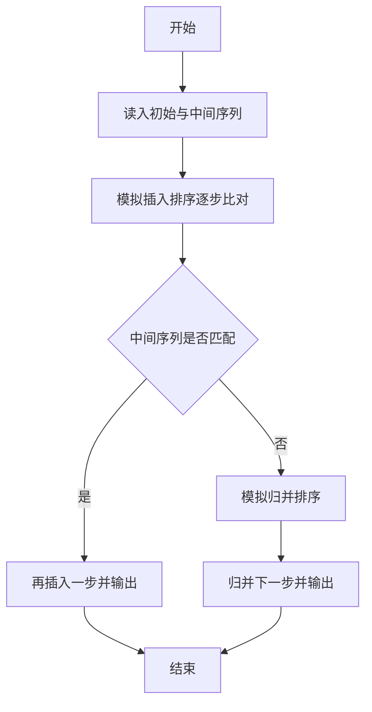
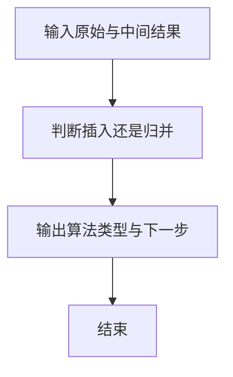

# 1035 插入与归并

- **分值：** 25分

### 题目描述

根据维基百科的定义：

**插入排序**是迭代算法，逐一获得输入数据，逐步产生有序的输出序列。每步迭代中，算法从输入序列中取出一元素，将之插入有序序列中正确的位置。如此迭代直到全部元素有序。

**归并排序**进行如下迭代操作：首先将原始序列看成 N 个只包含 1 个元素的有序子序列，然后每次迭代归并两个相邻的有序子序列，直到最后只剩下 1 个有序的序列。

现给定原始序列和由某排序算法产生的中间序列，请你判断该算法究竟是哪种排序算法？

### 输入格式：

输入在第一行给出正整数 $N$（$N\le 100$）；随后一行给出原始序列的 $N$ 个整数；最后一行给出由某排序算法产生的中间序列。这里假设排序的目标序列是升序。数字间以空格分隔。

### 输出格式：

首先在第 1 行中输出`Insertion Sort`表示插入排序、或`Merge Sort`表示归并排序；然后在第 2 行中输出用该排序算法再迭代一轮的结果序列。题目保证每组测试的结果是唯一的。数字间以空格分隔，且行首尾不得有多余空格。

### 输入样例 1：
```
10
3 1 2 8 7 5 9 4 6 0
1 2 3 7 8 5 9 4 6 0
```

### 输出样例 1：
```
Insertion Sort
1 2 3 5 7 8 9 4 6 0
```

### 输入样例 2：
```
10
3 1 2 8 7 5 9 4 0 6
1 3 2 8 5 7 4 9 0 6
```

### 输出样例 2：
```
Merge Sort
1 2 3 8 4 5 7 9 0 6
```


### 解题思路

本题的核心是：分别模拟一次插入排序和归并排序，比较中间序列以判断算法。程序先读取题目输入，再按照上述规则完成数据处理，最后严格按照题目要求输出结果。实现时应优先根据题目约束选择合适的数据类型和数据结构，避免溢出或不必要的重复计算。

时间复杂度为 O(n²)；空间复杂度为 O(n)。

### 代码流程说明

1. 读入初始序列与中间序列。
2. 模拟插入排序逐步比对。
3. 若不是插入，则模拟归并，并输出算法名与下一步序列。

### 代码实现

```ruby
# 题目：1035-插入与归并
# 实现原理：见正文「解题思路」。
# 代码步骤：
# 1. 读取输入。
# 2. 按题意完成核心计算。
# 3. 按题目要求输出结果。
#
values = STDIN.read.split.map(&:to_i)
count = values.shift
source = values.shift(count)
target = values.shift(count)

insert_at = lambda do |arr, index|
  key = arr[index]
  j = index - 1
  while j >= 0 && arr[j] > key
    arr[j + 1] = arr[j]
    j -= 1
  end
  arr[j + 1] = key
  arr
end

merge_pass = lambda do |arr, width|
  result = []
  i = 0
  while i < arr.length
    left = arr[i, width]
    right = arr[i + width, width] || []
    li = ri = 0
    merged = []
    while li < left.length && ri < right.length
      if left[li] <= right[ri]
        merged << left[li]
        li += 1
      else
        merged << right[ri]
        ri += 1
      end
    end
    merged.concat(left[li..]) if li < left.length
    merged.concat(right[ri..]) if ri < right.length
    result.concat(merged)
    i += width * 2
  end
  result
end

current = source.dup
insertion = false
(1...count).each do |index|
  current = insert_at.call(current, index)
  if current == target
    insertion = true
    current = insert_at.call(current.dup, index + 1) if index + 1 < count
    break
  end
end

if insertion
  puts "Insertion Sort"
  puts current.join(" ")
else
  current = source.dup
  width = 1
  loop do
    current = merge_pass.call(current, width)
    if current == target
      current = merge_pass.call(current, width * 2)
      puts "Merge Sort"
      puts current.join(" ")
      break
    end
    break if width * 2 >= count
    width *= 2
  end
end
```

### 代码流程图



### 解题流程图



### 常见易错点

- 插入排序下一步是再插入一个元素。
- 归并排序下一步是下一趟归并。
- 输出数组元素空格分隔。
