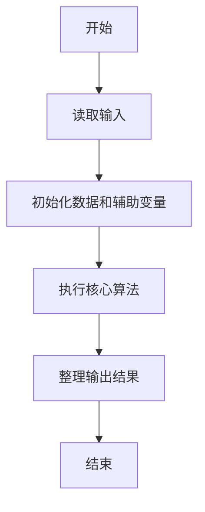
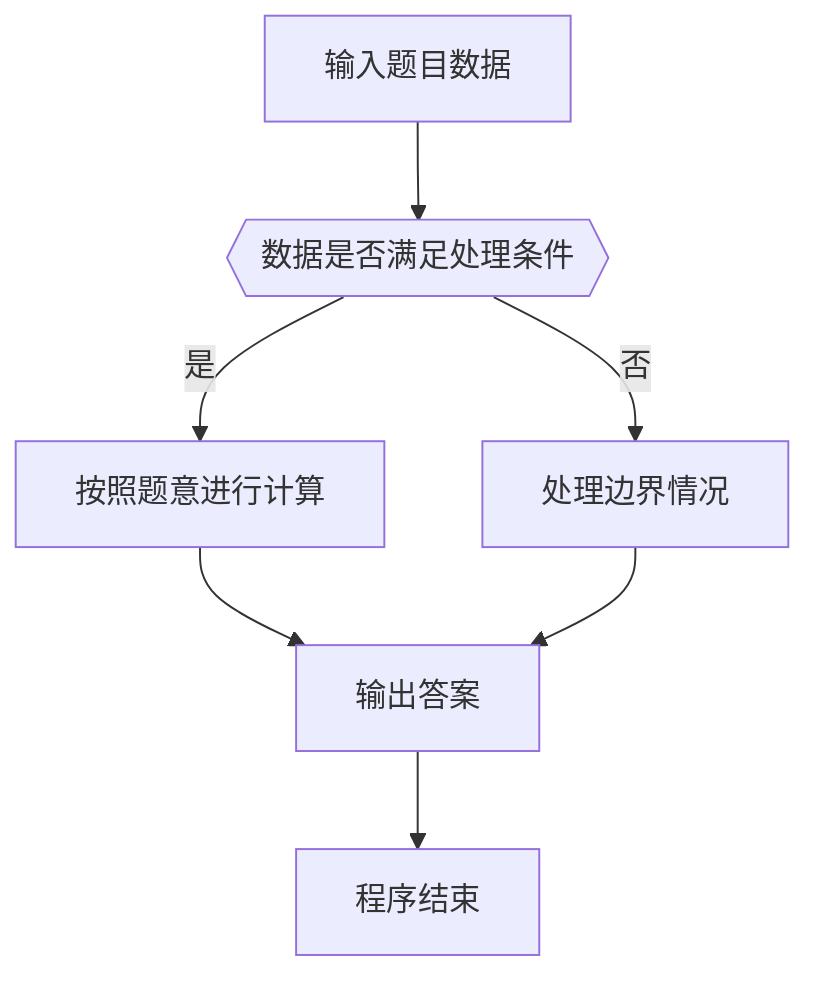

# 1035 插入与归并

- **分值：** 25分

### 题目描述

根据维基百科的定义：

**插入排序**是迭代算法，逐一获得输入数据，逐步产生有序的输出序列。每步迭代中，算法从输入序列中取出一元素，将之插入有序序列中正确的位置。如此迭代直到全部元素有序。

**归并排序**进行如下迭代操作：首先将原始序列看成 N 个只包含 1 个元素的有序子序列，然后每次迭代归并两个相邻的有序子序列，直到最后只剩下 1 个有序的序列。

现给定原始序列和由某排序算法产生的中间序列，请你判断该算法究竟是哪种排序算法？

### 输入格式：

输入在第一行给出正整数 $N$（$N\le 100$）；随后一行给出原始序列的 $N$ 个整数；最后一行给出由某排序算法产生的中间序列。这里假设排序的目标序列是升序。数字间以空格分隔。

### 输出格式：

首先在第 1 行中输出`Insertion Sort`表示插入排序、或`Merge Sort`表示归并排序；然后在第 2 行中输出用该排序算法再迭代一轮的结果序列。题目保证每组测试的结果是唯一的。数字间以空格分隔，且行首尾不得有多余空格。

### 输入样例 1：
```
10
3 1 2 8 7 5 9 4 6 0
1 2 3 7 8 5 9 4 6 0
```

### 输出样例 1：
```
Insertion Sort
1 2 3 5 7 8 9 4 6 0
```

### 输入样例 2：
```
10
3 1 2 8 7 5 9 4 0 6
1 3 2 8 5 7 4 9 0 6
```

### 输出样例 2：
```
Merge Sort
1 2 3 8 4 5 7 9 0 6
```


### 解题思路

本题的核心是：分别模拟一次插入排序和归并排序，比较中间序列以判断算法。程序先读取题目输入，再按照上述规则完成数据处理，最后严格按照题目要求输出结果。实现时应优先根据题目约束选择合适的数据类型和数据结构，避免溢出或不必要的重复计算。

时间复杂度为 O(n²)；空间复杂度为 O(n)。

### 代码流程说明

1. 读取 1035 插入与归并 所需的输入数据。
2. 初始化计数器、数组或其他辅助变量。
3. 分别模拟一次插入排序和归并排序，比较中间序列以判断算法。
4. 按题目规定的格式输出计算结果。

### 代码实现

```ruby
# 题目：1035-插入与归并
# 实现原理：
# 本题的核心是：分别模拟一次插入排序和归并排序，比较中间序列以判断算法。程序先读取题目输入，再按照上述规则完成数据处理，最后严格按照题目要求输出结果。实现时应优先根据题目约束选择合适的数据类型和数据结构，避免溢出或不必要的重复计算。
# 时间复杂度为 O(n²)；空间复杂度为 O(n)。
# 代码步骤：
# 1. 读取输入并初始化必要的数据结构。
# 2. 按题意完成核心计算，处理边界情况。
# 3. 按题目要求格式化并输出结果。
#
values = STDIN.read.split.map(&:to_i)
count = values.shift
source = values.shift(count)
target = values.shift(count)
current = source.dup
insertion = false
1.upto(count - 1) do |i|
  current[0..i] = current[0..i].sort
  if current == target
    insertion = true
    current[0..[i + 1, count - 1].min] = current[0..[i + 1, count - 1].min].sort
    break
  end
end
if insertion
  puts "Insertion Sort"
  puts current.join(" ")
else
  current = source.dup
  width = 1
  loop do
    current.each_slice(width * 2).with_index do |slice, index|
      start = index * width * 2
      current[start, slice.length] = slice.sort
    end
    break if current == target || (width *= 2) >= count
  end
  puts "Merge Sort"
  puts current.join(" ")
end
```

### 代码流程图



### 解题流程图



### 常见易错点

- 注意输入数据的范围，选择足够大的整数类型，并正确处理边界值。
- 循环、数组下标和字符串结束位置要严格对应题目定义，避免越界。
- 输出格式必须与题目要求完全一致，包括空格、换行、大小写和特殊符号。
- 如果存在排序、去重、进位、约分或四舍五入等操作，应在输出前统一完成。
