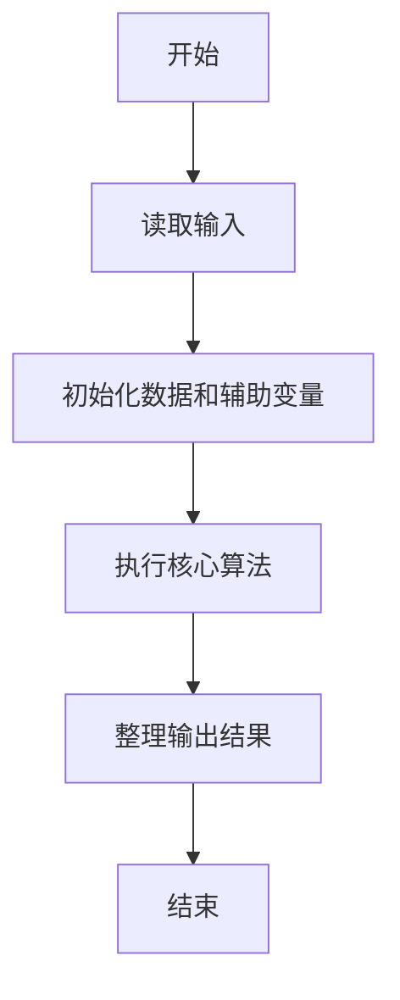
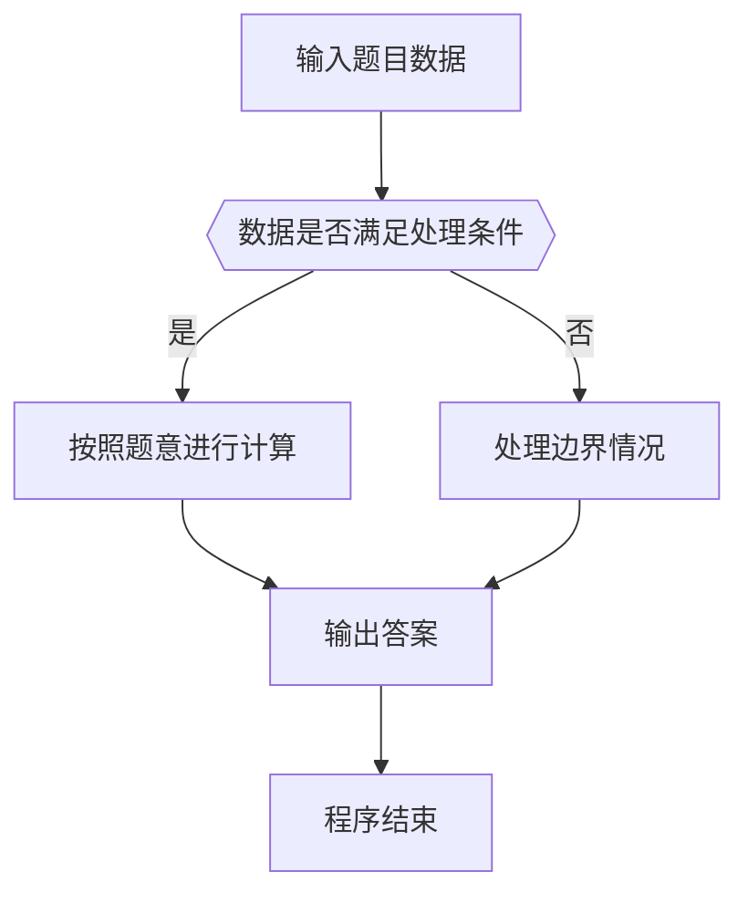

# 1036 跟奥巴马一起编程

- **分值：** 15分

### 题目描述

美国总统奥巴马不仅呼吁所有人都学习编程，甚至以身作则编写代码，成为美国历史上首位编写计算机代码的总统。2014 年底，为庆祝“计算机科学教育周”正式启动，奥巴马编写了很简单的计算机代码：在屏幕上画一个正方形。现在你也跟他一起画吧！

### 输入格式：

输入在一行中给出正方形边长 $N$（$3\le N\le 20$）和组成正方形边的某种字符 C，间隔一个空格。

### 输出格式：

输出由给定字符 C 画出的正方形。但是注意到行间距比列间距大，所以为了让结果看上去更像正方形，我们输出的行数实际上是列数的 50%（四舍五入取整）。

### 输入样例：
```
10 a
```

### 输出样例：
```
aaaaaaaaaa
a        a
a        a
a        a
aaaaaaaaaa
```


### 解题思路

本题的核心是：计算方块行数后按边框位置输出字符，其余位置输出空格。程序先读取题目输入，再按照上述规则完成数据处理，最后严格按照题目要求输出结果。实现时应优先根据题目约束选择合适的数据类型和数据结构，避免溢出或不必要的重复计算。

时间复杂度为 O(n²)；空间复杂度取决于输入规模，主要用于保存题目数据和中间结果。

### 代码流程说明

1. 读取 1036 跟奥巴马一起编程 所需的输入数据。
2. 初始化计数器、数组或其他辅助变量。
3. 计算方块行数后按边框位置输出字符，其余位置输出空格。
4. 按题目规定的格式输出计算结果。

### 代码实现

```ruby
# 题目：1036-跟奥巴马一起编程
# 实现原理：
# 本题的核心是：计算方块行数后按边框位置输出字符，其余位置输出空格。程序先读取题目输入，再按照上述规则完成数据处理，最后严格按照题目要求输出结果。实现时应优先根据题目约束选择合适的数据类型和数据结构，避免溢出或不必要的重复计算。
# 时间复杂度为 O(n²)；空间复杂度取决于输入规模，主要用于保存题目数据和中间结果。
# 代码步骤：
# 1. 读取输入并初始化必要的数据结构。
# 2. 按题意完成核心计算，处理边界情况。
# 3. 按题目要求格式化并输出结果。
#
width, symbol = STDIN.read.split
width = width.to_i
rows = (width + 1) / 2
rows.times do |row|
  puts row.zero? || row == rows - 1 ? symbol * width : symbol + " " * (width - 2) + symbol
end
```

### 代码流程图



### 解题流程图



### 常见易错点

- 注意输入数据的范围，选择足够大的整数类型，并正确处理边界值。
- 循环、数组下标和字符串结束位置要严格对应题目定义，避免越界。
- 输出格式必须与题目要求完全一致，包括空格、换行、大小写和特殊符号。
- 如果存在排序、去重、进位、约分或四舍五入等操作，应在输出前统一完成。
