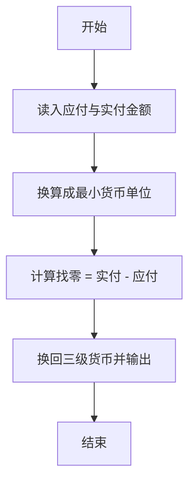
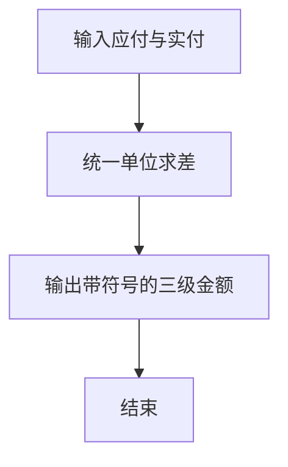

# 1037 在霍格沃茨找零钱

- **分值：** 20分

### 题目描述

如果你是哈利·波特迷，你会知道魔法世界有它自己的货币系统 —— 就如海格告诉哈利的：“十七个银西可(Sickle)兑一个加隆(Galleon)，二十九个纳特(Knut)兑一个西可，很容易。”现在，给定哈利应付的价钱 $P$ 和他实付的钱 $A$，你的任务是写一个程序来计算他应该被找的零钱。

### 输入格式：

输入在 1 行中分别给出 $P$ 和 $A$，格式为 `Galleon.Sickle.Knut`，其间用 1 个空格分隔。这里 `Galleon` 是 $[0,10^7]$ 区间内的整数，`Sickle` 是 $[0,17)$ 区间内的整数，`Knut` 是 $[0,29)$ 区间内的整数。

### 输出格式：

在一行中用与输入同样的格式输出哈利应该被找的零钱。如果他没带够钱，那么输出的应该是负数。

### 输入样例 1：
```
10.16.27 14.1.28
```

### 输出样例 1：
```
3.2.1
```

### 输入样例 2：
```
14.1.28 10.16.27
```

### 输出样例 2：
```
-3.2.1
```


### 解题思路

本题的核心是：把应付与实付金额换算成最小单位后求差，再逐级换回。程序先读取题目输入，再按照上述规则完成数据处理，最后严格按照题目要求输出结果。实现时应优先根据题目约束选择合适的数据类型和数据结构，避免溢出或不必要的重复计算。

时间复杂度为 O(1)；空间复杂度取决于输入规模，主要用于保存题目数据和中间结果。

### 代码流程说明

1. 读入应付 A 与实付 B。
2. 统一换算成 Knut 后计算 B-A。
3. 换回 Galleon.Sickle.Knut，可为负。

### 代码实现

```ruby
# 题目：1037-在霍格沃茨找零钱
# 实现原理：见正文「解题思路」。
# 代码步骤：
# 1. 读取输入。
# 2. 按题意完成核心计算。
# 3. 按题目要求输出结果。
#
parse = lambda { |value| value.split(".").map(&:to_i).then { |g, s, k| g * 17 * 29 + s * 29 + k } }
payable, paid = STDIN.read.split.map(&parse)
difference = paid - payable
sign = difference.negative? ? "-" : ""
difference = difference.abs
puts format("%s%d.%d.%d", sign, difference / (17 * 29), difference / 29 % 17, difference % 29)
```

### 代码流程图



### 解题流程图



### 常见易错点

- 1 Galleon = 17 Sickle，1 Sickle = 29 Knut。
- 找零可以是负数，负号写在最前。
- 中间计算用最小单位避免借位出错。
