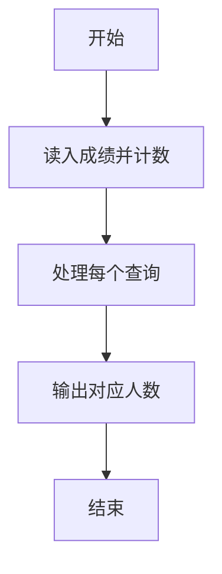
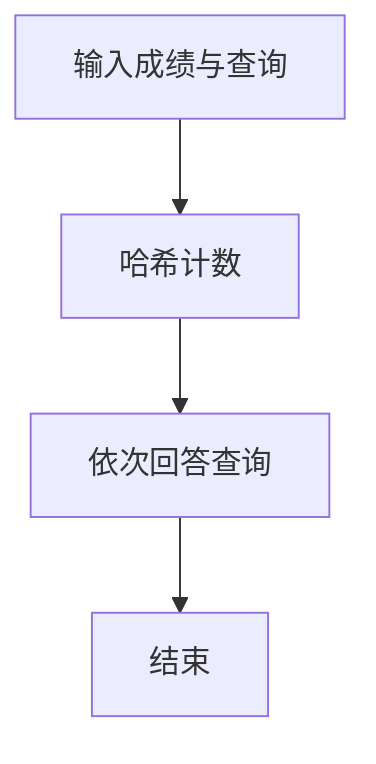

# 1038 统计同成绩学生

- **分值：** 20分

### 题目描述

本题要求读入 $N$ 名学生的成绩，将获得某一给定分数的学生人数输出。

### 输入格式：

输入在第 1 行给出不超过 $10^5$ 的正整数 $N$，即学生总人数。随后一行给出 $N$ 名学生的百分制整数成绩，中间以空格分隔。最后一行给出要查询的分数个数 $K$（不超过 $N$ 的正整数），随后是 $K$ 个分数，中间以空格分隔。

### 输出格式：

在一行中按查询顺序给出得分等于指定分数的学生人数，中间以空格分隔，但行末不得有多余空格。

### 输入样例：
```
10
60 75 90 55 75 99 82 90 75 50
3 75 90 88
```

### 输出样例：
```
3 2 0
```


### 解题思路

本题的核心是：建立分数到人数的映射，查询时直接输出对应计数。程序先读取题目输入，再按照上述规则完成数据处理，最后严格按照题目要求输出结果。实现时应优先根据题目约束选择合适的数据类型和数据结构，避免溢出或不必要的重复计算。

时间复杂度为 O(n + q)；空间复杂度取决于输入规模，主要用于保存题目数据和中间结果。

### 代码流程说明

1. 读入 n 个成绩并计数。
2. 读入 m 个查询分数。
3. 输出每个查询的人数。

### 代码实现

```ruby
# 题目：1038-统计同成绩学生
# 实现原理：
# 本题的核心是：建立分数到人数的映射，查询时直接输出对应计数
# 时间复杂度为 O(n + q)；空间复杂度取决于输入规模，主要用于保存题目数据和中间结果。
# 代码步骤：
# 1. 读取输入并初始化必要的数据结构。
# 2. 按题意完成核心计算，处理边界情况。
# 3. 按题目要求格式化并输出结果。
#
tokens = STDIN.read.split.map(&:to_i)
count = tokens.shift
scores = tokens.shift(count)
queries = tokens.shift
frequency = Array.new(101, 0)
scores.each { |score| frequency[score] += 1 }
puts tokens.first(queries).map { |score| frequency[score] }.join(" ")
```

### 代码流程图



### 解题流程图



### 常见易错点

- 没有出现过的分数输出 0。
- 成绩范围有限，可用数组计数。
- 查询输出同一行空格分隔。
