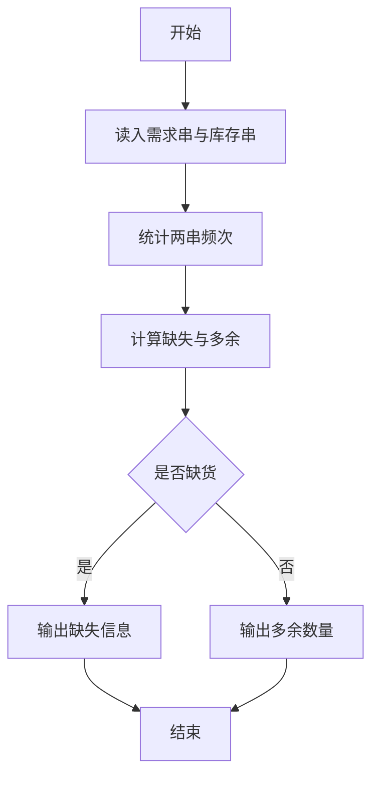
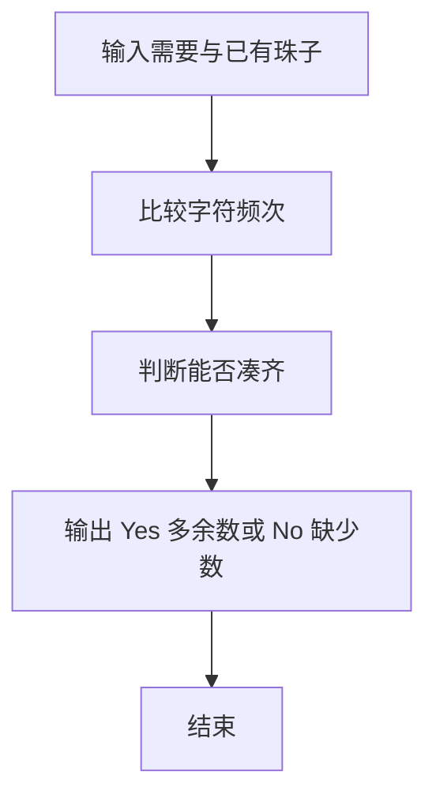

# 1039 到底买不买

- **分值：** 20分

### 题目描述

小红想买些珠子做一串自己喜欢的珠串。卖珠子的摊主有很多串五颜六色的珠串，但是不肯把任何一串拆散了卖。于是小红要你帮忙判断一下，某串珠子里是否包含了全部自己想要的珠子？如果是，那么告诉她有多少多余的珠子；如果不是，那么告诉她缺了多少珠子。

为方便起见，我们用[0-9]、[a-z]、[A-Z]范围内的字符来表示颜色。例如在图1中，第3串是小红想做的珠串；那么第1串可以买，因为包含了全部她想要的珠子，还多了8颗不需要的珠子；第2串不能买，因为没有黑色珠子，并且少了一颗红色的珠子。


图 1

### 输入格式：

每个输入包含 1 个测试用例。每个测试用例分别在 2 行中先后给出摊主的珠串和小红想做的珠串，两串都不超过 1000 个珠子。

### 输出格式：

如果可以买，则在一行中输出 `Yes` 以及有多少多余的珠子；如果不可以买，则在一行中输出 `No` 以及缺了多少珠子。其间以 1 个空格分隔。

### 输入样例 1：
```
ppRYYGrrYBR2258
YrR8RrY
```

### 输出样例 1：
```
Yes 8
```

### 输入样例 2：
```
ppRYYGrrYB225
YrR8RrY
```

### 输出样例 2：
```
No 2
```


### 解题思路

本题的核心是：统计两串字符频次，判断多余数量或缺少数量。程序先读取题目输入，再按照上述规则完成数据处理，最后严格按照题目要求输出结果。实现时应优先根据题目约束选择合适的数据类型和数据结构，避免溢出或不必要的重复计算。

时间复杂度为 O(L)；空间复杂度取决于输入规模，主要用于保存题目数据和中间结果。

### 代码流程说明

1. 统计买家需要的珠子频次与店家拥有的频次。
2. 计算缺少的珠子数。
3. 若缺少为 0，输出多余珠子数，否则输出缺少信息。

### 代码实现

```ruby
# 题目：1039-到底买不买
# 实现原理：
# 本题的核心是：统计两串字符频次，判断多余数量或缺少数量
# 时间复杂度为 O(L)；空间复杂度取决于输入规模，主要用于保存题目数据和中间结果。
# 代码步骤：
# 1. 读取输入并初始化必要的数据结构。
# 2. 按题意完成核心计算，处理边界情况。
# 3. 按题目要求格式化并输出结果。
#
available, wanted = STDIN.read.split
counts = available.chars.tally
missing = wanted.chars.count do |char|
  if counts[char].to_i.positive?
    counts[char] -= 1
    false
  else
    true
  end
end
if missing.zero?
  puts "Yes #{counts.values.sum}"
else
  puts "No #{missing}"
end
```

### 代码流程图



### 解题流程图



### 常见易错点

- 字符区分大小写。
- 缺货时输出 No 和缺少总数。
- 不缺时输出 Yes 和多余总数。
