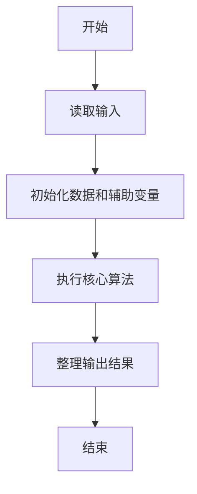
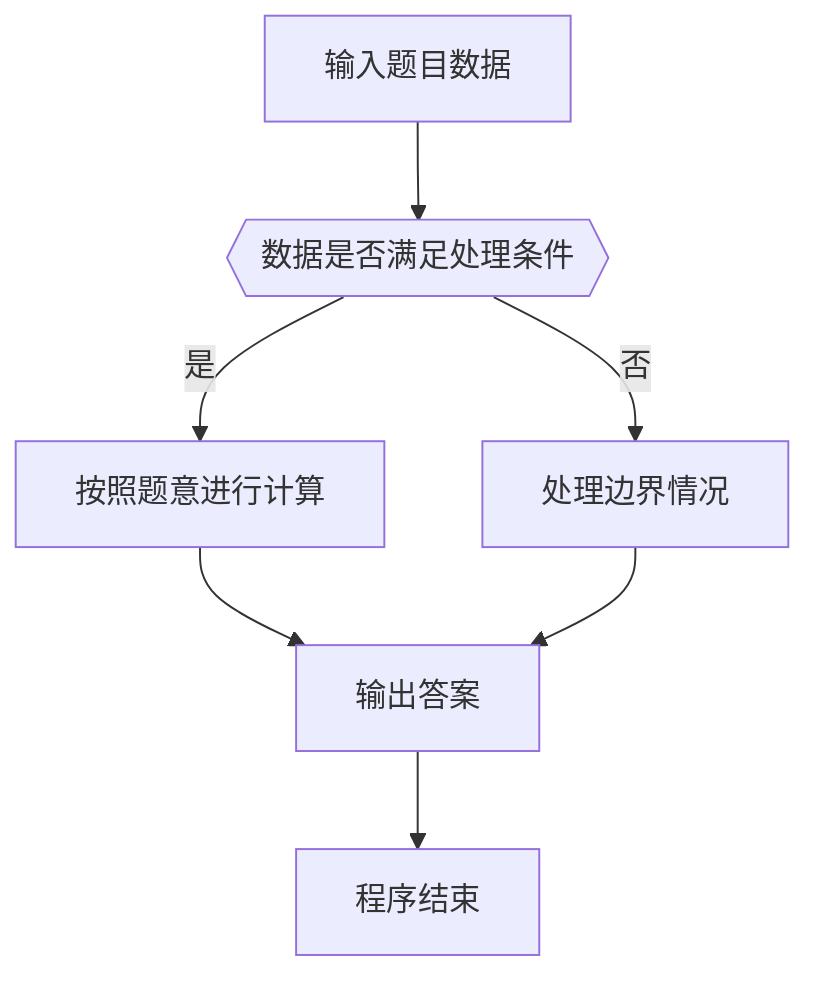

# 1040 有几个PAT

- **分值：** 25分

### 题目描述

字符串 `APPAPT` 中包含了两个单词 `PAT`，其中第一个 `PAT` 是第 2 位(`P`)，第 4 位(`A`)，第 6 位(`T`)；第二个 `PAT` 是第 3 位(`P`)，第 4 位(`A`)，第 6 位(`T`)。

现给定字符串，问一共可以形成多少个 `PAT`？

### 输入格式：

输入只有一行，包含一个字符串，长度不超过 $10^5$，只包含 `P`、`A`、`T` 三种字母。

### 输出格式：

在一行中输出给定字符串中包含多少个 `PAT`。由于结果可能比较大，只输出对 1000000007 取余数的结果。

### 输入样例：
```
APPAPT
```

### 输出样例：
```
2
```


### 解题思路

本题的核心是：扫描字符串，维护左侧 P 数和右侧 T 数，遇到 A 时累加贡献。程序先读取题目输入，再按照上述规则完成数据处理，最后严格按照题目要求输出结果。实现时应优先根据题目约束选择合适的数据类型和数据结构，避免溢出或不必要的重复计算。

时间复杂度为 O(L)；空间复杂度取决于输入规模，主要用于保存题目数据和中间结果。

### 代码流程说明

1. 读取 1040 有几个PAT 所需的输入数据。
2. 初始化计数器、数组或其他辅助变量。
3. 扫描字符串，维护左侧 P 数和右侧 T 数，遇到 A 时累加贡献。
4. 按题目规定的格式输出计算结果。

### 代码实现

```ruby
# 题目：1040-有几个PAT
# 实现原理：
# 本题的核心是：扫描字符串，维护左侧 P 数和右侧 T 数，遇到 A 时累加贡献。程序先读取题目输入，再按照上述规则完成数据处理，最后严格按照题目要求输出结果。实现时应优先根据题目约束选择合适的数据类型和数据结构，避免溢出或不必要的重复计算。
# 时间复杂度为 O(L)；空间复杂度取决于输入规模，主要用于保存题目数据和中间结果。
# 代码步骤：
# 1. 读取输入并初始化必要的数据结构。
# 2. 按题意完成核心计算，处理边界情况。
# 3. 按题目要求格式化并输出结果。
#
p_count = 0
pa_count = 0
answer = 0
STDIN.read.strip.each_char do |char|
  case char
  when "P" then p_count += 1
  when "A" then pa_count += p_count
  when "T" then answer += pa_count
  end
end
puts answer
```

### 代码流程图



### 解题流程图



### 常见易错点

- 注意输入数据的范围，选择足够大的整数类型，并正确处理边界值。
- 循环、数组下标和字符串结束位置要严格对应题目定义，避免越界。
- 输出格式必须与题目要求完全一致，包括空格、换行、大小写和特殊符号。
- 如果存在排序、去重、进位、约分或四舍五入等操作，应在输出前统一完成。
