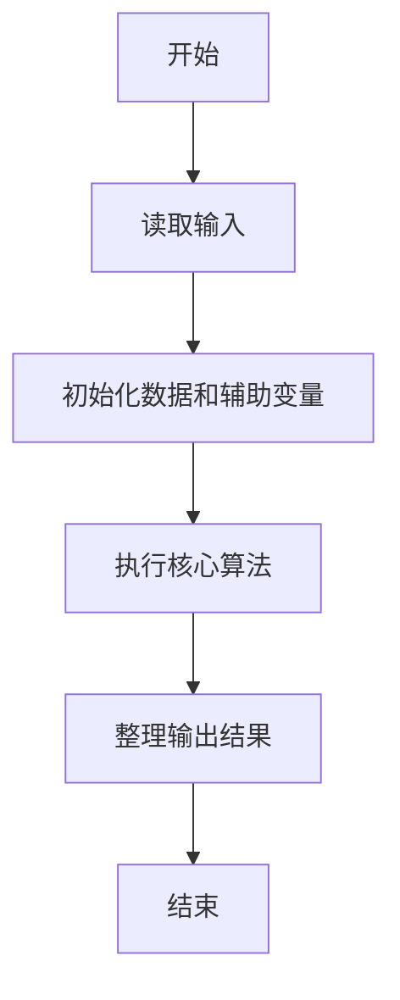
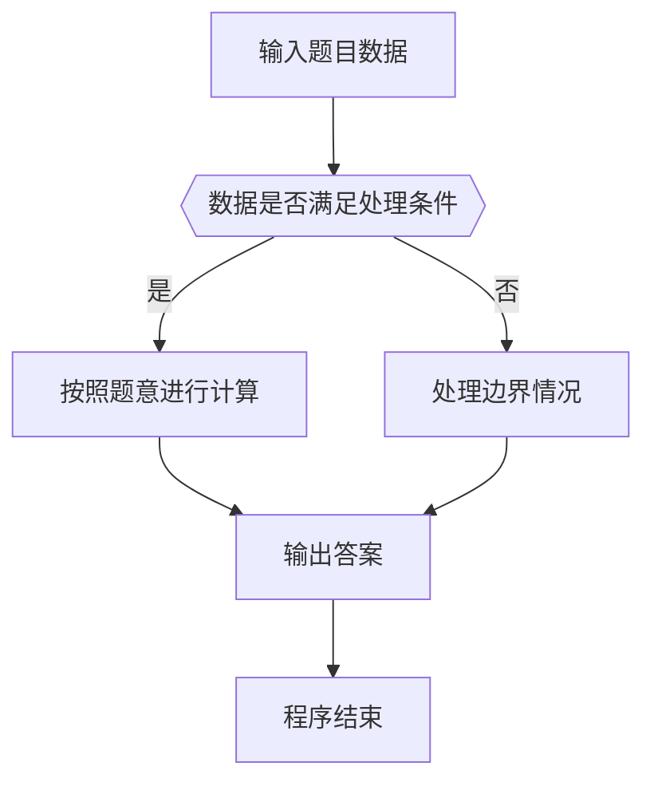

# 1041 考试座位号

- **分值：** 15分

### 题目描述

每个 PAT 考生在参加考试时都会被分配两个座位号，一个是试机座位，一个是考试座位。正常情况下，考生在入场时先得到试机座位号码，入座进入试机状态后，系统会显示该考生的考试座位号码，考试时考生需要换到考试座位就座。但有些考生迟到了，试机已经结束，他们只能拿着领到的试机座位号码求助于你，从后台查出他们的考试座位号码。

### 输入格式：

输入第一行给出一个正整数 $N$（$\le 1000$），随后 $N$ 行，每行给出一个考生的信息：`准考证号 试机座位号 考试座位号`。其中`准考证号`由 16 位数字组成，座位从 1 到 $N$ 编号。输入保证每个人的准考证号都不同，并且任何时候都不会把两个人分配到同一个座位上。

考生信息之后，给出一个正整数 $M$（$M\le N$），随后一行中给出 $M$ 个待查询的试机座位号码，以空格分隔。

### 输出格式：

对应每个需要查询的试机座位号码，在一行中输出对应考生的准考证号和考试座位号码，中间用 1 个空格分隔。

### 输入样例：
```
4
3310120150912233 2 4
3310120150912119 4 1
3310120150912126 1 3
3310120150912002 3 2
2
3 4
```

### 输出样例：
```
3310120150912002 2
3310120150912119 1
```


### 解题思路

本题的核心是：建立试机座位号到考试座位号的映射，按查询直接查表。程序先读取题目输入，再按照上述规则完成数据处理，最后严格按照题目要求输出结果。实现时应优先根据题目约束选择合适的数据类型和数据结构，避免溢出或不必要的重复计算。

时间复杂度为 O(n + q)；空间复杂度取决于输入规模，主要用于保存题目数据和中间结果。

### 代码流程说明

1. 读取 1041 考试座位号 所需的输入数据。
2. 初始化计数器、数组或其他辅助变量。
3. 建立试机座位号到考试座位号的映射，按查询直接查表。
4. 按题目规定的格式输出计算结果。

### 代码实现

```ruby
# 题目：1041-考试座位号
# 实现原理：
# 本题的核心是：建立试机座位号到考试座位号的映射，按查询直接查表。程序先读取题目输入，再按照上述规则完成数据处理，最后严格按照题目要求输出结果。实现时应优先根据题目约束选择合适的数据类型和数据结构，避免溢出或不必要的重复计算。
# 时间复杂度为 O(n + q)；空间复杂度取决于输入规模，主要用于保存题目数据和中间结果。
# 代码步骤：
# 1. 读取输入并初始化必要的数据结构。
# 2. 按题意完成核心计算，处理边界情况。
# 3. 按题目要求格式化并输出结果。
#
tokens = STDIN.read.split
count = tokens.shift.to_i
seats = {}
count.times do
  id, practice, exam = tokens.shift(3)
  seats[practice] = [id, exam]
end
query_count = tokens.shift.to_i
query_count.times do
  id, exam = seats.fetch(tokens.shift)
  puts "#{id} #{exam}"
end
```

### 代码流程图



### 解题流程图



### 常见易错点

- 注意输入数据的范围，选择足够大的整数类型，并正确处理边界值。
- 循环、数组下标和字符串结束位置要严格对应题目定义，避免越界。
- 输出格式必须与题目要求完全一致，包括空格、换行、大小写和特殊符号。
- 如果存在排序、去重、进位、约分或四舍五入等操作，应在输出前统一完成。
