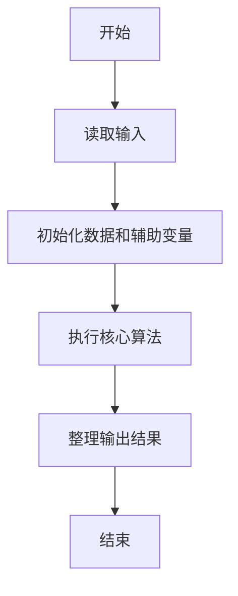
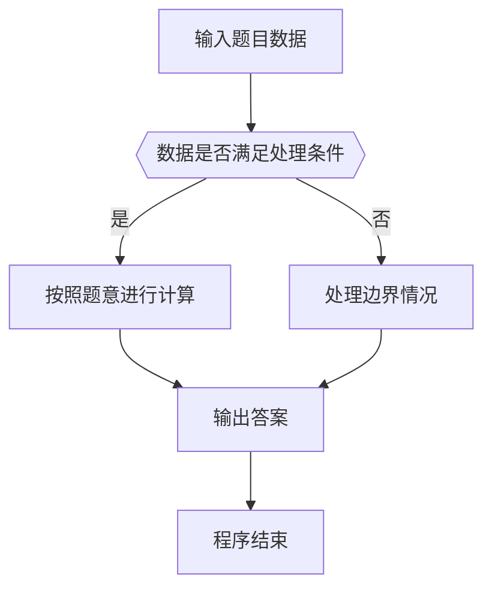

# 1042 字符统计

- **分值：** 20分

### 题目描述

请编写程序，找出一段给定文字中出现最频繁的那个英文字母。

### 输入格式：

输入在一行中给出一个长度不超过 1000 的字符串。字符串由 ASCII 码表中任意可见字符及空格组成，至少包含 1 个英文字母，以回车结束（回车不算在内）。

### 输出格式：

在一行中输出出现频率最高的那个英文字母及其出现次数，其间以空格分隔。如果有并列，则输出按字母序最小的那个字母。统计时不区分大小写，输出小写字母。

### 输入样例：
```
This is a simple TEST.  There ARE numbers and other symbols 1&2&3...........
```

### 输出样例：
```
e 7
```


### 解题思路

本题的核心是：只保留英文字母并统一转小写，统计出现次数后取最大者。程序先读取题目输入，再按照上述规则完成数据处理，最后严格按照题目要求输出结果。实现时应优先根据题目约束选择合适的数据类型和数据结构，避免溢出或不必要的重复计算。

时间复杂度为 O(L)；空间复杂度取决于输入规模，主要用于保存题目数据和中间结果。

### 代码流程说明

1. 读取 1042 字符统计 所需的输入数据。
2. 初始化计数器、数组或其他辅助变量。
3. 只保留英文字母并统一转小写，统计出现次数后取最大者。
4. 按题目规定的格式输出计算结果。

### 代码实现

```ruby
# 题目：1042-字符统计
# 实现原理：
# 本题的核心是：只保留英文字母并统一转小写，统计出现次数后取最大者。程序先读取题目输入，再按照上述规则完成数据处理，最后严格按照题目要求输出结果。实现时应优先根据题目约束选择合适的数据类型和数据结构，避免溢出或不必要的重复计算。
# 时间复杂度为 O(L)；空间复杂度取决于输入规模，主要用于保存题目数据和中间结果。
# 代码步骤：
# 1. 读取输入并初始化必要的数据结构。
# 2. 按题意完成核心计算，处理边界情况。
# 3. 按题目要求格式化并输出结果。
#
counts = Hash.new(0)
STDIN.gets.to_s.downcase.each_char { |char| counts[char] += 1 if char.match?(/[a-z]/) }
char, count = counts.max_by { |letter, value| [value, -letter.ord] }
puts "#{char} #{count}"
```

### 代码流程图



### 解题流程图



### 常见易错点

- 注意输入数据的范围，选择足够大的整数类型，并正确处理边界值。
- 循环、数组下标和字符串结束位置要严格对应题目定义，避免越界。
- 输出格式必须与题目要求完全一致，包括空格、换行、大小写和特殊符号。
- 如果存在排序、去重、进位、约分或四舍五入等操作，应在输出前统一完成。
