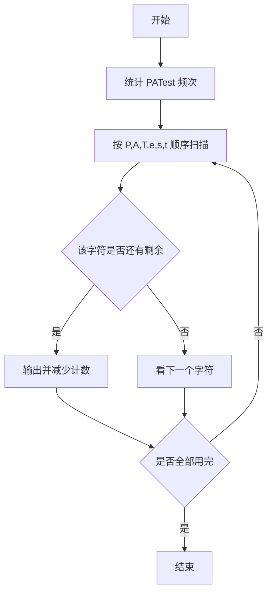
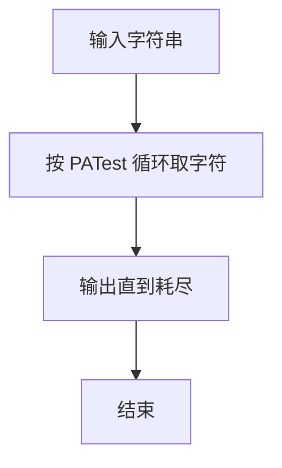

# 1043 输出PATest

- **分值：** 20分

### 题目描述

给定一个长度不超过 $10^4$ 的、仅由英文字母构成的字符串。请将字符重新调整顺序，按 `PATestPATest....` 这样的顺序输出，并忽略其它字符。当然，六种字符的个数不一定是一样多的，若某种字符已经输出完，则余下的字符仍按 PATest 的顺序打印，直到所有字符都被输出。

### 输入格式：

输入在一行中给出一个长度不超过 $10^4$ 的、仅由英文字母构成的非空字符串。

### 输出格式：

在一行中按题目要求输出处理后的字符串。题目保证输出非空。

### 输入样例：
```
redlesPayBestPATTopTeePHPereatitAPPT
```

### 输出样例：
```
PATestPATestPTetPTePePee
```


### 解题思路

本题的核心是：按顺序轮流输出仍有剩余的 P、A、T、e、s、t，直到全部字符耗尽。程序先读取题目输入，再按照上述规则完成数据处理，最后严格按照题目要求输出结果。实现时应优先根据题目约束选择合适的数据类型和数据结构，避免溢出或不必要的重复计算。

时间复杂度为 O(L)；空间复杂度取决于输入规模，主要用于保存题目数据和中间结果。

### 代码流程说明

1. 统计 PATest 六个字符的频次。
2. 按固定顺序循环输出仍有剩余的字符。
3. 直到全部用完。

### 代码实现

```ruby
# 题目：1043-输出PATest
# 实现原理：
# 本题的核心是：按顺序轮流输出仍有剩余的 P、A、T、e、s、t，直到全部字符耗尽
# 时间复杂度为 O(L)；空间复杂度取决于输入规模，主要用于保存题目数据和中间结果。
# 代码步骤：
# 1. 读取输入并初始化必要的数据结构。
# 2. 按题意完成核心计算，处理边界情况。
# 3. 按题目要求格式化并输出结果。
#
counts = STDIN.read.chars.tally
order = "PATest".chars
result = +""
while order.any? { |char| counts[char].to_i.positive? }
  order.each do |char|
    next unless counts[char].to_i.positive?
    result << char
    counts[char] -= 1
  end
end
puts result
```

### 代码流程图



### 解题流程图



### 常见易错点

- 只统计这六种字符。
- 循环顺序固定为 P A T e s t。
- 同一行连续输出。
