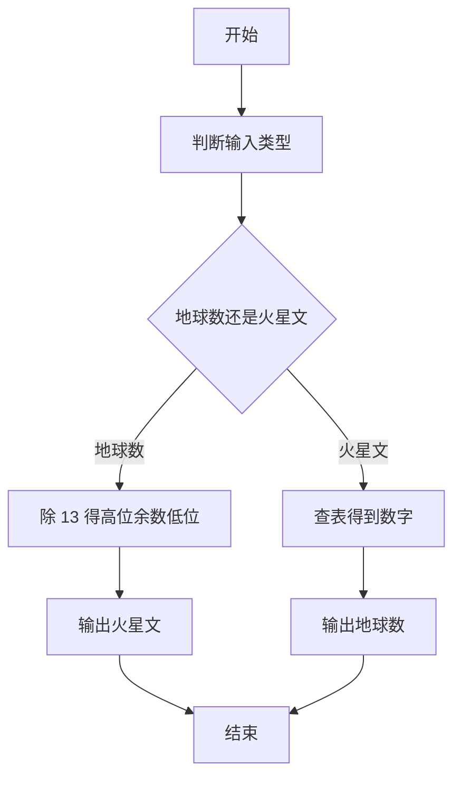
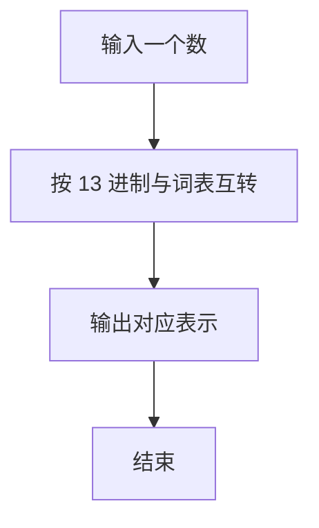

# 1044 火星数字

- **分值：** 20分

### 题目描述

火星人是以 13 进制计数的：

- 地球人的 0 被火星人称为 tret。
- 地球人数字 1 到 12 的火星文分别为：jan, feb, mar, apr, may, jun, jly, aug, sep, oct, nov, dec。
- 火星人将进位以后的 12 个高位数字分别称为：tam, hel, maa, huh, tou, kes, hei, elo, syy, lok, mer, jou。

例如地球人的数字 `29` 翻译成火星文就是 `hel mar`；而火星文 `elo nov` 对应地球数字 `115`。为了方便交流，请你编写程序实现地球和火星数字之间的互译。

### 输入格式：

输入第一行给出一个正整数 $N$（$N<100$），随后 $N$ 行，每行给出一个 $[0,169)$ 区间内的数字 —— 或者是地球文，或者是火星文。

### 输出格式：

对应输入的每一行，在一行中输出翻译后的另一种语言的数字。

### 输入样例：
```
4
29
5
elo nov
tam
```

### 输出样例：
```
hel mar
may
115
13
```


### 解题思路

本题的核心是：使用低位和高位火星数字表，在地球数与火星数之间按进制规则转换。程序先读取题目输入，再按照上述规则完成数据处理，最后严格按照题目要求输出结果。实现时应优先根据题目约束选择合适的数据类型和数据结构，避免溢出或不必要的重复计算。

时间复杂度为 O(L)；空间复杂度取决于输入规模，主要用于保存题目数据和中间结果。

### 代码流程说明

1. 判断输入是地球数字还是火星文。
2. 火星文按 13 进制，低位词 + 高位词。
3. 双向转换并输出。

### 代码实现

```ruby
# 题目：1044-火星数字
# 实现原理：
# 本题的核心是：使用低位和高位火星数字表，在地球数与火星数之间按进制规则转换
# 时间复杂度为 O(L)；空间复杂度取决于输入规模，主要用于保存题目数据和中间结果。
# 代码步骤：
# 1. 读取输入并初始化必要的数据结构。
# 2. 按题意完成核心计算，处理边界情况。
# 3. 按题目要求格式化并输出结果。
#
low = %w[tret jan feb mar apr may jun jly aug sep oct nov dec]
high = [nil, "tam", "hel", "maa", "huh", "tou", "kes", "hei", "elo", "syy", "lok", "mer", "jou"]
lines = STDIN.readlines.map(&:strip)
lines.drop(1).first(lines.first.to_i).each do |line|
  if line.match?(/\A\d+\z/)
    value = line.to_i
    puts value < 13 ? low[value] : value % 13 == 0 ? high[value / 13] : "#{high[value / 13]} #{low[value % 13]}"
  else
    parts = line.split
    value = high.index(parts[0]).to_i * 13 + low.index(parts[-1]).to_i
    puts value
  end
end
```

### 代码流程图



### 解题流程图



### 常见易错点

- 0 的火星文表示要单独处理。
- 高位为 1 时不输出 tret 之类的低位词（以题面词表为准）。
- 数字与字母输入的判断要准确。
