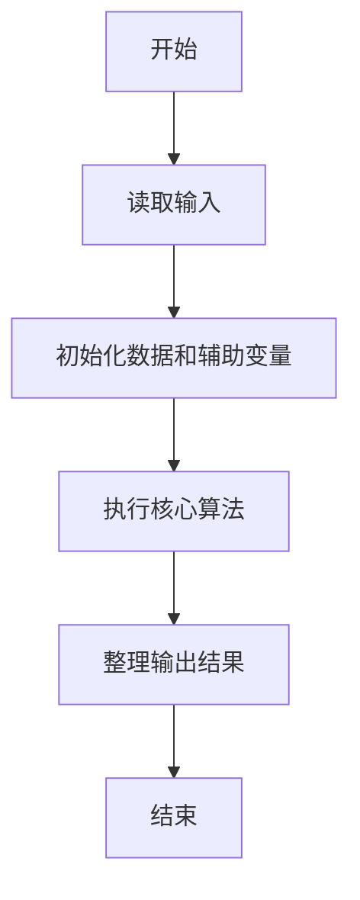
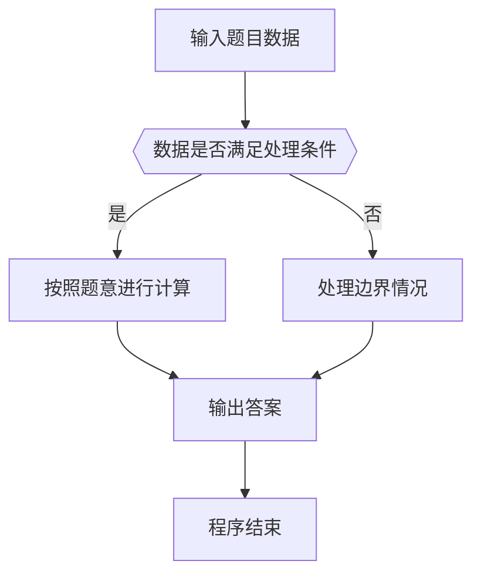

# 1045 快速排序

- **分值：** 25分

### 题目描述

著名的快速排序算法里有一个经典的划分过程：我们通常采用某种方法取一个元素作为主元，通过交换，把比主元小的元素放到它的左边，比主元大的元素放到它的右边。 给定划分后的 $N$ 个互不相同的正整数的排列，请问有多少个元素可能是划分前选取的主元？

例如给定 $N = 5$, 排列是1、3、2、4、5。则：

- 1 的左边没有元素，右边的元素都比它大，所以它可能是主元；
- 尽管 3 的左边元素都比它小，但其右边的 2 比它小，所以它不能是主元；
- 尽管 2 的右边元素都比它大，但其左边的 3 比它大，所以它不能是主元；
- 类似原因，4 和 5 都可能是主元。

因此，有 3 个元素可能是主元。

### 输入格式：

输入在第 1 行中给出一个正整数 $N$（$\le 10^5$）； 第 2 行是空格分隔的 $N$ 个不同的正整数，每个数不超过 $10^9$。

### 输出格式：

在第 1 行中输出有可能是主元的元素个数；在第 2 行中按递增顺序输出这些元素，其间以 1 个空格分隔，行首尾不得有多余空格。

### 输入样例：
```
5
1 3 2 4 5
```

### 输出样例：
```
3
1 4 5
```


### 解题思路

本题的核心是：排序后计算左侧最大值和右侧最小值，满足条件的元素即为主元。程序先读取题目输入，再按照上述规则完成数据处理，最后严格按照题目要求输出结果。实现时应优先根据题目约束选择合适的数据类型和数据结构，避免溢出或不必要的重复计算。

时间复杂度为 O(n log n)；空间复杂度取决于输入规模，主要用于保存题目数据和中间结果。

### 代码流程说明

1. 读取 1045 快速排序 所需的输入数据。
2. 初始化计数器、数组或其他辅助变量。
3. 排序后计算左侧最大值和右侧最小值，满足条件的元素即为主元。
4. 按题目规定的格式输出计算结果。

### 代码实现

```ruby
# 题目：1045-快速排序
# 实现原理：
# 本题的核心是：排序后计算左侧最大值和右侧最小值，满足条件的元素即为主元。程序先读取题目输入，再按照上述规则完成数据处理，最后严格按照题目要求输出结果。实现时应优先根据题目约束选择合适的数据类型和数据结构，避免溢出或不必要的重复计算。
# 时间复杂度为 O(n log n)；空间复杂度取决于输入规模，主要用于保存题目数据和中间结果。
# 代码步骤：
# 1. 读取输入并初始化必要的数据结构。
# 2. 按题意完成核心计算，处理边界情况。
# 3. 按题目要求格式化并输出结果。
#
tokens = STDIN.read.split.map(&:to_i)
count = tokens.shift
values = tokens.first(count)
sorted = values.sort
prefix_max = -Float::INFINITY
answer = []
values.each_with_index do |value, index|
  prefix_max = [prefix_max, value].max
  answer << value if value == sorted[index] && value >= prefix_max
end
puts answer.length
puts answer.join(" ")
```

### 代码流程图



### 解题流程图



### 常见易错点

- 注意输入数据的范围，选择足够大的整数类型，并正确处理边界值。
- 循环、数组下标和字符串结束位置要严格对应题目定义，避免越界。
- 输出格式必须与题目要求完全一致，包括空格、换行、大小写和特殊符号。
- 如果存在排序、去重、进位、约分或四舍五入等操作，应在输出前统一完成。
