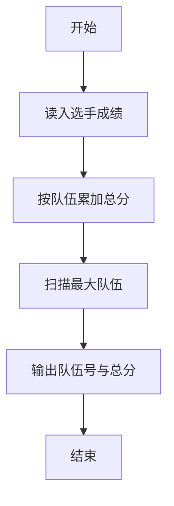
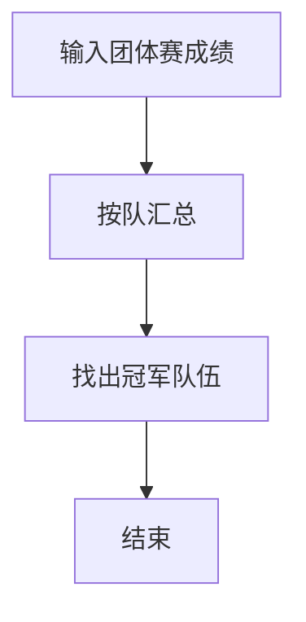

# 1047 编程团体赛

- **分值：** 20分

### 题目描述

编程团体赛的规则为：每个参赛队由若干队员组成；所有队员独立比赛；参赛队的成绩为所有队员的成绩和；成绩最高的队获胜。

现给定所有队员的比赛成绩，请你编写程序找出冠军队。

### 输入格式：

输入第一行给出一个正整数 $N$（$\le 10^4$），即所有参赛队员总数。随后 $N$ 行，每行给出一位队员的成绩，格式为：`队伍编号-队员编号 成绩`，其中`队伍编号`为 1 到 1000 的正整数，`队员编号`为 1 到 10 的正整数，`成绩`为 0 到 100 的整数。

### 输出格式：

在一行中输出冠军队的编号和总成绩，其间以一个空格分隔。注意：题目保证冠军队是唯一的。

### 输入样例：
```
6
3-10 99
11-5 87
102-1 0
102-3 100
11-9 89
3-2 61
```

### 输出样例：
```
11 176
```


### 解题思路

本题的核心是：按队伍汇总成员成绩，最后输出总成绩最高的队伍。程序先读取题目输入，再按照上述规则完成数据处理，最后严格按照题目要求输出结果。实现时应优先根据题目约束选择合适的数据类型和数据结构，避免溢出或不必要的重复计算。

时间复杂度为 O(n)；空间复杂度取决于输入规模，主要用于保存题目数据和中间结果。

### 代码流程说明

1. 读入 n 条队伍-选手-分数。
2. 按队伍编号累加。
3. 输出总分最高的队伍与分数。

### 代码实现

```ruby
# 题目：1047-编程团体赛
# 实现原理：
# 本题的核心是：按队伍汇总成员成绩，最后输出总成绩最高的队伍
# 时间复杂度为 O(n)；空间复杂度取决于输入规模，主要用于保存题目数据和中间结果。
# 代码步骤：
# 1. 读取输入并初始化必要的数据结构。
# 2. 按题意完成核心计算，处理边界情况。
# 3. 按题目要求格式化并输出结果。
#
tokens = STDIN.read.split
count = tokens.shift.to_i
scores = Hash.new(0)
count.times do
  team, score = tokens.shift(2)
  scores[team.split("-").first.to_i] += score.to_i
end
winner = scores.max_by { |team, score| [score, -team] }
puts "#{winner[0]} #{winner[1]}"
```

### 代码流程图



### 解题流程图



### 常见易错点

- 队伍编号与分数都是整数。
- 保证唯一最高分。
- 输出格式为编号 空格 总分。
