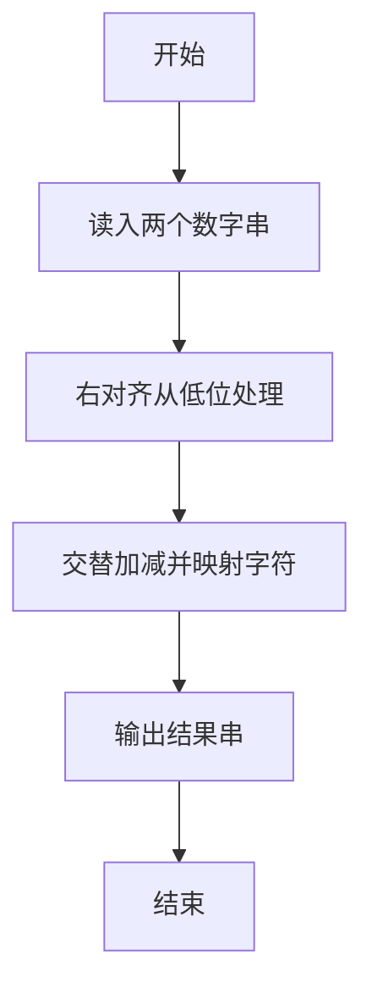
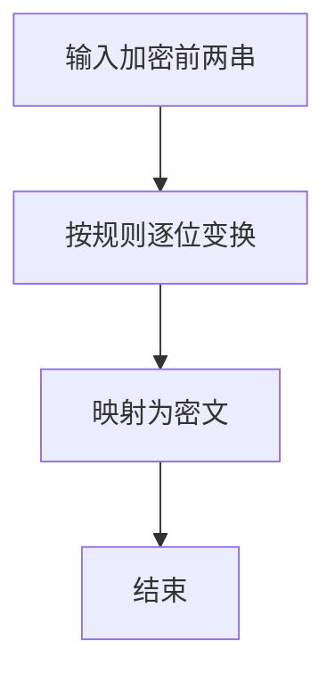

# 1048 数字加密

- **分值：** 20分

### 题目描述

本题要求实现一种数字加密方法。首先固定一个加密用正整数 A，对任一正整数 B，将其每一位数字与 A 的对应位置上的数字进行以下运算：对奇数位，对应位的数字相加后对 13 取余——这里用 J 代表 10、Q 代表 11、K 代表 12；对偶数位，用 B 的数字减去 A 的数字，若结果为负数，则再加 10。这里令个位为第 1 位。

### 输入格式：

输入在一行中依次给出 A 和 B，均为不超过 100 位的正整数，其间以空格分隔。

### 输出格式：

在一行中输出加密后的结果。

### 输入样例：
```
1234567 368782971
```

### 输出样例：
```
3695Q8118
```


### 解题思路

本题的核心是：从低位开始交替执行相加和相减，再按 13 进制输出结果。程序先读取题目输入，再按照上述规则完成数据处理，最后严格按照题目要求输出结果。实现时应优先根据题目约束选择合适的数据类型和数据结构，避免溢出或不必要的重复计算。

时间复杂度为 O(L)；空间复杂度取决于输入规模，主要用于保存题目数据和中间结果。

### 代码流程说明

1. 将两个字符串右对齐。
2. 从低位起奇数位相加、偶数位相减（按题面定义）。
3. 映射 0-12 为 0-9A-C 并输出。

### 代码实现

```ruby
# 题目：1048-数字加密
# 实现原理：
# 本题的核心是：从低位开始交替执行相加和相减，再按 13 进制输出结果
# 时间复杂度为 O(L)；空间复杂度取决于输入规模，主要用于保存题目数据和中间结果。
# 代码步骤：
# 1. 读取输入并初始化必要的数据结构。
# 2. 按题意完成核心计算，处理边界情况。
# 3. 按题目要求格式化并输出结果。
#
a, b = STDIN.read.split.map(&:chars)
length = [a.length, b.length].max
result = Array.new(length)
length.times do |offset|
  x = a[-1 - offset].to_i
  y = b[-1 - offset].to_i
  value = offset.even? ? (x + y) % 13 : (y - x + 10) % 10
  result[-1 - offset] = value < 10 ? value.to_s : %w[J Q K][value - 10]
end
puts result.join
```

### 代码流程图



### 解题流程图



### 常见易错点

- 两串长度可能不同，高位补 0 或按题面处理。
- 13 进制符号是 0-9 和 A-C。
- 结果要去掉不必要的前导 0，除非结果本身就是 0。
