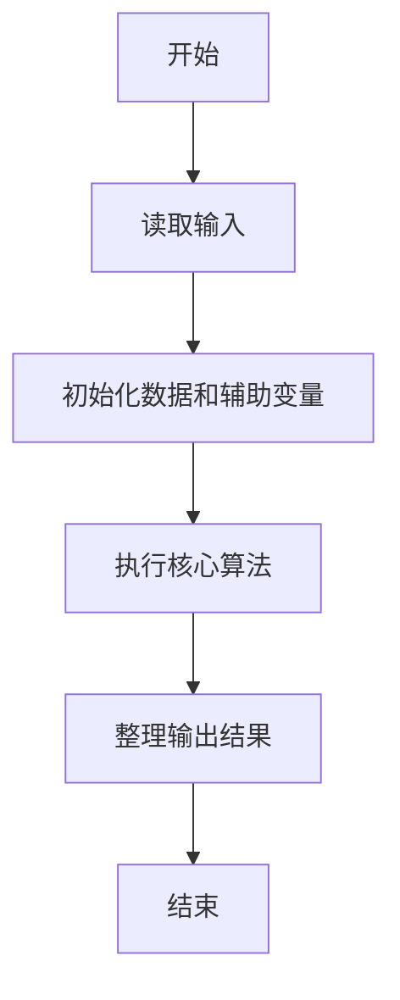
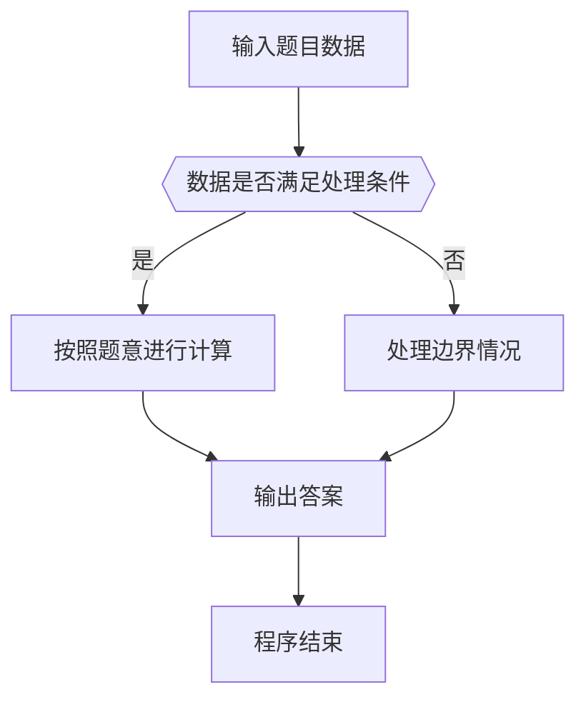

# 1049 数列的片段和

- **分值：** 20分

### 题目描述

给定一个正数数列，我们可以从中截取任意的连续的几个数，称为片段。例如，给定数列 { 0.1, 0.2, 0.3, 0.4 }，我们有 (0.1) (0.1, 0.2) (0.1, 0.2, 0.3) (0.1, 0.2, 0.3, 0.4) (0.2) (0.2, 0.3) (0.2, 0.3, 0.4) (0.3) (0.3, 0.4) (0.4) 这 10 个片段。

给定正整数数列，求出全部片段包含的所有的数之和。如本例中 10 个片段总和是 0.1 + 0.3 + 0.6 + 1.0 + 0.2 + 0.5 + 0.9 + 0.3 + 0.7 + 0.4 = 5.0。

### 输入格式：

输入第一行给出一个不超过 $10^5$ 的正整数 $N$，表示数列中数的个数，第二行给出 $N $ 个不超过 1.0 的正数，是数列中的数，其间以一个空格分隔。

### 输出格式：

在一行中输出该序列所有片段包含的数之和，精确到小数点后 2 位。

### 输入样例：
```
4
0.1 0.2 0.3 0.4
```

### 输出样例：
```
5.00
```

**感谢 Ruihan Zheng 对测试数据的修正。**


### 解题思路

本题的核心是：每个位置对所有包含它的连续片段贡献一次，直接累加其贡献次数。程序先读取题目输入，再按照上述规则完成数据处理，最后严格按照题目要求输出结果。实现时应优先根据题目约束选择合适的数据类型和数据结构，避免溢出或不必要的重复计算。

时间复杂度为 O(n)；空间复杂度取决于输入规模，主要用于保存题目数据和中间结果。

### 代码流程说明

1. 读取 1049 数列的片段和 所需的输入数据。
2. 初始化计数器、数组或其他辅助变量。
3. 每个位置对所有包含它的连续片段贡献一次，直接累加其贡献次数。
4. 按题目规定的格式输出计算结果。

### 代码实现

```ruby
# 题目：1049-数列的片段和
# 实现原理：
# 本题的核心是：每个位置对所有包含它的连续片段贡献一次，直接累加其贡献次数。程序先读取题目输入，再按照上述规则完成数据处理，最后严格按照题目要求输出结果。实现时应优先根据题目约束选择合适的数据类型和数据结构，避免溢出或不必要的重复计算。
# 时间复杂度为 O(n)；空间复杂度取决于输入规模，主要用于保存题目数据和中间结果。
# 代码步骤：
# 1. 读取输入并初始化必要的数据结构。
# 2. 按题意完成核心计算，处理边界情况。
# 3. 按题目要求格式化并输出结果。
#
tokens = STDIN.read.split.map(&:to_f)
count = tokens.shift.to_i
values = tokens.first(count)
answer = values.each_with_index.sum { |value, i| value * (i + 1) * (count - i) }
puts format("%.2f", answer)
```

### 代码流程图



### 解题流程图



### 常见易错点

- 注意输入数据的范围，选择足够大的整数类型，并正确处理边界值。
- 循环、数组下标和字符串结束位置要严格对应题目定义，避免越界。
- 输出格式必须与题目要求完全一致，包括空格、换行、大小写和特殊符号。
- 如果存在排序、去重、进位、约分或四舍五入等操作，应在输出前统一完成。
