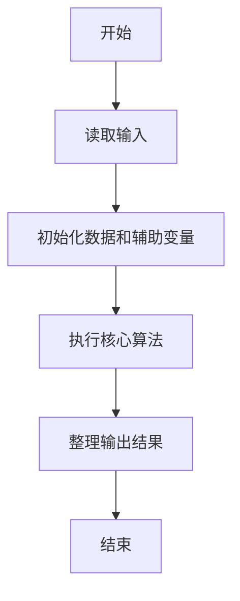
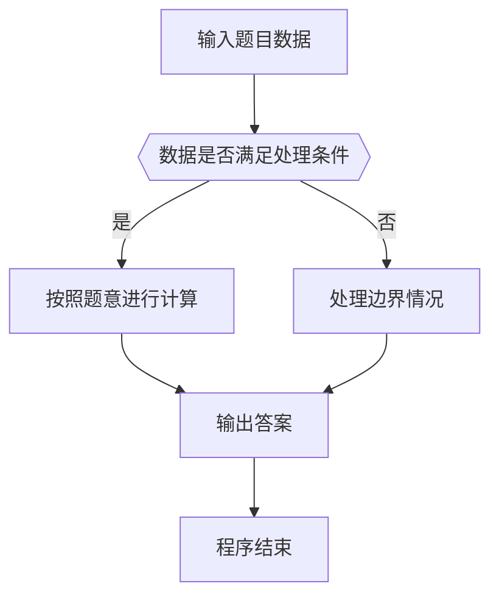

# 1051 复数乘法

- **分值：** 15分

### 题目描述

复数可以写成 $(A + Bi)$ 的常规形式，其中 $A$ 是实部，$B$ 是虚部，$i$ 是虚数单位，满足 $i^2 = -1$；也可以写成极坐标下的指数形式 $(R\times e^{(Pi)})$，其中 $R$ 是复数模，$P$ 是辐角，$i$ 是虚数单位，其等价于三角形式 $R(\cos (P) + i \sin (P))$。

现给定两个复数的 $R$ 和 $P$，要求输出两数乘积的常规形式。

### 输入格式：

输入在一行中依次给出两个非零复数的 $R_1$, $P_1$, $R_2$, $P_2$，数字间以空格分隔。

### 输出格式：

在一行中按照 `A+Bi` 的格式输出两数乘积的常规形式，实部和虚部均保留 2 位小数。注意：如果 `B` 是负数，则应该写成 `A-|B|i` 的形式。

### 输入样例：
```
2.3 3.5 5.2 0.4
```

### 输出样例：
```
-8.68-8.23i
```

**鸣谢福建医科大学刘睿妤同学修正题面！**


### 解题思路

本题的核心是：用极坐标表示复数，模长相乘、幅角相加后还原为直角坐标。程序先读取题目输入，再按照上述规则完成数据处理，最后严格按照题目要求输出结果。实现时应优先根据题目约束选择合适的数据类型和数据结构，避免溢出或不必要的重复计算。

时间复杂度为 O(1)；空间复杂度取决于输入规模，主要用于保存题目数据和中间结果。

### 代码流程说明

1. 读取 1051 复数乘法 所需的输入数据。
2. 初始化计数器、数组或其他辅助变量。
3. 用极坐标表示复数，模长相乘、幅角相加后还原为直角坐标。
4. 按题目规定的格式输出计算结果。

### 代码实现

```ruby
# 题目：1051-复数乘法
# 实现原理：
# 本题的核心是：用极坐标表示复数，模长相乘、幅角相加后还原为直角坐标。程序先读取题目输入，再按照上述规则完成数据处理，最后严格按照题目要求输出结果。实现时应优先根据题目约束选择合适的数据类型和数据结构，避免溢出或不必要的重复计算。
# 时间复杂度为 O(1)；空间复杂度取决于输入规模，主要用于保存题目数据和中间结果。
# 代码步骤：
# 1. 读取输入并初始化必要的数据结构。
# 2. 按题意完成核心计算，处理边界情况。
# 3. 按题目要求格式化并输出结果。
#
r1, p1, r2, p2 = STDIN.read.split.map(&:to_f)
real = r1 * r2 * Math.cos(p1 + p2)
imaginary = r1 * r2 * Math.sin(p1 + p2)
real = 0.0 if real.abs < 0.005
imaginary = 0.0 if imaginary.abs < 0.005
puts format("%.2f%+.2fi", real, imaginary)
```

### 代码流程图



### 解题流程图



### 常见易错点

- 注意输入数据的范围，选择足够大的整数类型，并正确处理边界值。
- 循环、数组下标和字符串结束位置要严格对应题目定义，避免越界。
- 输出格式必须与题目要求完全一致，包括空格、换行、大小写和特殊符号。
- 如果存在排序、去重、进位、约分或四舍五入等操作，应在输出前统一完成。
