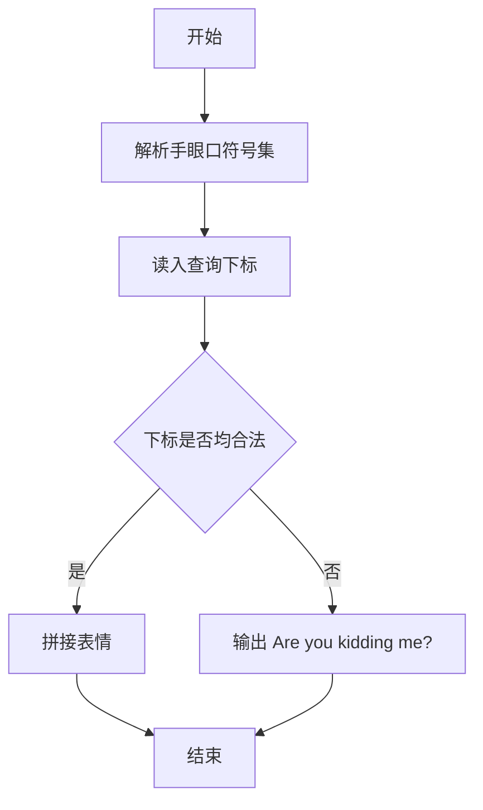
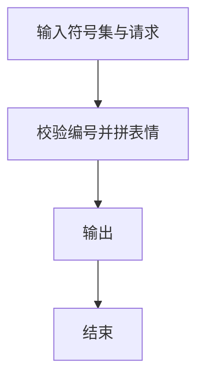

# 1052 卖个萌

- **分值：** 20分

### 题目描述

萌萌哒表情符号通常由“手”、“眼”、“口”三个主要部分组成。简单起见，我们假设一个表情符号是按下列格式输出的：
```
[左手]([左眼][口][右眼])[右手]
```
现给出可选用的符号集合，请你按用户的要求输出表情。

### 输入格式：

输入首先在前三行顺序对应给出手、眼、口的可选符号集。每个符号括在一对方括号 `[]`内。题目保证每个集合都至少有一个符号，并不超过 10 个符号；每个符号包含 1 到 4 个非空字符。

之后一行给出一个正整数 $K$，为用户请求的个数。随后 $K$ 行，每行给出一个用户的符号选择，顺序为左手、左眼、口、右眼、右手——这里只给出符号在相应集合中的序号（从 1 开始），数字间以空格分隔。

### 输出格式：

对每个用户请求，在一行中输出生成的表情。若用户选择的序号不存在，则输出 `Are you kidding me? @\\/@`。

### 输入样例：
```
[╮][╭][o][~\][/~]  [<][>]
 [╯][╰][^][-][=][>][<][@][⊙]
[Д][▽][_][ε][^]  ...
4
1 1 2 2 2
6 8 1 5 5
3 3 4 3 3
2 10 3 9 3

```

### 输出样例：
```
╮(╯▽╰)╭
<(@Д=)/~
o(^ε^)o
Are you kidding me? @\\/@
```


### 解题思路

本题的核心是：读取手、眼、口三个符号集合，按编号校验并拼接成表情。程序先读取题目输入，再按照上述规则完成数据处理，最后严格按照题目要求输出结果。实现时应优先根据题目约束选择合适的数据类型和数据结构，避免溢出或不必要的重复计算。

时间复杂度为 O(L)；空间复杂度取决于输入规模，主要用于保存题目数据和中间结果。

### 代码流程说明

1. 解析手、眼、口三组符号。
2. 读入查询下标。
3. 校验范围后拼接，非法输出固定提示。

### 代码实现

```ruby
# 题目：1052-卖个萌
# 实现原理：
# 本题的核心是：读取手、眼、口三个符号集合，按编号校验并拼接成表情
# 时间复杂度为 O(L)；空间复杂度取决于输入规模，主要用于保存题目数据和中间结果。
# 代码步骤：
# 1. 读取输入并初始化必要的数据结构。
# 2. 按题意完成核心计算，处理边界情况。
# 3. 按题目要求格式化并输出结果。
#
lines = STDIN.readlines.map(&:strip)
extract = ->(line) { line.scan(/\[([^\]]+)\]/).flatten }
hands = extract.call(lines[0])
eyes = extract.call(lines[1])
mouths = extract.call(lines[2])
count = lines[3].to_i
lines.drop(4).first(count).each do |line|
  indexes = line.split.map(&:to_i)
  valid = indexes.length == 5 && indexes[0].between?(1, hands.length) && indexes[1].between?(1, eyes.length) && indexes[2].between?(1, mouths.length) && indexes[3].between?(1, eyes.length) && indexes[4].between?(1, hands.length)
  puts valid ? "#{hands[indexes[0] - 1]}(#{eyes[indexes[1] - 1]}#{mouths[indexes[2] - 1]}#{eyes[indexes[3] - 1]})#{hands[indexes[4] - 1]}" : "Are you kidding me? @\\\\/@"
end
```

### 代码流程图



### 解题流程图



### 常见易错点

- 符号可能包含方括号以外的特殊字符，解析要稳健。
- 下标从 1 开始。
- 非法请求输出固定句子。
