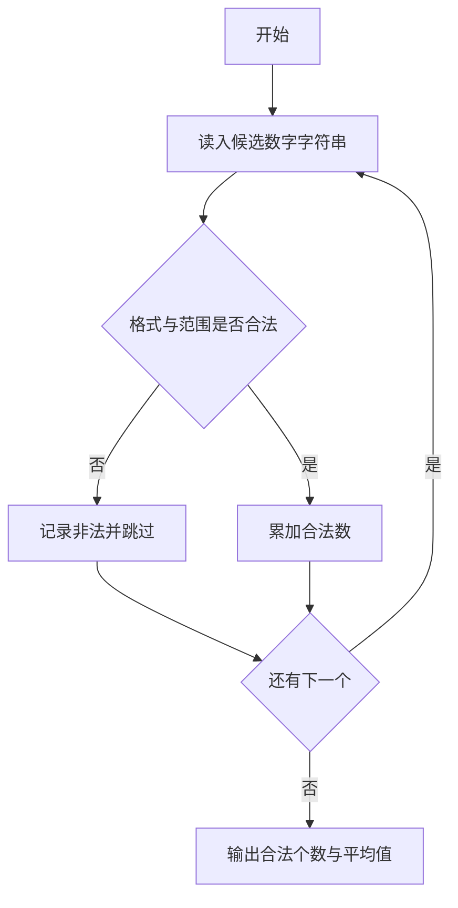
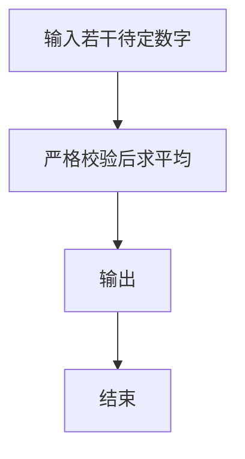

# 1054 求平均值

- **分值：** 20分

### 题目描述

本题的基本要求非常简单：给定 $N$ 个实数，计算它们的平均值。但复杂的是有些输入数据可能是非法的。一个“合法”的输入是 $[-1000, 1000]$ 区间内的实数，并且最多精确到小数点后 2 位。当你计算平均值的时候，不能把那些非法的数据算在内。

### 输入格式：

输入第一行给出正整数 $N$（$\le 100$）。随后一行给出 $N$ 个实数，数字间以一个空格分隔。

### 输出格式：

对每个非法输入，在一行中输出 `ERROR: X is not a legal number`，其中 `X` 是输入。最后在一行中输出结果：`The average of K numbers is Y`，其中 `K` 是合法输入的个数，`Y` 是它们的平均值，精确到小数点后 2 位。如果平均值无法计算，则用 `Undefined` 替换 `Y`。如果 `K` 为 1，则输出 `The average of 1 number is Y`。

### 输入样例 1：
```
7
5 -3.2 aaa 9999 2.3.4 7.123 2.35
```

### 输出样例 1：
```
ERROR: aaa is not a legal number
ERROR: 9999 is not a legal number
ERROR: 2.3.4 is not a legal number
ERROR: 7.123 is not a legal number
The average of 3 numbers is 1.38
```

### 输入样例 2：
```
2
aaa -9999
```

### 输出样例 2：
```
ERROR: aaa is not a legal number
ERROR: -9999 is not a legal number
The average of 0 numbers is Undefined
```


### 解题思路

本题的核心是：严格解析输入数字，验证格式后统计合法数的平均值。程序先读取题目输入，再按照上述规则完成数据处理，最后严格按照题目要求输出结果。实现时应优先根据题目约束选择合适的数据类型和数据结构，避免溢出或不必要的重复计算。

时间复杂度为 O(n)；空间复杂度取决于输入规模，主要用于保存题目数据和中间结果。

### 代码流程说明

1. 逐个读入字符串。
2. 验证是否为合法数字且最多两位小数、范围合法。
3. 对合法数求平均并输出。

### 代码实现

```ruby
# 题目：1054-求平均值
# 实现原理：
# 本题的核心是：严格解析输入数字，验证格式后统计合法数的平均值
# 时间复杂度为 O(n)；空间复杂度取决于输入规模，主要用于保存题目数据和中间结果。
# 代码步骤：
# 1. 读取输入并初始化必要的数据结构。
# 2. 按题意完成核心计算，处理边界情况。
# 3. 按题目要求格式化并输出结果。
#
tokens = STDIN.read.split
count = tokens.shift.to_i
valid = []
tokens.first(count).each do |text|
  number = Float(text) rescue nil
  legal = !number.nil? && number.between?(-1000, 1000) && text.sub(/^[+-]/, '').match?(/\A\d+(?:\.\d{1,2})?\z/)
  if legal
    valid << number
  else
    puts "ERROR: #{text} is not a legal number"
  end
end
if valid.empty?
  puts "The average of 0 numbers is Undefined"
else
  puts format("The average of %d numbers is %.2f", valid.length, valid.sum / valid.length)
end
```

### 代码流程图



### 解题流程图



### 常见易错点

- 非法数不能计入平均。
- 保留两位小数输出。
- 合法数为 0 时按题面输出 The average of 0 numbers is Undefined
