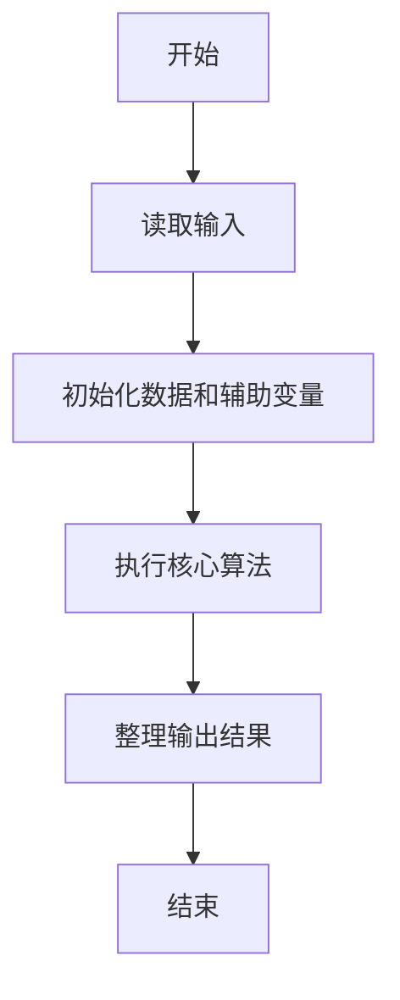
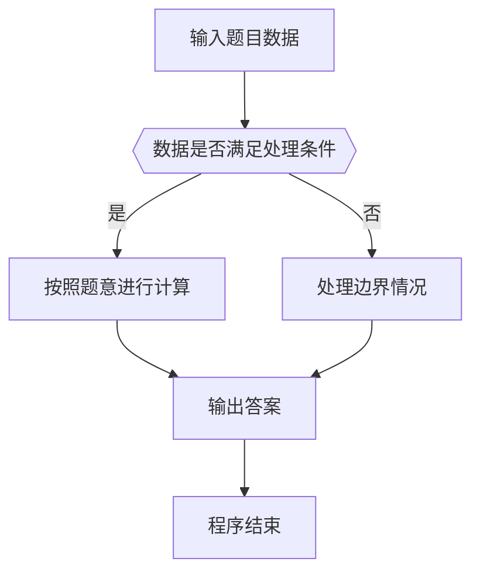

# 1055 集体照

- **分值：** 25分

### 题目描述

拍集体照时队形很重要，这里对给定的 $N$ 个人 $K$ 排的队形设计排队规则如下：

- 每排人数为 $N/K$（向下取整），多出来的人全部站在最后一排；

- 后排所有人的个子都不比前排任何人矮；

- 每排中最高者站中间（中间位置为 $m/2+1$，其中 $m$ 为该排人数，除法向下取整）；

- 每排其他人以中间人为轴，按身高非增序，先右后左交替入队站在中间人的两侧（例如5人身高为190、188、186、175、170，则队形为175、188、190、186、170。这里假设你面对拍照者，所以你的左边是中间人的右边）；

- 若多人身高相同，则按名字的字典序升序排列。这里保证无重名。

现给定一组拍照人，请编写程序输出他们的队形。

### 输入格式：

每个输入包含 1 个测试用例。每个测试用例第 1 行给出两个正整数 $N$（$N\le 10^4$，总人数）和 $K$（$K\le 10$，总排数）。随后 $N$ 行，每行给出一个人的名字（不包含空格、长度不超过 8 个英文字母）和身高（$[30,300]$ 区间内的整数）。

### 输出格式：

输出拍照的队形。即K排人名，其间以空格分隔，行末不得有多余空格。注意：假设你面对拍照者，后排的人输出在上方，前排输出在下方。

### 输入样例：
```
10 3
Tom 188
Mike 170
Eva 168
Tim 160
Joe 190
Ann 168
Bob 175
Nick 186
Amy 160
John 159
```

### 输出样例：
```
Bob Tom Joe Nick
Ann Mike Eva
Tim Amy John
```


### 解题思路

本题的核心是：按总分排序分组，最高分居中，其余成员按左右交替规则排队。程序先读取题目输入，再按照上述规则完成数据处理，最后严格按照题目要求输出结果。实现时应优先根据题目约束选择合适的数据类型和数据结构，避免溢出或不必要的重复计算。

时间复杂度为 O(n log n)；空间复杂度取决于输入规模，主要用于保存题目数据和中间结果。

### 代码流程说明

1. 读取 1055 集体照 所需的输入数据。
2. 初始化计数器、数组或其他辅助变量。
3. 按总分排序分组，最高分居中，其余成员按左右交替规则排队。
4. 按题目规定的格式输出计算结果。

### 代码实现

```ruby
# 题目：1055-集体照
# 实现原理：
# 本题的核心是：按总分排序分组，最高分居中，其余成员按左右交替规则排队。程序先读取题目输入，再按照上述规则完成数据处理，最后严格按照题目要求输出结果。实现时应优先根据题目约束选择合适的数据类型和数据结构，避免溢出或不必要的重复计算。
# 时间复杂度为 O(n log n)；空间复杂度取决于输入规模，主要用于保存题目数据和中间结果。
# 代码步骤：
# 1. 读取输入并初始化必要的数据结构。
# 2. 按题意完成核心计算，处理边界情况。
# 3. 按题目要求格式化并输出结果。
#
tokens = STDIN.read.split
count, rows = tokens.shift(2).map(&:to_i)
people = tokens.each_slice(2).map { |name, score| [name, score.to_i] }.sort_by { |name, score| [-score, name] }
base, extra = count.divmod(rows)
offset = 0
rows.downto(1) do |row|
  length = base + (row == rows ? extra : 0)
  group = people[offset, length].map(&:first)
  offset += length
  line = Array.new(length)
  middle = length / 2
  line[middle] = group.shift
  group.each_with_index { |name, i| line[i.even? ? middle - (i / 2 + 1) : middle + (i / 2 + 1)] = name }
  puts line.join(" ")
end
```

### 代码流程图



### 解题流程图



### 常见易错点

- 注意输入数据的范围，选择足够大的整数类型，并正确处理边界值。
- 循环、数组下标和字符串结束位置要严格对应题目定义，避免越界。
- 输出格式必须与题目要求完全一致，包括空格、换行、大小写和特殊符号。
- 如果存在排序、去重、进位、约分或四舍五入等操作，应在输出前统一完成。
