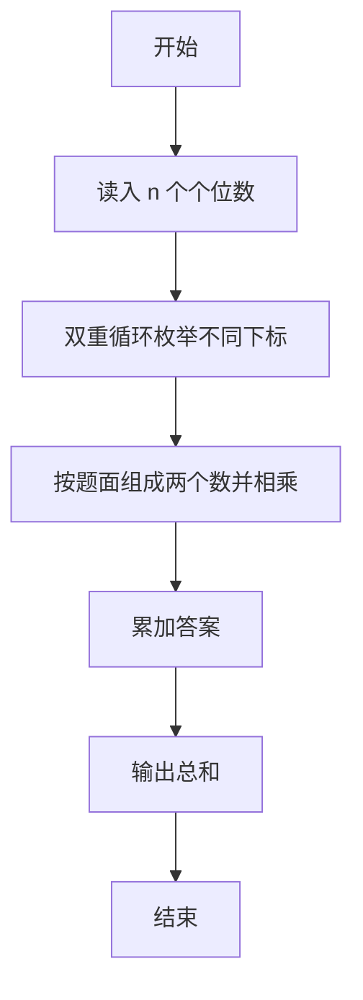
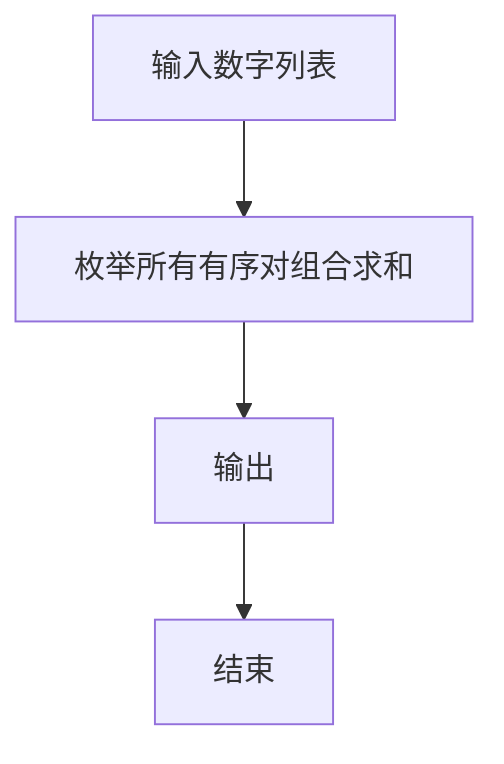

# 1056 组合数的和

- **分值：** 15分

### 题目描述

给定 N 个非 0 的个位数字，用其中任意 2 个数字都可以组合成 1 个 2 位的数字。要求所有可能组合出来的 2 位数字的和。例如给定 2、5、8，则可以组合出：25、28、52、58、82、85，它们的和为330。

### 输入格式：

输入在一行中先给出 $N$（$1<N<10$），随后给出 $N$ 个不同的非 0 个位数字。数字间以空格分隔。

### 输出格式：

输出所有可能组合出来的2位数字的和。

### 输入样例：
```
3 2 8 5
```

### 输出样例：
```
330
```


### 解题思路

本题的核心是：按输入顺序取两位数字组成两个数，计算各对乘积并求和。程序先读取题目输入，再按照上述规则完成数据处理，最后严格按照题目要求输出结果。实现时应优先根据题目约束选择合适的数据类型和数据结构，避免溢出或不必要的重复计算。

时间复杂度为 O(n²)；空间复杂度为 O(n)。

### 代码流程说明

1. 读入 n 个数字。
2. 任取两个不同位置 i,j，组成 10*a[i]+a[j] 与 10*a[j]+a[i] 或按题面两数规则。
3. 累加所有乘积。

### 代码实现

```ruby
# 题目：1056-组合数的和
# 实现原理：
# 本题的核心是：按输入顺序取两位数字组成两个数，计算各对乘积并求和
# 时间复杂度为 O(n²)；空间复杂度为 O(n)。
# 代码步骤：
# 1. 读取输入并初始化必要的数据结构。
# 2. 按题意完成核心计算，处理边界情况。
# 3. 按题目要求格式化并输出结果。
#
values = STDIN.read.split.map(&:to_i)
count = values.shift
values = values.first(count)
answer = 0
values.each_with_index do |left, i|
  values.each_with_index { |right, j| answer += left * 10 + right if i != j }
end
puts answer
```

### 代码流程图



### 解题流程图



### 常见易错点

- 题目中的组合规则按位取两个数字，不是任意拼接。
- i 与 j 不相同。
- 答案可能较大，Ruby 无溢出。
